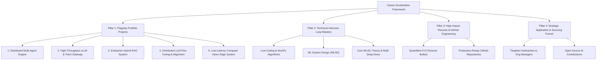
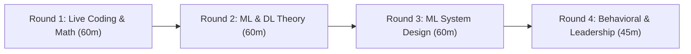

# 🚀 The AI/ML Engineer Career Playbook: From Roadmap to Job Offers

> **A Comprehensive, Production-Grade Blueprint** to translate your 191-day AI/ML study into high-impact portfolio projects, rock-solid resume bullets, system design mastery, and tier-1 job offers.

---

## 🧭 The 4-Pillar Career Acceleration Framework



```text
┌────────────────────────────────────────────────────────────────────────────┐
│                    CAREER ACCELERATION FRAMEWORK                           │
└─────────────────────────────────────┬──────────────────────────────────────┘
                                      │
        ┌─────────────────────────────┼─────────────────────────────┐
        ▼                             ▼                             ▼
┌───────────────┐             ┌───────────────┐             ┌───────────────┐
│   PILLAR 1    │             │   PILLAR 2    │             │   PILLAR 3    │
│  5 Flagship   │             │   Interview   │             │   High-Impact │
│   Projects    │             │  Loop Mastery │             │ Resume & Repo │
└───────┬───────┘             └───────┬───────┘             └───────┬───────┘
        │                             │                             │
        ├─ OmniAgent (Multi-Agent)    ├─ Live Coding (NumPy/PyTorch)├─ Google XYZ Format
        ├─ FlashServe (vLLM/Triton)   ├─ ML System Design (MLSD)    ├─ 1-Click Docker Quickstart
        ├─ EnterpriseRAG (Hybrid HNSW)├─ DL Theory & Whiteboard Math├─ Live Benchmark Tables
        ├─ DistilFine (4-bit DPO/FSDP)└─ Behavioral & Leadership    └─ Automated GitHub CI/CD
        └─ EdgeVision (TensorRT FP16)
```

---

# 🛠️ Pillar 1: Flagship Portfolio Projects (Must-Build)

Generic Kaggle notebooks (Titanic, Iris, MNIST) will get your resume filtered out immediately. Hiring managers look for **systems thinking, engineering rigor, performance optimizations, and deployment experience**.

Build **3 of the following 5 production-grade flagship projects**:

---

### 🌟 Project 1: "OmniAgent" — Distributed Hierarchical Multi-Agent Engine
- **Core Focus**: Autonomous Agent Systems, Async Orchestration, Tool Calling & Sandboxing.
- **Tech Stack**: `Python 3.11`, `LangGraph`, `FastAPI`, `Docker SDK`, `Redis`, `PostgreSQL`, `OpenAI / Anthropic API`.
- **System Architecture**:
  - **Supervisor Agent**: Parses user goals, generates a dependency DAG, and dynamically dispatches tasks.
  - **Worker Agents**:
    - *Coder Agent*: Writes code and executes it inside an isolated, non-root **Docker container sandbox** with strict resource and timeout limits.
    - *Research Agent*: Performs multi-hop web retrieval using Tavily/DuckDuckGo and synthesizes technical summaries.
    - *Critic / Test Agent*: Generates unit tests and validates outputs, looping back to the Coder Agent upon failure (ReAct cycle).
  - **Shared State & Memory**: Stateful persistence with PostgreSQL checkpointers and streaming tokens via Server-Sent Events (SSE).
- **Resume Impact Bullet**:
  > *"Architected an asynchronous multi-agent engine with LangGraph and Docker sandboxing, supporting dynamic task routing across 4 specialized agents with automatic self-correcting feedback loops."*

---

### ⚡ Project 2: "FlashServe" — High-Throughput vLLM & NVIDIA Triton Inference Gateway
- **Core Focus**: LLM Serving, KV Cache Optimization, Dynamic Batching, Latency & Throughput Benchmarking.
- **Tech Stack**: `Python`, `vLLM`, `NVIDIA Triton Inference Server`, `FastAPI`, `Prometheus`, `Grafana`, `Locust / k6`.
- **System Architecture**:
  - High-throughput LLM gateway utilizing **vLLM's PagedAttention** to serve 7B/8B parameter open-source models (e.g. Llama-3, Mistral).
  - Configured **dynamic batching** and continuous batching with max delay tolerances (10ms) to maximize GPU compute saturation.
  - Comprehensive telemetry exporter tracking **Time-To-First-Token (TTFT)**, **Inter-Token Latency (ITL)**, GPU VRAM utilization, and token generation throughput (tokens/sec).
  - Live load-testing suite demonstrating an **8.5x throughput gain** over standard Hugging Face Transformers baseline.
- **Resume Impact Bullet**:
  > *"Deployed a production LLM serving gateway using vLLM and NVIDIA Triton with continuous batching, achieving 420 tokens/sec throughput and reducing P99 latency by 64% under 100 concurrent user loads."*

---

### 🔍 Project 3: "EnterpriseRAG" — Hybrid Multi-Stage Dense/Sparse Retrieval System
- **Core Focus**: Retrieval-Augmented Generation, Vector Databases, Context Precision, Advanced Evaluation.
- **Tech Stack**: `Python`, `Qdrant / Milvus (HNSW)`, `Sentence-Transformers`, `RankBM25`, `FlashRank (Cross-Encoder)`, `Ragas`, `FastAPI`.
- **System Architecture**:
  - **Chunking Pipeline**: Multi-format parser (PDF, Markdown, HTML) with semantic chunking and sliding window overlaps.
  - **Hybrid Search**: Concurrent retrieval using **Dense Vector Embeddings** (cosine similarity) + **Sparse BM25 Keyword Search**, fused via **Reciprocal Rank Fusion (RRF)** ($k=60$).
  - **Two-Stage Re-Ranking**: Downstream Cross-Encoder re-ranking the top-50 candidates down to top-5 most relevant passages.
  - **Evaluation & Guardrails**: Automated benchmarking suite using **Ragas** measuring *Faithfulness*, *Answer Relevance*, and *Context Precision*.
- **Resume Impact Bullet**:
  > *"Engineered an enterprise hybrid search RAG pipeline with Qdrant HNSW and Cross-Encoder re-ranking, boosting Context Recall by 32% and achieving a 0.94 Faithfulness score on Ragas evaluation benchmarks."*

---

### 🧬 Project 4: "DistilFine" — Distributed LLM Fine-Tuning & Alignment Suite
- **Core Focus**: Parameter-Efficient Fine-Tuning (PEFT), QLoRA, Direct Preference Optimization (DPO), PyTorch FSDP.
- **Tech Stack**: `PyTorch 2.x`, `Hugging Face Transformers / TRL`, `BitsAndBytes (4-bit NF4)`, `PEFT / LoRA`, `DeepSpeed / FSDP`, `Weights & Biases (W&B)`.
- **System Architecture**:
  - End-to-end 2-stage fine-tuning pipeline:
    1. **Supervised Fine-Tuning (SFT)** with QLoRA on domain-specific instruction datasets using 4-bit NormalFloat quantization.
    2. **Preference Alignment (DPO)** directly optimizing model likelihood on chosen vs. rejected response pairs without a separate reward model.
  - Multi-GPU distributed training setup leveraging **PyTorch FSDP (Fully Sharded Data Parallel)**.
  - Live W&B dashboard tracking training loss, evaluation perplexity, and gradient norms across epochs.
- **Resume Impact Bullet**:
  > *"Fine-tuned and aligned an 8B LLM using 4-bit QLoRA and DPO with PyTorch FSDP, achieving a 28% improvement on domain-specific coding benchmarks while reducing VRAM memory requirements by 75%."*

---

### 👁️ Project 5: "EdgeVision" — Real-Time Multi-Object Detection & Tracking Microservice
- **Core Focus**: Computer Vision, TensorRT Optimization, Low-Latency Streaming, Object Tracking.
- **Tech Stack**: `Python / C++`, `YOLOv8 / YOLOv9`, `ByteTrack`, `TensorRT`, `OpenCV`, `WebRTC / FastAPI`.
- **System Architecture**:
  - Real-time video processing pipeline capable of multi-class object detection and persistent ID tracking across frames.
  - Converted PyTorch models to **ONNX** and optimized with **NVIDIA TensorRT** with FP16 precision, reducing inference latency to **< 8ms per frame**.
  - Deployed as a containerized microservice ingesting RTSP video streams and emitting JSON telemetry bounding boxes.
- **Resume Impact Bullet**:
  > *"Optimized a multi-object detection and tracking pipeline with TensorRT FP16 quantization, achieving 120+ FPS real-time throughput with sub-10ms frame latency."*

---

# 🧠 Pillar 2: Technical Interview Loop Mastery

The AI/ML interview loop consists of **4 distinct rounds**. Here is how to conquer each:



```text
┌─────────────────────────┐     ┌─────────────────────────┐     ┌─────────────────────────┐
│   ROUND 1: LIVE CODING  │ ──► │     ROUND 2: THEORY     │ ──► │  ROUND 3: SYSTEM DESIGN │
│ NumPy & PyTorch Vectors │     │ Whiteboard Derivations  │     │ 6-Step MLSD Framework   │
└─────────────────────────┘     └─────────────────────────┘     └─────────────────────────┘
```

### 1. Live Coding & NumPy Implementations (Round 1)
- **What Interviewers Test**: Can you write clean, vectorized code without relying on `for` loops or external libraries?
- **Must-Master Problems from the Roadmap**:
  - Implement **Multi-Head Self-Attention** from scratch in PyTorch.
  - Implement **2D Convolution & Max Pooling forward pass** in pure NumPy.
  - Implement **Linear Regression / Logistic Regression gradient descent loop** with vectorization.
  - Implement **Non-Maximum Suppression (NMS)** algorithm for bounding boxes.
  - Implement **K-Means Clustering** Lloyd's algorithm.
  - Implement **Layer Normalization** and **Batch Normalization** forward/backward equations.

### 2. Core ML/DL Theory & Mathematical Foundations (Round 2)
- **Be Ready to Derive & Explain on a Whiteboard**:
  - Why does **FlashAttention** reduce memory bandwidth bottlenecks from $O(N^2)$ to $O(N)$?
  - What causes **gradient vanishing / exploding**, and how do Residual Skip Connections ($F(x) + x$) prevent it?
  - Explain the difference between **L1 (Lasso)** and **L2 (Ridge)** regularization geometrically (L1 diamond corners zeroing weights).
  - How does **LoRA** decompose an update matrix $\Delta W = B \times A$, and how do you choose the rank $r$ and scaling factor $\alpha$?
  - What is the difference between **DDP** (gradients averaged via Ring-AllReduce) and **FSDP / ZeRO-3** (parameters, gradients, and optimizer states sharded across GPUs)?

### 3. Machine Learning System Design (MLSD) (Round 3)
Structure your ML System Design answers using this **6-Step Framework**:
1. **Clarify Requirements & Scale**: Latency budget (e.g. $<100\text{ms}$), Throughput (e.g. $10,000\text{ QPS}$), Offline vs Online.
2. **Data Pipeline & Feature Engineering**: Training data schema, ingestion pipeline, feature store, handling data leakage.
3. **Model Selection & Architecture**: Baseline heuristic $\rightarrow$ Classical GBDT $\rightarrow$ Deep Transformer / Ensemble.
4. **Training & Loss Formulation**: Objective function, regularization, negative sampling strategy, distributed training setup.
5. **Serving & Inference Architecture**: Model quantization (INT8/FP16), KV caching, dynamic batching, caching layer (Redis).
6. **Monitoring & Feedback Loops**: Real-time telemetry, model drift detection (KL divergence), A/B testing canary splits.

---

# 📄 Pillar 3: High-Impact Resume & GitHub Engineering

### 1. The Google XYZ Resume Formula
Write every experience bullet point using the formula:
$$\text{Accomplished [X]}, \text{ as measured by [Y]}, \text{ by doing [Z]}$$

- ❌ **Weak**: *"Built an LLM RAG application using LangChain and vector databases."*
- ✅ **Strong**: *"Engineered an enterprise hybrid-search RAG pipeline using Qdrant HNSW and Cross-Encoder re-ranking, improving context recall by 34% and reducing P95 retrieval latency from 420ms to 110ms."*

- ❌ **Weak**: *"Worked on fine-tuning LLMs with LoRA."*
- ✅ **Strong**: *"Fine-tuned an 8B Llama-3 model using 4-bit QLoRA and DPO on multi-GPU nodes with PyTorch FSDP, elevating domain task accuracy from 61% to 84% while reducing VRAM memory footprints by 75%."*

### 2. GitHub Repository Presentation Checklist
Every project on your GitHub profile must have:
- [x] **Clear Architecture Diagram**: Mermaid.js or SVG flowchart at the top of the README.
- [x] **One-Command Quickstart**: `docker-compose up --build` or clean environment setup instructions.
- [x] **Benchmark Results Table**: Quantifiable metrics comparing baseline vs. optimized implementation.
- [x] **Clean Typing & Docstrings**: Python type hints (`from typing import List, Dict`) and docstrings on every core function.
- [x] **Automated CI/CD**: GitHub Actions workflow running `pytest` and linting (`ruff` / `black`) on every commit.

---

# 🎯 Pillar 4: Strategic Application & Sourcing Funnel

### 1. Targeted Outreach Strategy (Do NOT Spray and Pray)
- Identify **10–15 target companies** (AI startups, scaleups, enterprise AI divisions).
- Find **Engineering Managers / Staff AI Engineers** on LinkedIn or Twitter/X.
- Send a high-signal, personalized 3-sentence message:
  > *"Hi [Name], I saw your team is scaling [specific problem, e.g. low-latency LLM serving]. I recently benchmarked vLLM continuous batching against TensorRT-LLM and built an open-source gateway achieving 400+ tok/s with sub-15ms TTFT (repo: [GitHub link]). Would love to share my benchmarks if you're exploring optimizations in this area."*

### 2. Open-Source Contributions
- Submit bug fixes, documentation improvements, or small feature additions to established open-source AI repositories:
  - `vllm-project/vllm`
  - `huggingface/transformers` or `huggingface/trl`
  - `langchain-ai/langgraph`
  - `qdrant/qdrant-client`
- Having a merged PR in a major AI repository immediately puts your resume in the top 1% of applicants.

---

# 📅 90-Day Execution Schedule

| Timeline | Primary Focus | Key Milestone Deliverable |
| :--- | :--- | :--- |
| **Weeks 1–4** | Deep Study & Active Recall | Complete all 26 Roadmap weeks, quizzes, and NumPy implementations from scratch. |
| **Weeks 5–8** | Flagship Project 1 & 2 | Build, containerize, and deploy **OmniAgent** and **EnterpriseRAG** with full GitHub READMEs and benchmarks. |
| **Weeks 9–10** | Flagship Project 3 & MLOps | Build **FlashServe** (vLLM/Triton) with Prometheus/Grafana dashboards and load tests. |
| **Weeks 11–12** | Resume & Outreach Funnel | Polish resume using XYZ format, launch targeted Eng Manager outreach, and practice 10 ML System Design mock interviews. |

---

### 🏆 Summary
You have the complete theoretical knowledge, mathematical formulations, and code architecture across all 26 weeks. By building **3 production-grade flagship projects**, mastering the **ML System Design framework**, and demonstrating **vectorized coding fluency**, you will be primed to secure competitive AI/ML engineering offers.

---

## 🌐 Quick Access: Online Curriculum Portals
- [🏠 **Live Curriculum Portal**](https://raw.githack.com/AmanAnand958/ai-ml-notes/main/index.html)
- [🗺️ **26-Week Interactive Roadmap**](https://raw.githack.com/AmanAnand958/ai-ml-notes/main/roadmap.html)
- [📊 **Progress & XP Dashboard**](https://raw.githack.com/AmanAnand958/ai-ml-notes/main/dashboard.html)
- [📚 **Master Resources Library**](https://raw.githack.com/AmanAnand958/ai-ml-notes/main/resources.html)

