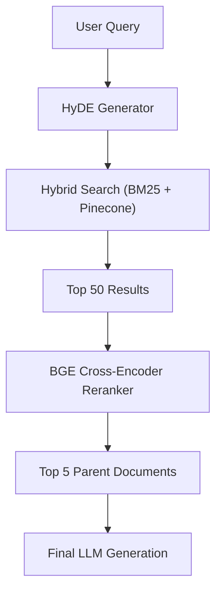

WEEK 19 · DAY 136
# Hybrid Search & RRF
Combining Keywords and Vectors
⏳ 45 mins
Difficulty: Hard
💬 Hinglish Explanation:
💡 Gotcha: Common Pitfalls in Day-136
Always validate underlying data assumptions, check tensor shape alignments, and verify hyperparameter scaling before running production training or evaluation loops.
### 🎯 By the end of Day 136, you will:
- Implement BM25 for sparse retrieval.
- Implement Dense embeddings.
- Fuse scores using Reciprocal Rank Fusion.
#### 🚦 Before You Start Checklist:
- practical application with basic RAG
- Pinecone or Qdrant setup
## 🧠 Theory
Analogy:
Hybrid Search & RRF
💡 Gotcha & Common Pitfall Warning:
Always double check tensor dimensions, verify data types before matrix operations, and ensure feature scaling is fitted strictly on the training set to prevent data leakage.
### Reciprocal Rank Fusion (RRF)
RRF combines ranks from multiple retrievers. The formula is:
python
```python
# Real production example using Pinecone Hybrid Search
from pinecone import Pinecone
from pinecone_text.sparse import BM25Encoder

pc = Pinecone(api_key="API_KEY")
index = pc.Index("hybrid-index")

bm25 = BM25Encoder().default()
# BM25 is fitted on your corpus
sparse_vec = bm25.encode_queries("how to implement rrf")
dense_vec = get_embeddings("how to implement rrf")

# Query Pinecone
index.query(
    top_k=5,
    vector=dense_vec,
    sparse_vector=sparse_vec,
    alpha=0.5 # 0.5 means equal weight to sparse and dense
)
```
### 🤔 Predict the Output
If alpha=1.0 in Pinecone's query, what does the search become?
Check
## ⚡ Tasks
**Task 1: Compute RRF Manually · MEDIUM · ⏱ 45 mins**
Write a function to compute RRF for two rank lists: List A = [doc1, doc2, doc3], List B = [doc2, doc1, doc4]. Use k=60.
**Task**
## 🧪 Day 136 Knowledge Check
**Q:** Why is k typically set to 60 in RRF?
  - It maximizes sparse impact
  - It balances high-ranked and low-ranked items effectively
  - It is the max integer limit
## 🧪 Applied Extension Checks
**Q:** Concept check — for Hybrid Search & RRF, which evaluation approach is most defensible?
  - A) Use a task-specific baseline and measure quality, latency, cost, and failure modes before scaling Hybrid Search & RRF.
  - B) Adopt Hybrid Search & RRF without a baseline because a larger system is automatically better.
  - C) Remove evaluation so the team can move faster.
  - D) Hard-code credentials and environment-specific values.
**Q:** Debugging check — what should you verify first when implementing Hybrid Search & RRF?
  - A) Reproduce the issue with a small deterministic fixture, then inspect inputs, configuration, dependencies, and expected outputs.
  - B) Skip reproduction and immediately increase model size or production traffic.
  - C) Remove evaluation so the team can move faster.
  - D) Hard-code credentials and environment-specific values.
**Q:** Production scenario — what control belongs in a launch plan for Hybrid Search & RRF?
  - A) Use a canary or staged rollout with quality and latency telemetry, budget/security checks, and a tested rollback path.
  - B) Ship globally after one successful demo and assume there are no operational risks.
  - C) Remove evaluation so the team can move faster.
  - D) Hard-code credentials and environment-specific values.
## 🃏 Revision Flashcards
**Flashcard:** What is Hybrid Search?
> Combining keyword/sparse (BM25) and dense vector search to get the best of both worlds.
**Flashcard:** What is the formula for RRF?
> Sum of 1 / (k + rank) for each retriever.
**Flashcard:** Typical 'k' value in RRF?
> k = 60
### ✅ Key Takeaways
"RRF ek simple mathematical trick hai jo multiple search results ko ek strong list mein combine karti hai!"
- BM25 handles exact match (IDs, acronyms).
- Dense handles semantic meaning.
- RRF requires no training.
## 📚 Recommended Resources
📄
#### RRF Paper
Original paper on Reciprocal Rank Fusion
WEEK 19 · DAY 137
# Cross-Encoders & Re-ranking
Improving Retrieval Precision
⏳ 50 mins
Difficulty: Medium
💬 Hinglish Explanation:
💡 Gotcha: Common Pitfalls in Day-137
Always validate underlying data assumptions, check tensor shape alignments, and verify hyperparameter scaling before running production training or evaluation loops.
### 🎯 By the end of Day 137, you will:
- Implement and evaluate Bi-Encoders vs Cross-Encoders.
- Implement a Cohere or BGE Re-ranker.
#### 🚦 Before You Start Checklist:
- Vector DB populated
- Transformers library installed
## 🧠 Theory
Analogy:
Cross-Encoders & Re-ranking
💡 Gotcha & Common Pitfall Warning:
Always double check tensor dimensions, verify data types before matrix operations, and ensure feature scaling is fitted strictly on the training set to prevent data leakage.
A Bi-Encoder embeds query and document separately. A Cross-Encoder processes them together, allowing self-attention across query and doc tokens.
python
```python
# Real usage of sentence-transformers CrossEncoder
from sentence_transformers import CrossEncoder

# Load BGE Reranker
model = CrossEncoder('BAAI/bge-reranker-v2-m3')

query = "how to setup reranker"
docs = ["Use cross-encoders for reranking", "Vector search is fast", "BM25 is keyword based"]

# Calculate scores
pairs = [[query, doc] for doc in docs]
scores = model.predict(pairs)

# Combine and sort
ranked = sorted(zip(scores, docs), reverse=True)
print(ranked[0]) # Highest scoring document
```
### 🤔 Predict the Output
Why don't we use Cross-Encoders for the entire database search?
Check
## ⚡ Tasks
**Task 1: Cohere Re-rank API · MEDIUM · EASY · ⏱ 45 mins**
Write a snippet using Cohere's `rerank` endpoint.
**Bonus Task: Latency Comparison · MEDIUM · HARD · ⏱ 45 mins**
Run a benchmark comparing Bi-Encoder retrieval vs Cross-Encoder reranking latency on 100 docs using time.perf_counter.
**Task**
## 🧪 Day 137 Knowledge Check
**Q:** What is the architecture of a Cross-Encoder?
  - Two separate BERT models
  - Single BERT model receiving [CLS] Query [SEP] Doc
  - An LSTM network
## 🧪 Applied Extension Checks
**Q:** Concept check — for Cross-Encoders & Re-ranking, which evaluation approach is most defensible?
  - A) Use a task-specific baseline and measure quality, latency, cost, and failure modes before scaling Cross-Encoders & Re-ranking.
  - B) Adopt Cross-Encoders & Re-ranking without a baseline because a larger system is automatically better.
  - C) Remove evaluation so the team can move faster.
  - D) Hard-code credentials and environment-specific values.
**Q:** Debugging check — what should you verify first when implementing Cross-Encoders & Re-ranking?
  - A) Reproduce the issue with a small deterministic fixture, then inspect inputs, configuration, dependencies, and expected outputs.
  - B) Skip reproduction and immediately increase model size or production traffic.
  - C) Remove evaluation so the team can move faster.
  - D) Hard-code credentials and environment-specific values.
**Q:** Production scenario — what control belongs in a launch plan for Cross-Encoders & Re-ranking?
  - A) Use a canary or staged rollout with quality and latency telemetry, budget/security checks, and a tested rollback path.
  - B) Ship globally after one successful demo and assume there are no operational risks.
  - C) Remove evaluation so the team can move faster.
  - D) Hard-code credentials and environment-specific values.
## 🃏 Revision Flashcards
**Flashcard:** Bi-Encoder vs Cross-Encoder
> Bi: Separate embeddings (fast). Cross: Joint processing (accurate).
**Flashcard:** When to use Reranking?
> After initial retrieval (Top-K) to reorder the candidate list.
**Flashcard:** Why are Cross-Encoders slow?
> They process query+doc together in full attention, so complexity is O(N) per query, not pre-computable.
### ✅ Key Takeaways
"Retrieve fast (Bi-encoder), Rerank smart (Cross-encoder)."
- Cross-Encoders see both query and doc simultaneously.
- Cohere Rerank and BGE are state-of-the-art.
## 📚 Recommended Resources
🤗
#### BGE Reranker
HuggingFace Model Card
WEEK 19 · DAY 138
# Advanced Chunking Strategies
Parent-Document & Semantic Chunking
⏳ 50 mins
Difficulty: Hard
💬 Hinglish Explanation:
💡 Gotcha: Common Pitfalls in Day-138
Always validate underlying data assumptions, check tensor shape alignments, and verify hyperparameter scaling before running production training or evaluation loops.
### 🎯 By the end of Day 138, you will:
- Implement Parent-Document Chunking in LangChain.
- Implement and evaluate Semantic Chunking based on cosine distance.
#### 🚦 Before You Start Checklist:
- Basic text splitters knowledge
## 🧠 Theory
Analogy:
Advanced Chunking Strategies
💡 Gotcha & Common Pitfall Warning:
Always double check tensor dimensions, verify data types before matrix operations, and ensure feature scaling is fitted strictly on the training set to prevent data leakage.
### Parent Document Retriever
We split a doc into large parent chunks, then split parents into smaller child chunks. We embed children, but retrieve parents.
python
```python
from langchain.retrievers import ParentDocumentRetriever
from langchain.storage import InMemoryStore
from langchain_chroma import Chroma
from langchain_openai import OpenAIEmbeddings
from langchain_text_splitters import RecursiveCharacterTextSplitter

# Create child and parent splitters
parent_splitter = RecursiveCharacterTextSplitter(chunk_size=2000)
child_splitter = RecursiveCharacterTextSplitter(chunk_size=400)

# The vectorstore only indexes the child chunks
vectorstore = Chroma(collection_name="split_parents", embedding_function=OpenAIEmbeddings())
store = InMemoryStore()

retriever = ParentDocumentRetriever(
    vectorstore=vectorstore,
    docstore=store,
    child_splitter=child_splitter,
    parent_splitter=parent_splitter,
)

# Add docs
# retriever.add_documents(docs)
```
### 🤔 Predict the Output
If a query matches a child chunk, what text is actually returned by the retriever?
Check
## ⚡ Tasks
**Task 1: Semantic Chunking · MEDIUM · ⏱ 45 mins**
Write a script using `SemanticChunker` from `langchain_experimental`.
**Bonus Task: Sliding Window Chunker · MEDIUM · HARD · ⏱ 45 mins**
Write a custom text splitter that uses a 500-char window with 100-char overlap without using LangChain splitters.
**Task**
## 🧪 Day 138 Knowledge Check
**Q:** Why use Parent-Document Chunking?
  - To save memory in Vector DB
  - To get accurate search (small chunks) but give LLM full context (large chunks)
  - To reduce embedding costs
## 🧪 Applied Extension Checks
**Q:** Concept check — for Advanced Chunking Strategies, which evaluation approach is most defensible?
  - A) Use a task-specific baseline and measure quality, latency, cost, and failure modes before scaling Advanced Chunking Strategies.
  - B) Adopt Advanced Chunking Strategies without a baseline because a larger system is automatically better.
  - C) Remove evaluation so the team can move faster.
  - D) Hard-code credentials and environment-specific values.
**Q:** Debugging check — what should you verify first when implementing Advanced Chunking Strategies?
  - A) Reproduce the issue with a small deterministic fixture, then inspect inputs, configuration, dependencies, and expected outputs.
  - B) Skip reproduction and immediately increase model size or production traffic.
  - C) Remove evaluation so the team can move faster.
  - D) Hard-code credentials and environment-specific values.
**Q:** Production scenario — what control belongs in a launch plan for Advanced Chunking Strategies?
  - A) Use a canary or staged rollout with quality and latency telemetry, budget/security checks, and a tested rollback path.
  - B) Ship globally after one successful demo and assume there are no operational risks.
  - C) Remove evaluation so the team can move faster.
  - D) Hard-code credentials and environment-specific values.
## 🃏 Revision Flashcards
**Flashcard:** What is Parent-Doc Chunking?
> Embed small child chunks, return large parent chunks on match.
**Flashcard:** What is Semantic Chunking?
> Splitting text where the cosine distance between sentences sharply changes.
**Flashcard:** Sliding Window Chunking
> Splitting text into overlapping chunks so context is not lost at chunk boundaries.
### ✅ Key Takeaways
"Context is king! Small chunks for finding needles, large chunks for painting the full picture."
- Child chunks improve retrieval accuracy.
- Parent chunks provide needed context to the LLM.
## 📚 Recommended Resources
🦜
#### LangChain Docs
[Parent Document Retriever](https://python.langchain.com/v0.2/docs/how_to/parent_document_retriever/)
WEEK 19 · DAY 139
# Vector Indexing Deep Dive
HNSW, IVF-PQ & FAISS
⏳ 60 mins
Difficulty: Hard
💬 Hinglish Explanation:
💡 Gotcha: Common Pitfalls in Day-139
Always validate underlying data assumptions, check tensor shape alignments, and verify hyperparameter scaling before running production training or evaluation loops.
### 🎯 By the end of Day 139, you will:
- Implement and evaluate Hierarchical Navigable Small World (HNSW).
- Implement and evaluate Inverted File Index (IVF) and Product Quantization (PQ).
- Implement a custom FAISS index.
#### 🚦 Before You Start Checklist:
- FAISS installed (`pip install faiss-cpu`)
## 🧠 Theory
Analogy:
Vector Indexing Deep Dive
💡 Gotcha & Common Pitfall Warning:
Always double check tensor dimensions, verify data types before matrix operations, and ensure feature scaling is fitted strictly on the training set to prevent data leakage.
### FAISS Indexing: IVF-PQ
Instead of comparing with all vectors, IVF clusters vectors into Voronoi cells. PQ compresses vectors into short codes.
python
```python
import faiss
import numpy as np

d = 128  # dimension
nb = 10000  # database size
nq = 10  # queries
xb = np.random.random((nb, d)).astype('float32')
xq = np.random.random((nq, d)).astype('float32')

# IVF-PQ index
nlist = 100 # number of clusters
m = 8 # number of subquantizers
quantizer = faiss.IndexFlatL2(d)  # coarse quantizer
index = faiss.IndexIVFPQ(quantizer, d, nlist, m, 8)

# Train and add
index.train(xb)
index.add(xb)

# Search
index.nprobe = 10 # Search in 10 nearest clusters
D, I = index.search(xq, k=5)
print(I)
```
### 🤔 Predict the Output
Increasing `nprobe` in IVF index does what to speed and accuracy?
Check
## ⚡ Tasks
**Task 1: HNSW in FAISS · MEDIUM · ⏱ 45 mins**
Create an HNSW index using FAISS.
**Bonus Task: Benchmark Index Types · MEDIUM · HARD · ⏱ 45 mins**
Create a FAISS Flat, IVF, and HNSW index on the same random 50k vectors. Time search speed and compare recall@10.
**Task**
## 🧪 Day 139 Knowledge Check
**Q:** What is Product Quantization (PQ) used for?
  - Compressing vectors to save memory
  - Increasing embedding dimensions
  - Making Exact KNN faster
## 🧪 Applied Extension Checks
**Q:** Concept check — for Vector Indexing Deep Dive, which evaluation approach is most defensible?
  - A) Use a task-specific baseline and measure quality, latency, cost, and failure modes before scaling Vector Indexing Deep Dive.
  - B) Adopt Vector Indexing Deep Dive without a baseline because a larger system is automatically better.
  - C) Remove evaluation so the team can move faster.
  - D) Hard-code credentials and environment-specific values.
**Q:** Debugging check — what should you verify first when implementing Vector Indexing Deep Dive?
  - A) Reproduce the issue with a small deterministic fixture, then inspect inputs, configuration, dependencies, and expected outputs.
  - B) Skip reproduction and immediately increase model size or production traffic.
  - C) Remove evaluation so the team can move faster.
  - D) Hard-code credentials and environment-specific values.
**Q:** Production scenario — what control belongs in a launch plan for Vector Indexing Deep Dive?
  - A) Use a canary or staged rollout with quality and latency telemetry, budget/security checks, and a tested rollback path.
  - B) Ship globally after one successful demo and assume there are no operational risks.
  - C) Remove evaluation so the team can move faster.
  - D) Hard-code credentials and environment-specific values.
## 🃏 Revision Flashcards
**Flashcard:** What is HNSW?
> A multi-layered graph where upper layers have long links (fast skip), lower have short links.
**Flashcard:** What does nprobe do?
> Number of clusters (Voronoi cells) to check during IVF search.
**Flashcard:** efSearch in HNSW
> Exploration factor during search. Higher efSearch = slower but higher recall.
### ✅ Key Takeaways
"Production Vector DBs (Qdrant, Milvus) HNSW ya IVF-PQ use karte hain speed ke liye."
- HNSW is fast and accurate but uses lots of RAM.
- IVF-PQ uses very little RAM but requires training and has lower recall.
## 📚 Recommended Resources
📖
#### FAISS Wiki
Index algorithms deep dive
WEEK 19 · DAY 140
# GraphRAG & Knowledge Graphs
Extracting Relationships with Neo4j
⏳ 50 mins
Difficulty: Hard
💬 Hinglish Explanation:
💡 Gotcha: Common Pitfalls in Day-140
Always validate underlying data assumptions, check tensor shape alignments, and verify hyperparameter scaling before running production training or evaluation loops.
### 🎯 By the end of Day 140, you will:
- Implement and evaluate Knowledge Graph triples (Entity-Rel-Entity).
- Extract graphs using LLMs.
- Query Neo4j using Cypher.
#### 🚦 Before You Start Checklist:
- Free Neo4j AuraDB instance
## 🧠 Theory
Analogy:
GraphRAG & Knowledge Graphs
💡 Gotcha & Common Pitfall Warning:
Always double check tensor dimensions, verify data types before matrix operations, and ensure feature scaling is fitted strictly on the training set to prevent data leakage.
### LLMGraphTransformer
LangChain provides utilities to automatically extract graph nodes and edges from unstructured text using function calling.
python
```python
from langchain_experimental.graph_transformers import LLMGraphTransformer
from langchain_openai import ChatOpenAI
from langchain_core.documents import Document

llm = ChatOpenAI(temperature=0, model_name="gpt-4")
llm_transformer = LLMGraphTransformer(llm=llm)

text = "Elon Musk is the CEO of Tesla. Tesla builds electric cars."
documents = [Document(page_content=text)]
graph_documents = llm_transformer.convert_to_graph_documents(documents)

print(graph_documents[0].nodes)
# [Node(id='Elon Musk', type='Person'), Node(id='Tesla', type='Organization')]
print(graph_documents[0].relationships)
# [Relationship(source='Elon Musk', target='Tesla', type='CEO_OF')]
```
### 🤔 Predict the Output
What Cypher query would find the company Elon Musk is CEO of?
Check
## ⚡ Tasks
**Task 1: Load to Neo4j · MEDIUM · ⏱ 45 mins**
Write the code to add `graph_documents` to a LangChain `Neo4jGraph`.
**Bonus Task: GraphRAG QA · MEDIUM · MED · ⏱ 45 mins**
After ingesting documents into Neo4j, write a LangChain chain that queries the graph for answering questions about relationships.
**Task**
## 🧪 Day 140 Knowledge Check
**Q:** Why use GraphRAG over VectorRAG?
  - It is much faster
  - It captures deterministic relationships and multi-hop reasoning
  - It requires smaller LLMs
## 🧪 Applied Extension Checks
**Q:** Concept check — for GraphRAG & Knowledge Graphs, which evaluation approach is most defensible?
  - A) Use a task-specific baseline and measure quality, latency, cost, and failure modes before scaling GraphRAG & Knowledge Graphs.
  - B) Adopt GraphRAG & Knowledge Graphs without a baseline because a larger system is automatically better.
  - C) Remove evaluation so the team can move faster.
  - D) Hard-code credentials and environment-specific values.
**Q:** Debugging check — what should you verify first when implementing GraphRAG & Knowledge Graphs?
  - A) Reproduce the issue with a small deterministic fixture, then inspect inputs, configuration, dependencies, and expected outputs.
  - B) Skip reproduction and immediately increase model size or production traffic.
  - C) Remove evaluation so the team can move faster.
  - D) Hard-code credentials and environment-specific values.
**Q:** Production scenario — what control belongs in a launch plan for GraphRAG & Knowledge Graphs?
  - A) Use a canary or staged rollout with quality and latency telemetry, budget/security checks, and a tested rollback path.
  - B) Ship globally after one successful demo and assume there are no operational risks.
  - C) Remove evaluation so the team can move faster.
  - D) Hard-code credentials and environment-specific values.
## 🃏 Revision Flashcards
**Flashcard:** What is a Triplet?
> Subject - Predicate - Object (e.g., Steve Jobs - FOUNDED - Apple)
**Flashcard:** What is Cypher?
> The query language for Neo4j (Graph Database).
**Flashcard:** Graph vs Vector RAG
> Vector: semantic similarity. Graph: exact, multi-hop entity relationships. Best systems use both.
### ✅ Key Takeaways
"Graph + Vector = Ultimate RAG. Use vectors for similarity, graphs for facts."
- LLMs can extract structure via function calling.
- Neo4j stores property graphs efficiently.
## 📚 Recommended Resources
🕸️
#### Neo4j Cypher
Cypher Query Language Docs
WEEK 19 · DAY 141
# Advanced Query Transformations
HyDE & Step-Back Prompting
⏳ 45 mins
Difficulty: Medium
💬 Hinglish Explanation:
💡 Gotcha: Common Pitfalls in Day-141
Always validate underlying data assumptions, check tensor shape alignments, and verify hyperparameter scaling before running production training or evaluation loops.
### 🎯 By the end of Day 141, you will:
- Implement Hypothetical Document Embeddings (HyDE).
- Implement Step-Back Prompting.
#### 🚦 Before You Start Checklist:
- LangChain installed
## 🧠 Theory
Analogy:
Advanced Query Transformations
💡 Gotcha & Common Pitfall Warning:
Always double check tensor dimensions, verify data types before matrix operations, and ensure feature scaling is fitted strictly on the training set to prevent data leakage.
### HyDE (Hypothetical Document Embeddings)
Embeddings of a query are often in a different subspace than documents. By prompting the LLM to write a hypothetical response, we create a text that looks like the target document, making cosine similarity much more effective.
python
```python
from langchain_core.prompts import PromptTemplate
from langchain_openai import OpenAIEmbeddings
from langchain.chains import LLMChain
from langchain_openai import OpenAI

llm = OpenAI()
prompt = PromptTemplate(
    input_variables=["question"],
    template="Please write a scientific paper passage that answers this question: {question}"
)
hyde_chain = LLMChain(llm=llm, prompt=prompt)

query = "What is the mitochondria?"
hypothetical_doc = hyde_chain.run(query)

embeddings = OpenAIEmbeddings()
hyde_vector = embeddings.embed_query(hypothetical_doc)
# Now use hyde_vector to search the vector database!
```
### Step-Back Prompting
Instead of answering a specific complex question, ask the LLM to generate a broader "step-back" question first, retrieve info for both, and then synthesize.
### 🤔 Predict the Output
What is a major downside of HyDE?
Check
## ⚡ Tasks
**Task 1: Step-Back Prompt · MEDIUM · EASY · ⏱ 45 mins**
Write a system prompt that generates a step-back question for "Did Estavanico live in the same time period as Columbus?"
**Bonus Task: Multi-Query Retriever · MEDIUM · MED · ⏱ 45 mins**
Use LangChain MultiQueryRetriever to generate 3 query variants per user question and retrieve union of results.
**Task**
## 🧪 Day 141 Knowledge Check
**Q:** Why does HyDE work better than raw query embedding?
  - Because it searches using document-like language instead of query language
  - Because it uses a larger LLM
  - Because it summarizes the database
## 🧪 Applied Extension Checks
**Q:** Concept check — for Advanced Query Transformations, which evaluation approach is most defensible?
  - A) Use a task-specific baseline and measure quality, latency, cost, and failure modes before scaling Advanced Query Transformations.
  - B) Adopt Advanced Query Transformations without a baseline because a larger system is automatically better.
  - C) Remove evaluation so the team can move faster.
  - D) Hard-code credentials and environment-specific values.
**Q:** Debugging check — what should you verify first when implementing Advanced Query Transformations?
  - A) Reproduce the issue with a small deterministic fixture, then inspect inputs, configuration, dependencies, and expected outputs.
  - B) Skip reproduction and immediately increase model size or production traffic.
  - C) Remove evaluation so the team can move faster.
  - D) Hard-code credentials and environment-specific values.
**Q:** Production scenario — what control belongs in a launch plan for Advanced Query Transformations?
  - A) Use a canary or staged rollout with quality and latency telemetry, budget/security checks, and a tested rollback path.
  - B) Ship globally after one successful demo and assume there are no operational risks.
  - C) Remove evaluation so the team can move faster.
  - D) Hard-code credentials and environment-specific values.
## 🃏 Revision Flashcards
**Flashcard:** What does HyDE stand for?
> Hypothetical Document Embeddings
**Flashcard:** What is Step-Back Prompting?
> Generating a broader conceptual question to retrieve better context.
**Flashcard:** Multi-Query Retrieval
> Generating multiple query variants for the same question and fusing retrieved results.
### ✅ Key Takeaways
"Don't just search the user's raw input. Transform it first!"
- HyDE hallucination is actually a feature, not a bug here.
- Step-Back improves reasoning on complex constraints.
## 📚 Recommended Resources
📄
#### HyDE Paper
Precise Zero-Shot Dense Retrieval without Relevance Labels
WEEK 19 · DAY 142
# Capstone: Production RAG
Building a fully optimized RAG Pipeline
⏳ 120 mins
Difficulty: CAPSTONE
💬 Hinglish Explanation:
💡 Gotcha: Common Pitfalls in Day-142
Always validate underlying data assumptions, check tensor shape alignments, and verify hyperparameter scaling before running production training or evaluation loops.
### 🎯 By the end of Day 142, you will:
- Build a multi-stage LangChain retrieval pipeline.
- Combine HyDE, Pinecone Hybrid, and BGE Reranker.
#### 🚦 Before You Start Checklist:
- Reviewed days 136-141
## 🧠 Theory
Analogy:
Capstone: Production RAG
💡 Gotcha & Common Pitfall Warning:
Always double check tensor dimensions, verify data types before matrix operations, and ensure feature scaling is fitted strictly on the training set to prevent data leakage.
### The Pipeline Architecture

This architecture represents a true state-of-the-art production pipeline.
python
```python
from langchain.retrievers import ContextualCompressionRetriever
from langchain.retrievers.document_compressors import CrossEncoderReranker
from langchain_community.cross_encoders import HuggingFaceCrossEncoder

# 1. Base Hybrid Retriever
# base_retriever = pinecone_hybrid_retriever

# 2. Reranker setup
model = HuggingFaceCrossEncoder(model_name="BAAI/bge-reranker-base")
compressor = CrossEncoderReranker(model=model, top_n=5)

# 3. Compression Retriever (Reranker wraps Base)
compression_retriever = ContextualCompressionRetriever(
    base_compressor=compressor, base_retriever=base_retriever
)

# Usage: compression_retriever.invoke(query)
```
### 🤔 Predict the Output
What is the tradeoff of adding the Cross-Encoder step?
Check
## ⚡ Tasks
**Task 1: Assemble the Pipeline · MEDIUM · CAPSTONE · ⏱ 45 mins**
Write a FastAPI endpoint that takes a query, runs it through HyDE, queries Qdrant/Pinecone, reranks the results, and streams the LLM response.
**Task**
## 🧪 Day 142 Knowledge Check
**Q:** Which stage drops the most irrelevant documents?
  - Vector Database Search
  - The Reranker
  - The Final LLM
## 🧪 Applied Extension Checks
**Q:** Concept check — for Capstone: Production RAG, which evaluation approach is most defensible?
  - A) Use a task-specific baseline and measure quality, latency, cost, and failure modes before scaling Capstone: Production RAG.
  - B) Adopt Capstone: Production RAG without a baseline because a larger system is automatically better.
  - C) Remove evaluation so the team can move faster.
  - D) Hard-code credentials and environment-specific values.
**Q:** Debugging check — what should you verify first when implementing Capstone: Production RAG?
  - A) Reproduce the issue with a small deterministic fixture, then inspect inputs, configuration, dependencies, and expected outputs.
  - B) Skip reproduction and immediately increase model size or production traffic.
  - C) Remove evaluation so the team can move faster.
  - D) Hard-code credentials and environment-specific values.
**Q:** Production scenario — what control belongs in a launch plan for Capstone: Production RAG?
  - A) Use a canary or staged rollout with quality and latency telemetry, budget/security checks, and a tested rollback path.
  - B) Ship globally after one successful demo and assume there are no operational risks.
  - C) Remove evaluation so the team can move faster.
  - D) Hard-code credentials and environment-specific values.
## 🃏 Revision Flashcards
**Flashcard:** LangChain CompressionRetriever
> A wrapper that takes a base retriever and applies a transformation/reranking (compression) step to the outputs.
**Flashcard:** Production RAG Latency Target
> Typically < 1 second for retrieval, with LLM streaming for perceived speed.
**Flashcard:** Contextual Compression
> After retrieval, an LLM extracts only the sentences from a doc that are relevant to the query.
### ✅ Key Takeaways
"Modular RAG pipelines give you the best precision. Swap components as better models release!"
- Use `ContextualCompressionRetriever` for easy reranking integration.
- Streaming is mandatory for UX when adding heavy retrieval layers.
## 📚 Recommended Resources
🦜
#### LangChain Docs
[Contextual Compression](https://python.langchain.com/v0.2/docs/how_to/contextual_compression/)
