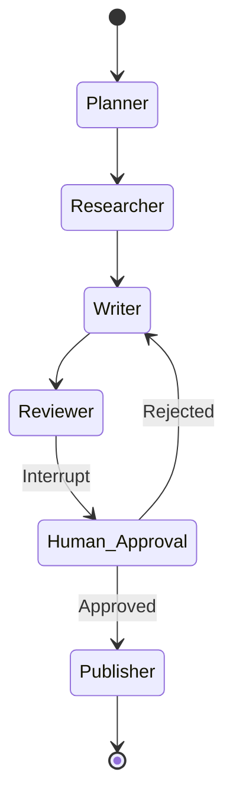

WEEK 20 · DAY 143
# ReAct & Plan-and-Solve
Reasoning and Acting Frameworks
⏳ 45 mins
Difficulty: Medium
💬 Hinglish Explanation:
### 🎯 By the end of Day 143, you will:
- Implement a ReAct loop using LangChain.
- Implement and evaluate when to use Plan-and-Solve.
#### 🚦 Before You Start Checklist:
- LangChain installed
## 🧠 Theory
Analogy:
ReAct & Plan-and-Solve
💡 Gotcha & Common Pitfall Warning:
Always double check tensor dimensions, verify data types before matrix operations, and ensure feature scaling is fitted strictly on the training set to prevent data leakage.
### ReAct Prompting
A ReAct agent cycles through Thought -> Action -> Observation until it has the final answer.
python
```python
from langchain import hub
from langchain.agents import AgentExecutor, create_react_agent
from langchain_community.tools.tavily_search import TavilySearchResults
from langchain_openai import OpenAI

tools = [TavilySearchResults(max_results=1)]
prompt = hub.pull("hwchase17/react")
llm = OpenAI()

agent = create_react_agent(llm, tools, prompt)
agent_executor = AgentExecutor(agent=agent, tools=tools, verbose=True)

# Example: Thought -> Action(Search) -> Observation -> Final Answer
agent_executor.invoke({"input": "What is the current weather in SF?"})
```
### 🤔 Predict the Output
What happens if the Action fails (e.g., API is down) in a ReAct loop?
Check
## ⚡ Tasks
**Task 1: Plan-and-Solve Agent · MEDIUM · ⏱ 45 mins**
Write the setup for an experimental `PlanAndExecute` agent in LangChain.
**Task**
## 🧪 Day 143 Knowledge Check
**Q:** When is Plan-and-Solve better than ReAct?
  - For long-horizon tasks requiring multi-step planning upfront
  - For simple calculator operations
  - When using smaller LLMs
## 🧪 Applied Extension Checks
**Q:** Concept check — for ReAct & Plan-and-Solve, which evaluation approach is most defensible?
  - A) Use a task-specific baseline and measure quality, latency, cost, and failure modes before scaling ReAct & Plan-and-Solve.
  - B) Adopt ReAct & Plan-and-Solve without a baseline because a larger system is automatically better.
  - C) Remove evaluation so the team can move faster.
  - D) Hard-code credentials and environment-specific values.
**Q:** Debugging check — what should you verify first when implementing ReAct & Plan-and-Solve?
  - A) Reproduce the issue with a small deterministic fixture, then inspect inputs, configuration, dependencies, and expected outputs.
  - B) Skip reproduction and immediately increase model size or production traffic.
  - C) Remove evaluation so the team can move faster.
  - D) Hard-code credentials and environment-specific values.
**Q:** Production scenario — what control belongs in a launch plan for ReAct & Plan-and-Solve?
  - A) Use a canary or staged rollout with quality and latency telemetry, budget/security checks, and a tested rollback path.
  - B) Ship globally after one successful demo and assume there are no operational risks.
  - C) Remove evaluation so the team can move faster.
  - D) Hard-code credentials and environment-specific values.
## 🃏 Revision Flashcards
**Flashcard:** ReAct Loop
> Thought -> Action (Tool) -> Observation -> Repeat until Answer.
**Flashcard:** Plan-and-Solve
> Creates a full step-by-step plan first, then executes it sequentially.
**Flashcard:** ReAct Observation
> The output of an Action (tool call) returned back to the agent to inform its next Thought.
### ✅ Key Takeaways
"ReAct is great for dynamic problems. Plan-and-Solve is better when the path to the solution is long but predictable."
- ReAct integrates reasoning with taking action.
- Agents can enter infinite loops if not capped (`max_iterations`).
## 📚 Recommended Resources
📄
#### ReAct Paper
Synergizing Reasoning and Acting in Language Models
WEEK 20 · DAY 144
# Structured Output via Instructor
Enforcing JSON with Pydantic
⏳ 40 mins
Difficulty: Medium
💬 Hinglish Explanation:
💡 Gotcha & Common Pitfall Warning:
Always double check tensor dimensions, verify data types before matrix operations, and ensure feature scaling is fitted strictly on the training set to prevent data leakage.
### 🎯 By the end of Day 144, you will:
- Use `instructor` to extract structured data.
- Define schemas using Pydantic.
#### 🚦 Before You Start Checklist:
- Basic knowledge of Python Pydantic
## 🧠 Theory
Analogy:
Structured Output via Instructor
💡 Gotcha & Common Pitfall Warning:
Always double check tensor dimensions, verify data types before matrix operations, and ensure feature scaling is fitted strictly on the training set to prevent data leakage.
### Instructor & Pydantic
By patching the OpenAI client, `instructor` leverages OpenAI's function calling/JSON mode to return validated Pydantic objects directly.
python
```python
import instructor
from pydantic import BaseModel
from openai import OpenAI

# Patch the OpenAI client
client = instructor.from_openai(OpenAI())

# Define your desired output structure
class UserDetail(BaseModel):
    name: str
    age: int
    occupations: list[str]

# Call the model
user_info = client.chat.completions.create(
    model="gpt-4o",
    response_model=UserDetail,
    messages=[
        {"role": "user", "content": "John Doe is 30 years old and works as a plumber and a chef."}
    ]
)

print(user_info.name) # John Doe
print(user_info.occupations) # ['plumber', 'chef']
```
### 🤔 Predict the Output
What happens if the LLM forgets a required field in the JSON?
Check
## ⚡ Tasks
**Task 1: Extractor Schema · MEDIUM · EASY · ⏱ 45 mins**
Create a Pydantic schema for extracting a Receipt (Store name, total amount, list of items with price).
**Bonus Task: Nested Pydantic · MEDIUM · MED · ⏱ 45 mins**
Create an Instructor schema for a research paper (title, authors list, abstract, list of citations with DOI).
**Task**
## 🧪 Day 144 Knowledge Check
**Q:** Why is structured output critical for Agents?
  - It makes the LLM run faster
  - It allows safe programmatic consumption of LLM outputs by downstream code
  - It reduces API costs
## 🧪 Applied Extension Checks
**Q:** Concept check — for Structured Output via Instructor, which evaluation approach is most defensible?
  - A) Use a task-specific baseline and measure quality, latency, cost, and failure modes before scaling Structured Output via Instructor.
  - B) Adopt Structured Output via Instructor without a baseline because a larger system is automatically better.
  - C) Remove evaluation so the team can move faster.
  - D) Hard-code credentials and environment-specific values.
**Q:** Debugging check — what should you verify first when implementing Structured Output via Instructor?
  - A) Reproduce the issue with a small deterministic fixture, then inspect inputs, configuration, dependencies, and expected outputs.
  - B) Skip reproduction and immediately increase model size or production traffic.
  - C) Remove evaluation so the team can move faster.
  - D) Hard-code credentials and environment-specific values.
**Q:** Production scenario — what control belongs in a launch plan for Structured Output via Instructor?
  - A) Use a canary or staged rollout with quality and latency telemetry, budget/security checks, and a tested rollback path.
  - B) Ship globally after one successful demo and assume there are no operational risks.
  - C) Remove evaluation so the team can move faster.
  - D) Hard-code credentials and environment-specific values.
## 🃏 Revision Flashcards
**Flashcard:** Instructor Library
> A Python library that patches LLM clients to return validated Pydantic objects.
**Flashcard:** Pydantic
> Data validation and settings management using Python type annotations.
**Flashcard:** Instructor Retry
> If Pydantic validation fails, Instructor auto-retries the LLM call with the validation error in the prompt.
### ✅ Key Takeaways
"Never parse LLM text manually. Always use Pydantic/Instructor to enforce JSON schemas!"
- Instructor automatically retries if validation fails.
- It leverages function calling under the hood.
## 📚 Recommended Resources
📖
#### Instructor Docs
Official Documentation for Instructor
WEEK 20 · DAY 145
# LangGraph StateGraph
Stateful Multi-Actor Applications
⏳ 60 mins
Difficulty: Hard
💬 Hinglish Explanation:
💡 Gotcha & Common Pitfall Warning:
Always double check tensor dimensions, verify data types before matrix operations, and ensure feature scaling is fitted strictly on the training set to prevent data leakage.
### 🎯 By the end of Day 145, you will:
- Implement and evaluate LangGraph's cyclic architecture.
- Build a `StateGraph`.
#### 🚦 Before You Start Checklist:
- Knowledge of Directed Cyclic Graphs
## 🧠 Theory
Analogy:
LangGraph StateGraph
💡 Gotcha & Common Pitfall Warning:
Always double check tensor dimensions, verify data types before matrix operations, and ensure feature scaling is fitted strictly on the training set to prevent data leakage.
### Building a StateGraph
python
```python
from typing import TypedDict, Annotated
from langgraph.graph import StateGraph, END
import operator

# Define the State
class AgentState(TypedDict):
    messages: Annotated[list, operator.add]

# Define nodes (functions)
def bot(state: AgentState):
    return {"messages": ["Hello from bot!"]}

def action(state: AgentState):
    return {"messages": ["Action executed!"]}

# Build Graph
graph = StateGraph(AgentState)
graph.add_node("bot", bot)
graph.add_node("action", action)

graph.set_entry_point("bot")
graph.add_edge("bot", "action")
graph.add_edge("action", END)

app = graph.compile()
out = app.invoke({"messages": ["Start"]})
print(out["messages"]) # ['Start', 'Hello from bot!', 'Action executed!']
```
### 🤔 Predict the Output
What does `operator.add` do in the `Annotated[list, operator.add]` state definition?
Check
## ⚡ Tasks
**Task 1: Conditional Edges · MEDIUM · ⏱ 45 mins**
Write a LangGraph snippet that uses a conditional edge `add_conditional_edges()` to route to "tools" or "end".
**Bonus Task: Interrupt & Resume · MEDIUM · HARD · ⏱ 45 mins**
Build a LangGraph with a tool node and add an interrupt. Test pausing execution and resuming with app.invoke(None, thread).
**Task**
## 🧪 Day 145 Knowledge Check
**Q:** Why use LangGraph instead of standard AgentExecutor?
  - It is written in Rust
  - It allows custom cycles, fine-grained state management, and multi-agent coordination
  - It uses less API tokens
## 🧪 Applied Extension Checks
**Q:** Concept check — for LangGraph StateGraph, which evaluation approach is most defensible?
  - A) Use a task-specific baseline and measure quality, latency, cost, and failure modes before scaling LangGraph StateGraph.
  - B) Adopt LangGraph StateGraph without a baseline because a larger system is automatically better.
  - C) Remove evaluation so the team can move faster.
  - D) Hard-code credentials and environment-specific values.
**Q:** Debugging check — what should you verify first when implementing LangGraph StateGraph?
  - A) Reproduce the issue with a small deterministic fixture, then inspect inputs, configuration, dependencies, and expected outputs.
  - B) Skip reproduction and immediately increase model size or production traffic.
  - C) Remove evaluation so the team can move faster.
  - D) Hard-code credentials and environment-specific values.
**Q:** Production scenario — what control belongs in a launch plan for LangGraph StateGraph?
  - A) Use a canary or staged rollout with quality and latency telemetry, budget/security checks, and a tested rollback path.
  - B) Ship globally after one successful demo and assume there are no operational risks.
  - C) Remove evaluation so the team can move faster.
  - D) Hard-code credentials and environment-specific values.
## 🃏 Revision Flashcards
**Flashcard:** LangGraph State
> A TypedDict that is passed to every node. Nodes return updates to this state.
**Flashcard:** Conditional Edge
> A routing function that dynamically decides the next node based on the current State.
**Flashcard:** LANGGRAPH END
> The special sentinel node that terminates the graph's execution.
### ✅ Key Takeaways
"LangGraph control flow ko graph jaisa treat karta hai, which is perfect for complex LLM workflows."
- Nodes are python functions that modify state.
- Edges determine the flow, allowing loops.
## 📚 Recommended Resources
🕸️
#### LangGraph
Official LangGraph Documentation
WEEK 20 · DAY 146
# Multi-Agent Systems
CrewAI and Role-Playing Agents
⏳ 50 mins
Difficulty: Medium
💬 Hinglish Explanation:
💡 Gotcha & Common Pitfall Warning:
Always double check tensor dimensions, verify data types before matrix operations, and ensure feature scaling is fitted strictly on the training set to prevent data leakage.
### 🎯 By the end of Day 146, you will:
- Create a multi-agent workforce using CrewAI.
- Define Agents, Tasks, and Crews.
#### 🚦 Before You Start Checklist:
- `pip install crewai`
## 🧠 Theory
Analogy:
Multi-Agent Systems
💡 Gotcha & Common Pitfall Warning:
Always double check tensor dimensions, verify data types before matrix operations, and ensure feature scaling is fitted strictly on the training set to prevent data leakage.
### CrewAI Architecture
CrewAI orchestrates agents by giving them specific roles, goals, and backstories.
python
```python
from crewai import Agent, Task, Crew, Process

# 1. Define Agents
researcher = Agent(
    role='Senior Tech Researcher',
    goal='Uncover the latest trends in AI',
    backstory='You are an expert at analyzing tech news.',
    verbose=True,
    allow_delegation=False
)
writer = Agent(
    role='Tech Content Writer',
    goal='Write a compelling blog post',
    backstory='You write engaging and clear tech articles.',
    verbose=True
)

# 2. Define Tasks
task1 = Task(description='Research CrewAI framework.', expected_output='A summary of CrewAI.', agent=researcher)
task2 = Task(description='Write a blog post from the research.', expected_output='A 3-paragraph blog post.', agent=writer)

# 3. Form the Crew
crew = Crew(
    agents=[researcher, writer],
    tasks=[task1, task2],
    process=Process.sequential # Task 1 then Task 2
)

result = crew.kickoff()
print(result)
```
### 🤔 Predict the Output
If `process=Process.hierarchical` is used, what is required?
Check
## ⚡ Tasks
**Task 1: Tools in CrewAI · MEDIUM · EASY · ⏱ 45 mins**
Modify the `researcher` agent to include a `search_tool`.
**Task**
## 🧪 Day 146 Knowledge Check
**Q:** What is `allow_delegation` in CrewAI?
  - It allows an agent to ask another agent for help or pass on a task
  - It delegates API calls to a cheaper model
  - It runs tasks in parallel
## 🧪 Applied Extension Checks
**Q:** Concept check — for Multi-Agent Systems, which evaluation approach is most defensible?
  - A) Use a task-specific baseline and measure quality, latency, cost, and failure modes before scaling Multi-Agent Systems.
  - B) Adopt Multi-Agent Systems without a baseline because a larger system is automatically better.
  - C) Remove evaluation so the team can move faster.
  - D) Hard-code credentials and environment-specific values.
**Q:** Debugging check — what should you verify first when implementing Multi-Agent Systems?
  - A) Reproduce the issue with a small deterministic fixture, then inspect inputs, configuration, dependencies, and expected outputs.
  - B) Skip reproduction and immediately increase model size or production traffic.
  - C) Remove evaluation so the team can move faster.
  - D) Hard-code credentials and environment-specific values.
**Q:** Production scenario — what control belongs in a launch plan for Multi-Agent Systems?
  - A) Use a canary or staged rollout with quality and latency telemetry, budget/security checks, and a tested rollback path.
  - B) Ship globally after one successful demo and assume there are no operational risks.
  - C) Remove evaluation so the team can move faster.
  - D) Hard-code credentials and environment-specific values.
## 🃏 Revision Flashcards
**Flashcard:** Agent Backstory
> Provides persona context in CrewAI, helping the LLM adopt the right tone and logic.
**Flashcard:** Sequential vs Hierarchical
> Sequential: Linear task flow. Hierarchical: A manager agent distributes tasks dynamically.
**Flashcard:** CrewAI Task Output
> The `expected_output` field tells the agent exactly what format and content is required to be correct.
### ✅ Key Takeaways
"Role-playing is powerful. A 'Writer' and 'Researcher' cooperating produces better results than one generic 'Assistant'."
- CrewAI simplifies multi-agent orchestration.
- Agents perform best with specific, narrow scopes.
## 📚 Recommended Resources
👥
#### CrewAI Github
Official Repository
WEEK 20 · DAY 147
# Vector Memory & Coreference
Long-term Memory for Agents
⏳ 50 mins
Difficulty: Hard
💬 Hinglish Explanation:
💡 Gotcha & Common Pitfall Warning:
Always double check tensor dimensions, verify data types before matrix operations, and ensure feature scaling is fitted strictly on the training set to prevent data leakage.
### 🎯 By the end of Day 147, you will:
- Implement VectorStore-backed memory.
- Solve Coreference Resolution (e.g. "it", "he") for search queries.
#### 🚦 Before You Start Checklist:
- Understanding of embeddings
## 🧠 Theory
Analogy:
Vector Memory & Coreference
💡 Gotcha & Common Pitfall Warning:
Always double check tensor dimensions, verify data types before matrix operations, and ensure feature scaling is fitted strictly on the training set to prevent data leakage.
### Coreference Resolution in RAG
If user asks "What is LangChain?", then follows up with "Who created it?", searching "Who created it?" in a vector DB fails because "it" lacks context. We must rewrite the query.
python
```python
from langchain.chains import create_history_aware_retriever
from langchain_core.prompts import MessagesPlaceholder, ChatPromptTemplate

# 1. Prompt to rewrite query based on history
contextualize_q_system_prompt = (
    "Given a chat history and the latest user question "
    "which might reference context in the chat history, "
    "formulate a standalone question which can be understood "
    "without the chat history."
)
contextualize_q_prompt = ChatPromptTemplate.from_messages(
    [
        ("system", contextualize_q_system_prompt),
        MessagesPlaceholder("chat_history"),
        ("human", "{input}"),
    ]
)

# 2. History Aware Retriever
history_aware_retriever = create_history_aware_retriever(
    llm, retriever, contextualize_q_prompt
)
# Automatically rewrites "Who created it?" -> "Who created LangChain?" before searching.
```
### 🤔 Predict the Output
What happens if you skip history-aware retrieval and just embed the raw follow-up query?
Check
## ⚡ Tasks
**Task 1: Zep Memory · MEDIUM · ⏱ 45 mins**
Zep is a long-term memory store for LLM apps. Check its basic integration API concept.
**Bonus Task: Conversational RAG · MEDIUM · HARD · ⏱ 45 mins**
Wire create_history_aware_retriever and create_retrieval_chain together into a full multi-turn chatbot.
**Task**
## 🧪 Day 147 Knowledge Check
**Q:** What is Coreference Resolution?
  - Replacing pronouns (he/it) with their actual entities from previous context
  - Compressing vectors
  - Resolving API timeouts
## 🧪 Applied Extension Checks
**Q:** Concept check — for Vector Memory & Coreference, which evaluation approach is most defensible?
  - A) Use a task-specific baseline and measure quality, latency, cost, and failure modes before scaling Vector Memory & Coreference.
  - B) Adopt Vector Memory & Coreference without a baseline because a larger system is automatically better.
  - C) Remove evaluation so the team can move faster.
  - D) Hard-code credentials and environment-specific values.
**Q:** Debugging check — what should you verify first when implementing Vector Memory & Coreference?
  - A) Reproduce the issue with a small deterministic fixture, then inspect inputs, configuration, dependencies, and expected outputs.
  - B) Skip reproduction and immediately increase model size or production traffic.
  - C) Remove evaluation so the team can move faster.
  - D) Hard-code credentials and environment-specific values.
**Q:** Production scenario — what control belongs in a launch plan for Vector Memory & Coreference?
  - A) Use a canary or staged rollout with quality and latency telemetry, budget/security checks, and a tested rollback path.
  - B) Ship globally after one successful demo and assume there are no operational risks.
  - C) Remove evaluation so the team can move faster.
  - D) Hard-code credentials and environment-specific values.
## 🃏 Revision Flashcards
**Flashcard:** History-Aware Retriever
> Uses an LLM to rewrite the user's latest query using chat history before querying the vector DB.
**Flashcard:** Vector Memory
> Storing entire past conversations in a vector DB and retrieving relevant past turns dynamically.
**Flashcard:** Zep
> A memory service for LLMs that auto-summarises and vectorises conversation history.
### ✅ Key Takeaways
"Vector search is stateless. You must contextualize the query using history to make memory work!"
- Never embed raw follow-up questions directly.
- Dedicated memory servers like Zep handle auto-summarization and vectorization.
## 📚 Recommended Resources
🦜
#### LangChain Chat History
Docs on conversational RAG
WEEK 20 · DAY 148
# Human-in-the-loop (HITL)
LangGraph Interruptions
⏳ 45 mins
Difficulty: Medium
💬 Hinglish Explanation:
💡 Gotcha: LLM-as-a-Judge Position & Self-Enhancement Bias
Using an LLM to evaluate two model outputs suffers from position bias (favoring answer A over B) and self-enhancement bias (favoring outputs generated by its own model family). Always swap answer positions and average evaluation scores.
### 🎯 By the end of Day 148, you will:
- Implement thread persistence in LangGraph.
- Use `interrupt_before` to pause execution for human approval.
#### 🚦 Before You Start Checklist:
- Reviewed Day 145 (StateGraph)
## 🧠 Theory
Analogy:
Human-in-the-loop (HITL)
💡 Gotcha & Common Pitfall Warning:
Always double check tensor dimensions, verify data types before matrix operations, and ensure feature scaling is fitted strictly on the training set to prevent data leakage.
### LangGraph Persister & Interrupts
To pause a graph, we need a memory persister (so state isn't lost) and an interrupt flag on a specific node.
python
```python
from langgraph.checkpoint.sqlite import SqliteSaver

memory = SqliteSaver.from_conn_string(":memory:")

# Assuming 'graph' is built with a "tools" node
app = graph.compile(
    checkpointer=memory,
    interrupt_before=["tools"] # Graph pauses BEFORE executing 'tools' node
)

thread = {"configurable": {"thread_id": "1"}}
state = app.invoke({"messages": ["Send email to CEO"]}, thread)

print("Paused state:", state)

# Human approves! Continue execution:
state_after = app.invoke(None, thread)
```
### 🤔 Predict the Output
If the human wants to modify the state (e.g. edit the drafted email) before continuing, what LangGraph function is used?
Check
## ⚡ Tasks
**Task 1: Time Travel · MEDIUM · ⏱ 45 mins**
In LangGraph, you can retrieve past states using `get_state_history`. Write the snippet to print the last 3 states.
**Task**
## 🧪 Day 148 Knowledge Check
**Q:** Why is a checkpointer required for `interrupt_before`?
  - Because the process might exit, so the state must be saved to disk/DB to resume later
  - To check for API limits
  - To validate Pydantic models
## 🧪 Applied Extension Checks
**Q:** Concept check — for Human-in-the-loop (HITL), which evaluation approach is most defensible?
  - A) Use a task-specific baseline and measure quality, latency, cost, and failure modes before scaling Human-in-the-loop (HITL).
  - B) Adopt Human-in-the-loop (HITL) without a baseline because a larger system is automatically better.
  - C) Remove evaluation so the team can move faster.
  - D) Hard-code credentials and environment-specific values.
**Q:** Debugging check — what should you verify first when implementing Human-in-the-loop (HITL)?
  - A) Reproduce the issue with a small deterministic fixture, then inspect inputs, configuration, dependencies, and expected outputs.
  - B) Skip reproduction and immediately increase model size or production traffic.
  - C) Remove evaluation so the team can move faster.
  - D) Hard-code credentials and environment-specific values.
**Q:** Production scenario — what control belongs in a launch plan for Human-in-the-loop (HITL)?
  - A) Use a canary or staged rollout with quality and latency telemetry, budget/security checks, and a tested rollback path.
  - B) Ship globally after one successful demo and assume there are no operational risks.
  - C) Remove evaluation so the team can move faster.
  - D) Hard-code credentials and environment-specific values.
## 🃏 Revision Flashcards
**Flashcard:** interrupt_before
> Pauses the LangGraph execution right before a specified node runs.
**Flashcard:** update_state
> Allows a human to modify the graph's state manually while it is paused.
**Flashcard:** interrupt_after
> Pauses the graph AFTER a node runs, useful for reviewing outputs before they feed to the next step.
### ✅ Key Takeaways
"HITL ensures safety. Always interrupt before destructive actions (writes, emails, payments)."
- LangGraph handles state persistence automatically via Checkpointers.
- You can 'time travel' by resuming from older thread states.
## 📚 Recommended Resources
🕸️
#### LangGraph HITL
Human-in-the-loop documentation
WEEK 20 · DAY 149
# Capstone: Multi-Agent System
End-to-End Research & Writing Agent
⏳ 120 mins
Difficulty: CAPSTONE
💬 Hinglish Explanation:
💡 Gotcha: Common Pitfalls in Day-149
Always validate underlying data assumptions, check tensor shape alignments, and verify hyperparameter scaling before running production training or evaluation loops.
### 🎯 By the end of Day 149, you will:
- Combine StateGraph, HITL, and structured outputs.
- Build a resilient multi-step agent workflow.
#### 🚦 Before You Start Checklist:
- Reviewed Days 143-148
## 🧠 Theory
Analogy:
Capstone: Multi-Agent System
💡 Gotcha & Common Pitfall Warning:
Always double check tensor dimensions, verify data types before matrix operations, and ensure feature scaling is fitted strictly on the training set to prevent data leakage.
### The Agentic Workflow Architecture

This graph utilizes looping (Reviewer rejecting work sends it back to Writer) and HITL (Human must approve the final draft).
python
```python
# Conceptual structure for the Capstone Graph
# 1. State definition
class ResearchState(TypedDict):
    topic: str
    plan: list[str]
    draft: str
    feedback: str

# 2. Nodes: plan_node, research_node, write_node, review_node
# 3. Conditional Edges
def route_review(state):
    if "looks good" in state["feedback"].lower():
        return "human_approval"
    return "writer"

# ... compile with checkpointer and interrupt_before=["human_approval"]
```
### 🤔 Predict the Output
In a production system, how would the 'human_approval' step be implemented on the frontend?
Check
## ⚡ Tasks
**Task 1: Full Implementation · MEDIUM · CAPSTONE · ⏱ 45 mins**
Write the complete code for the Research-Write-Review LangGraph agent.
**Task**
## 🧪 Day 149 Knowledge Check
**Q:** Which design pattern prevents an agent from getting stuck in an infinite research loop?
  - More RAM
  - Setting a max recursion limit in LangGraph compile() or State
  - Using a smaller LLM
## 🧪 Applied Extension Checks
**Q:** Concept check — for Capstone: Multi-Agent System, which evaluation approach is most defensible?
  - A) Use a task-specific baseline and measure quality, latency, cost, and failure modes before scaling Capstone: Multi-Agent System.
  - B) Adopt Capstone: Multi-Agent System without a baseline because a larger system is automatically better.
  - C) Remove evaluation so the team can move faster.
  - D) Hard-code credentials and environment-specific values.
**Q:** Debugging check — what should you verify first when implementing Capstone: Multi-Agent System?
  - A) Reproduce the issue with a small deterministic fixture, then inspect inputs, configuration, dependencies, and expected outputs.
  - B) Skip reproduction and immediately increase model size or production traffic.
  - C) Remove evaluation so the team can move faster.
  - D) Hard-code credentials and environment-specific values.
**Q:** Production scenario — what control belongs in a launch plan for Capstone: Multi-Agent System?
  - A) Use a canary or staged rollout with quality and latency telemetry, budget/security checks, and a tested rollback path.
  - B) Ship globally after one successful demo and assume there are no operational risks.
  - C) Remove evaluation so the team can move faster.
  - D) Hard-code credentials and environment-specific values.
## 🃏 Revision Flashcards
**Flashcard:** Cyclic Graph
> A graph where edges can loop back to previous nodes (e.g., Writer -> Reviewer -> Writer).
**Flashcard:** Agent Workforce
> Multiple specialized LLM agents coordinating via a shared state or hierarchical management.
**Flashcard:** Agent Recursion Limit
> LangGraph's `recursion_limit` in compile() prevents infinite tool-calling loops.
### ✅ Key Takeaways
"Single prompt LLMs are toys. Multi-agent state machines are production apps."
- Break complex tasks down using Plan-and-Solve.
- Use LangGraph for deterministic control flow over agent reasoning.
## 📚 Recommended Resources
📰
#### LangChain Blog
Introduction to LangGraph Multi-Agent Workflows
