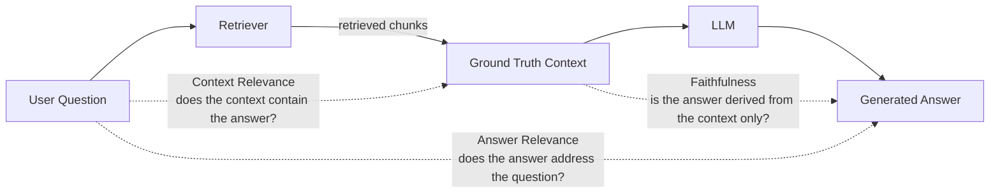

WEEK 22 · DAY 157
# LLM Evaluation Metrics
DeepEval & Ragas for RAG Testing
⏳ 45 mins
Difficulty: Hard
💬 Hinglish Explanation:
### 🎯 By the end of Day 157, you will:
- Implement and evaluate RAG evaluation metrics (Faithfulness, Answer Relevance).
- Implement automated testing using DeepEval.
#### 🚦 Before You Start Checklist:
- OpenAI API Key set (used as Judge)
## 🧠 Theory
Analogy:
LLM Evaluation Metrics
### Metrics (RAG Triad)

*The RAG Triad — three judge metrics that close the loop on a RAG answer*
- **Context Relevance:** Does the retrieved context actually contain the answer?
- **Faithfulness:** Is the generated answer completely derived from the retrieved context? (Prevents hallucinations).
- **Answer Relevance:** Does the generated answer directly address the user's question?
python
```python
from deepeval import assert_test
from deepeval.test_case import LLMTestCase
from deepeval.metrics import AnswerRelevancyMetric

# 1. Create a Test Case based on an actual RAG interaction
test_case = LLMTestCase(
    input="What is the capital of France?",
    actual_output="Paris is the capital of France.",
    retrieval_context=["Paris is the capital and most populous city of France."]
)

# 2. Define the Metric using GPT-4 as the Judge
answer_relevancy_metric = AnswerRelevancyMetric(threshold=0.7)

# 3. Assert (Will throw error if score < threshold)
assert_test(test_case, [answer_relevancy_metric])
```
### 🤔 Predict the Output
If the user asks "How tall is the Eiffel Tower?" and the LLM answers "It is located in Paris", which metric will fail?
Check
## ⚡ Tasks
**Task 1: Faithfulness Metric · MEDIUM · ⏱ 45 mins**
Write a DeepEval snippet that tests `FaithfulnessMetric` on a hallucinated output.
**Task**
## 🧪 Day 157 Knowledge Check
**Q:** Why use LLM-as-a-Judge instead of exact string matching?
  - It is cheaper
  - LLM answers are phrased differently every time, exact matching yields false negatives
  - It is faster
## 🧪 Applied Extension Checks
**Q:** Concept check — for LLM Evaluation Metrics, which evaluation approach is most defensible?
  - A) Use a task-specific baseline and measure quality, latency, cost, and failure modes before scaling LLM Evaluation Metrics.
  - B) Adopt LLM Evaluation Metrics without a baseline because a larger system is automatically better.
  - C) Remove evaluation so the team can move faster.
  - D) Hard-code credentials and environment-specific values.
**Q:** Debugging check — what should you verify first when implementing LLM Evaluation Metrics?
  - A) Reproduce the issue with a small deterministic fixture, then inspect inputs, configuration, dependencies, and expected outputs.
  - B) Skip reproduction and immediately increase model size or production traffic.
  - C) Remove evaluation so the team can move faster.
  - D) Hard-code credentials and environment-specific values.
**Q:** Production scenario — what control belongs in a launch plan for LLM Evaluation Metrics?
  - A) Use a canary or staged rollout with quality and latency telemetry, budget/security checks, and a tested rollback path.
  - B) Ship globally after one successful demo and assume there are no operational risks.
  - C) Remove evaluation so the team can move faster.
  - D) Hard-code credentials and environment-specific values.
## 🃏 Revision Flashcards
**Flashcard:** LLM-as-a-Judge
> Using a powerful model (like GPT-4) to grade the output of another model based on a strict grading rubric.
**Flashcard:** Faithfulness
> Measures if the generated answer can be entirely supported by the retrieved context. (Checks for hallucination).
**Flashcard:** RAGAS
> An open-source framework specifically for evaluating RAG pipelines using context precision and answer correctness.
### ✅ Key Takeaways
"Vibes-based testing doesn't scale. Automate your prompt evaluations in CI/CD pipelines!"
- DeepEval and Ragas are industry standards for LLM testing.
- They can easily integrate into GitHub Actions via `pytest`.
## 📚 Recommended Resources
📖
#### DeepEval Docs
Official Documentation
WEEK 22 · DAY 158
# Observability & Tracing
Langfuse and App Telemetry
⏳ 40 mins
Difficulty: Medium
💬 Hinglish Explanation:
💡 Gotcha & Common Pitfall Warning:
Always double check tensor dimensions, verify data types before matrix operations, and ensure feature scaling is fitted strictly on the training set to prevent data leakage.
### 🎯 By the end of Day 158, you will:
- Implement tracing using Langfuse.
- Track tokens, latency, and costs per user.
#### 🚦 Before You Start Checklist:
- Free account on Langfuse Cloud
## 🧠 Theory
Analogy:
Observability & Tracing
💡 Gotcha & Common Pitfall Warning:
Always double check tensor dimensions, verify data types before matrix operations, and ensure feature scaling is fitted strictly on the training set to prevent data leakage.
### Langfuse Traces
A Trace represents a single user interaction (e.g., a conversation turn). Spans represent internal steps (e.g., DB lookup). Generations track the actual LLM API calls and tokens.
python
```python
from langfuse.decorators import observe
import openai

# Use @observe decorator to automatically trace this function
@observe()
def generate_story(topic: str):
    response = openai.chat.completions.create(
        model="gpt-3.5-turbo",
        messages=[{"role": "user", "content": f"Tell a story about {topic}"}],
    )
    return response.choices[0].message.content

# Calling this will send traces and token costs to Langfuse dashboard automatically
generate_story("a brave knight")
```
### 🤔 Predict the Output
Why do we need session tracking in observability?
Check
## ⚡ Tasks
**Task 1: LangChain Callback Integration · MEDIUM · EASY · ⏱ 45 mins**
Write the code to add Langfuse tracing directly into a LangChain execution.
**Bonus Task: Cost Tracking · MEDIUM · MED · ⏱ 45 mins**
Modify the Langfuse handler to also log user_id metadata per trace for per-user cost attribution.
**Task**
## 🧪 Day 158 Knowledge Check
**Q:** What is a Span in tracing terminology?
  - The entire user conversation
  - An individual unit of work within a trace (e.g., retrieving from a DB)
  - The total cost of the API call
## 🧪 Applied Extension Checks
**Q:** Concept check — for Observability & Tracing, which evaluation approach is most defensible?
  - A) Use a task-specific baseline and measure quality, latency, cost, and failure modes before scaling Observability & Tracing.
  - B) Adopt Observability & Tracing without a baseline because a larger system is automatically better.
  - C) Remove evaluation so the team can move faster.
  - D) Hard-code credentials and environment-specific values.
**Q:** Debugging check — what should you verify first when implementing Observability & Tracing?
  - A) Reproduce the issue with a small deterministic fixture, then inspect inputs, configuration, dependencies, and expected outputs.
  - B) Skip reproduction and immediately increase model size or production traffic.
  - C) Remove evaluation so the team can move faster.
  - D) Hard-code credentials and environment-specific values.
**Q:** Production scenario — what control belongs in a launch plan for Observability & Tracing?
  - A) Use a canary or staged rollout with quality and latency telemetry, budget/security checks, and a tested rollback path.
  - B) Ship globally after one successful demo and assume there are no operational risks.
  - C) Remove evaluation so the team can move faster.
  - D) Hard-code credentials and environment-specific values.
## 🃏 Revision Flashcards
**Flashcard:** LLM Observability
> Monitoring LLM applications in production to track performance, latency, errors, and costs.
**Flashcard:** @observe
> A Python decorator (from Langfuse) that instantly tracks execution time and internal LLM calls of any function.
**Flashcard:** Langfuse Prompt Management
> Langfuse stores versioned prompts server-side, enabling A/B testing and instant rollback without redeployment.
### ✅ Key Takeaways
"Never ship to production without tracing! You need to know exactly how much each user is costing you."
- Langfuse, Arize, and Helicone are top choices for Observability.
- They track prompt versions, allowing you to A/B test system prompts.
## 📚 Recommended Resources
🔥
#### Langfuse Docs
Quickstart and Integrations
WEEK 22 · DAY 159
# Output Guardrails
Guardrails AI & NeMo
⏳ 50 mins
Difficulty: Hard
💬 Hinglish Explanation:
💡 Gotcha & Common Pitfall Warning:
Always double check tensor dimensions, verify data types before matrix operations, and ensure feature scaling is fitted strictly on the training set to prevent data leakage.
### 🎯 By the end of Day 159, you will:
- Implement and evaluate why prompt engineering isn't enough for security.
- Implement programmatic Guardrails.
#### 🚦 Before You Start Checklist:
- `pip install guardrails-ai`
## 🧠 Theory
Analogy:
Output Guardrails
💡 Gotcha & Common Pitfall Warning:
Always double check tensor dimensions, verify data types before matrix operations, and ensure feature scaling is fitted strictly on the training set to prevent data leakage.
### Guardrails AI
Guardrails execute independent validation logic (regex, smaller models, API checks) on the LLM's output before returning it to the user.
python
```python
from guardrails.hub import ProfanityFree
from guardrails import Guard
import openai

# 1. Setup the Guard with a specific Validator
guard = Guard().use(
    ProfanityFree, on_fail="fix" # Auto-fixes by removing the profanity
)

# 2. Run the LLM wrapped in the Guard
raw_llm_output, validated_output, *rest = guard(
    openai.chat.completions.create,
    model="gpt-3.5-turbo",
    messages=[{"role": "user", "content": "Write a sentence with a swear word."}]
)

print(validated_output) # Swear words will be redacted/removed!
```
### 🤔 Predict the Output
What happens if `on_fail="exception"` is used?
Check
## ⚡ Tasks
**Task 1: PII Masking · MEDIUM · ⏱ 45 mins**
Write a guard setup that uses `PIIFilter` to mask phone numbers and emails.
**Task**
## 🧪 Day 159 Knowledge Check
**Q:** Why use a Guardrail library instead of a prompt rule?
  - Prompts cost more money
  - Prompts can be easily bypassed (jailbroken). Programmatic guardrails run independent deterministic checks.
  - Prompts slow down generation
## 🧪 Applied Extension Checks
**Q:** Concept check — for Output Guardrails, which evaluation approach is most defensible?
  - A) Use a task-specific baseline and measure quality, latency, cost, and failure modes before scaling Output Guardrails.
  - B) Adopt Output Guardrails without a baseline because a larger system is automatically better.
  - C) Remove evaluation so the team can move faster.
  - D) Hard-code credentials and environment-specific values.
**Q:** Debugging check — what should you verify first when implementing Output Guardrails?
  - A) Reproduce the issue with a small deterministic fixture, then inspect inputs, configuration, dependencies, and expected outputs.
  - B) Skip reproduction and immediately increase model size or production traffic.
  - C) Remove evaluation so the team can move faster.
  - D) Hard-code credentials and environment-specific values.
**Q:** Production scenario — what control belongs in a launch plan for Output Guardrails?
  - A) Use a canary or staged rollout with quality and latency telemetry, budget/security checks, and a tested rollback path.
  - B) Ship globally after one successful demo and assume there are no operational risks.
  - C) Remove evaluation so the team can move faster.
  - D) Hard-code credentials and environment-specific values.
## 🃏 Revision Flashcards
**Flashcard:** Input Guardrail
> Checks the user's prompt BEFORE sending to LLM (e.g., rejecting prompt injections or jailbreaks).
**Flashcard:** Output Guardrail
> Checks the LLM's response BEFORE sending to the user (e.g., filtering PII, profanity, formatting issues).
**Flashcard:** Prompt Injection
> When malicious user input is crafted to override the system prompt and hijack the LLM. Input guardrails block this.
### ✅ Key Takeaways
"In enterprise, compliance is king. If your bot leaks an email, it's a huge lawsuit. Mask everything!"
- Guardrails decouple policy from the LLM prompt.
- NVIDIA NeMo Guardrails is another popular enterprise choice.
## 📚 Recommended Resources
🛡️
#### Guardrails Hub
Pre-built validators for LLMs
WEEK 22 · DAY 160
# Semantic Caching
Saving Costs and Reducing Latency
⏳ 40 mins
Difficulty: Medium
💬 Hinglish Explanation:
💡 Gotcha & Common Pitfall Warning:
Always double check tensor dimensions, verify data types before matrix operations, and ensure feature scaling is fitted strictly on the training set to prevent data leakage.
### 🎯 By the end of Day 160, you will:
- Implement and evaluate the limitations of exact-match caching.
- Implement Semantic Caching using GPTCache.
#### 🚦 Before You Start Checklist:
- Knowledge of embeddings
## 🧠 Theory
Analogy:
Semantic Caching
💡 Gotcha & Common Pitfall Warning:
Always double check tensor dimensions, verify data types before matrix operations, and ensure feature scaling is fitted strictly on the training set to prevent data leakage.
### GPTCache Setup
Semantic caching intercepts the API call. If the similarity score is above a threshold, it returns the cached response in <10ms.
python
```python
from gptcache import cache
from gptcache.adapter import openai
from gptcache.embedding import Onnx
from gptcache.manager import CacheBase, VectorBase, get_data_manager
from gptcache.similarity_evaluation.distance import SearchDistanceEvaluation

# 1. Initialize Cache
onnx = Onnx()
data_manager = get_data_manager(CacheBase("sqlite"), VectorBase("faiss", dimension=onnx.dimension))
cache.init(
    embedding_func=onnx.to_embeddings,
    data_manager=data_manager,
    similarity_evaluation=SearchDistanceEvaluation(),
)

# 2. First call (Takes 1-2 seconds, hits OpenAI)
response1 = openai.ChatCompletion.create(
    model='gpt-3.5-turbo',
    messages=[{"role": "user", "content": "Explain quantum computing in simple terms."}]
)

# 3. Second call with slightly different phrasing (Takes 10ms, hits Cache)
response2 = openai.ChatCompletion.create(
    model='gpt-3.5-turbo',
    messages=[{"role": "user", "content": "Can you explain quantum computing simply?"}]
)
```
### 🤔 Predict the Output
What is the main risk of setting the similarity threshold too low (e.g., 0.5)?
Check
## ⚡ Tasks
**Task 1: Redis Caching · MEDIUM · ⏱ 45 mins**
Write the setup to use Redis as the storage backend instead of SQLite for scalable caching.
**Bonus Task: Cache Stats · MEDIUM · HARD · ⏱ 45 mins**
Write code to log the cache hit rate (hits / total requests) after 100 queries and report cost savings estimate.
**Task**
## 🧪 Day 160 Knowledge Check
**Q:** How does Semantic Caching reduce API costs?
  - By intercepting similar queries and answering them locally without calling the paid API
  - By compressing the JSON payload
  - By lowering the temperature of the model
## 🧪 Applied Extension Checks
**Q:** Concept check — for Semantic Caching, which evaluation approach is most defensible?
  - A) Use a task-specific baseline and measure quality, latency, cost, and failure modes before scaling Semantic Caching.
  - B) Adopt Semantic Caching without a baseline because a larger system is automatically better.
  - C) Remove evaluation so the team can move faster.
  - D) Hard-code credentials and environment-specific values.
**Q:** Debugging check — what should you verify first when implementing Semantic Caching?
  - A) Reproduce the issue with a small deterministic fixture, then inspect inputs, configuration, dependencies, and expected outputs.
  - B) Skip reproduction and immediately increase model size or production traffic.
  - C) Remove evaluation so the team can move faster.
  - D) Hard-code credentials and environment-specific values.
**Q:** Production scenario — what control belongs in a launch plan for Semantic Caching?
  - A) Use a canary or staged rollout with quality and latency telemetry, budget/security checks, and a tested rollback path.
  - B) Ship globally after one successful demo and assume there are no operational risks.
  - C) Remove evaluation so the team can move faster.
  - D) Hard-code credentials and environment-specific values.
## 🃏 Revision Flashcards
**Flashcard:** Exact Cache
> Only hits if the string is identical. Useless for LLMs where users phrase things differently.
**Flashcard:** Semantic Cache
> Uses a vector DB to find conceptually similar past queries, serving cached answers to save time and money.
**Flashcard:** TTL (Cache)
> Time-to-Live. Semantic cache entries should expire (e.g. 24h) for time-sensitive questions.
### ✅ Key Takeaways
"For FAQs or high-traffic apps, 40% of queries might be repeats. Cache them!"
- Caching cuts costs directly.
- Latency drops from ~2000ms to ~10ms.
## 📚 Recommended Resources
💾
#### GPTCache
GitHub Repository
WEEK 22 · DAY 161
# API Gateways & Load Balancing
Managing 100+ Models with LiteLLM
⏳ 45 mins
Difficulty: Hard
💬 Hinglish Explanation:
💡 Gotcha & Common Pitfall Warning:
Always double check tensor dimensions, verify data types before matrix operations, and ensure feature scaling is fitted strictly on the training set to prevent data leakage.
### 🎯 By the end of Day 161, you will:
- Standardize API formats across providers.
- Implement Fallbacks and Retries.
- Implement Load Balancing.
#### 🚦 Before You Start Checklist:
- `pip install litellm`
## 🧠 Theory
Analogy:
API Gateways & Load Balancing
💡 Gotcha & Common Pitfall Warning:
Always double check tensor dimensions, verify data types before matrix operations, and ensure feature scaling is fitted strictly on the training set to prevent data leakage.
### Standardization & Fallbacks
LiteLLM allows you to call any provider using the standard OpenAI `chat.completions` syntax.
python
```python
from litellm import completion

# Call Anthropic exactly like OpenAI!
response = completion(
    model="claude-3-opus-20240229",
    messages=[{"role": "user", "content": "Hello"}],
)

# Implementing Failovers / Fallbacks
# If OpenAI is down (RateLimit), it automatically switches to Anthropic
response_fallback = completion(
    model="gpt-4",
    fallbacks=["claude-3-opus", "gemini-1.5-pro"],
    messages=[{"role": "user", "content": "Hello"}],
)
```
### Load Balancing via Proxy
LiteLLM Proxy can run as a standalone server acting as a gateway, distributing traffic across multiple API keys or Azure deployments.
### 🤔 Predict the Output
Why would a company want to use load balancing across 5 different OpenAI API keys?
Check
## ⚡ Tasks
**Task 1: Proxy Setup · MEDIUM · ⏱ 45 mins**
Write a `config.yaml` to set up LiteLLM Proxy with an OpenAI model and an Anthropic model.
**Bonus Task: Budget Router · MEDIUM · MED · ⏱ 45 mins**
Use LiteLLM budget routing to cap spend per user at \$0.01/day, routing to a cheaper model when the budget is hit.
**Task**
## 🧪 Day 161 Knowledge Check
**Q:** What is a Fallback in the context of LLM API calls?
  - Saving responses to a database
  - Automatically trying a different model provider if the primary one errors or times out
  - Rolling back weights to a previous version
## 🧪 Applied Extension Checks
**Q:** Concept check — for API Gateways & Load Balancing, which evaluation approach is most defensible?
  - A) Use a task-specific baseline and measure quality, latency, cost, and failure modes before scaling API Gateways & Load Balancing.
  - B) Adopt API Gateways & Load Balancing without a baseline because a larger system is automatically better.
  - C) Remove evaluation so the team can move faster.
  - D) Hard-code credentials and environment-specific values.
**Q:** Debugging check — what should you verify first when implementing API Gateways & Load Balancing?
  - A) Reproduce the issue with a small deterministic fixture, then inspect inputs, configuration, dependencies, and expected outputs.
  - B) Skip reproduction and immediately increase model size or production traffic.
  - C) Remove evaluation so the team can move faster.
  - D) Hard-code credentials and environment-specific values.
**Q:** Production scenario — what control belongs in a launch plan for API Gateways & Load Balancing?
  - A) Use a canary or staged rollout with quality and latency telemetry, budget/security checks, and a tested rollback path.
  - B) Ship globally after one successful demo and assume there are no operational risks.
  - C) Remove evaluation so the team can move faster.
  - D) Hard-code credentials and environment-specific values.
## 🃏 Revision Flashcards
**Flashcard:** LiteLLM
> A python library and proxy server that standardizes 100+ LLM APIs into the OpenAI format.
**Flashcard:** Load Balancing
> Distributing incoming traffic equally across multiple endpoints to avoid rate limits and improve latency.
**Flashcard:** LiteLLM Router
> The LiteLLM Router class enables client-side load balancing and fallback without running a proxy server.
### ✅ Key Takeaways
"Vendor lock-in is dangerous. Use a gateway so you can swap out OpenAI for Anthropic or Local models instantly!"
- Fallbacks ensure high availability (99.99% uptime).
- Gateways also centralize API key management and spend tracking.
## 📚 Recommended Resources
🚀
#### LiteLLM Docs
Routing and Fallback guides
WEEK 22 · DAY 162
# System Design Math
VRAM & Capacity Planning
⏳ 45 mins
Difficulty: Hard
💬 Hinglish Explanation:
💡 Gotcha: Data Drift vs Concept Drift
Data Drift occurs when input feature distributions shift $P(X)$. Concept Drift occurs when the underlying relationship between inputs and targets changes $P(Y \mid X)$. A model can suffer concept drift even if input feature statistics remain unchanged!
### 🎯 By the end of Day 162, you will:
- Calculate Model Parameter VRAM.
- Calculate KV Cache VRAM.
#### 🚦 Before You Start Checklist:
- Calculator ready!
## 🧠 Theory
Analogy:
System Design Math
PYTHON — WORKED EXAMPLE
```python
# Worked Example
import numpy as np
print("Executing worked example pipeline...")
```
💡 Gotcha & Common Pitfall Warning:
Always double check tensor dimensions, verify data types before matrix operations, and ensure feature scaling is fitted strictly on the training set to prevent data leakage.
### Model Memory (Weights)
1 parameter in FP16 (16-bit) = 2 bytes.
Example: A 70B model in FP16 takes $70 \times 10^9 \times 2 = 140$ GB.   An A100 GPU has 80GB VRAM. Thus, you need at least 2 x A100s just to hold the model!
### KV Cache Memory
For every token generated, memory is used.
If you have a batch size of 128 and context length of 4096 on a 70B model, the KV cache alone could take 20GB-40GB of VRAM.
### 🤔 Predict the Output
If a 7B model is quantized to 4-bit, how much VRAM do the weights take?
Check
## ⚡ Tasks
**Task 1: System Design Problem · MEDIUM · ⏱ 45 mins**
Calculate GPUs needed: You need to serve a 13B model in FP16. Your expected KV cache max is 10GB. You have 24GB RTX 3090 GPUs. How many GPUs?
**Task**
## 🧪 Day 162 Knowledge Check
**Q:** Why does batch size increase VRAM requirements?
  - Because the model weights multiply
  - Because each sequence in the batch gets its own KV Cache allocation
  - Because context length increases
## 🧪 Applied Extension Checks
**Q:** Concept check — for System Design Math, which evaluation approach is most defensible?
  - A) Use a task-specific baseline and measure quality, latency, cost, and failure modes before scaling System Design Math.
  - B) Adopt System Design Math without a baseline because a larger system is automatically better.
  - C) Remove evaluation so the team can move faster.
  - D) Hard-code credentials and environment-specific values.
**Q:** Debugging check — what should you verify first when implementing System Design Math?
  - A) Reproduce the issue with a small deterministic fixture, then inspect inputs, configuration, dependencies, and expected outputs.
  - B) Skip reproduction and immediately increase model size or production traffic.
  - C) Remove evaluation so the team can move faster.
  - D) Hard-code credentials and environment-specific values.
**Q:** Production scenario — what control belongs in a launch plan for System Design Math?
  - A) Use a canary or staged rollout with quality and latency telemetry, budget/security checks, and a tested rollback path.
  - B) Ship globally after one successful demo and assume there are no operational risks.
  - C) Remove evaluation so the team can move faster.
  - D) Hard-code credentials and environment-specific values.
## 🃏 Revision Flashcards
**Flashcard:** FP16 Size
> 2 bytes per parameter (1B params = 2GB).
**Flashcard:** Total VRAM Formula
> VRAM = (Model Weights Size) + (KV Cache Size) + (Activations/Overhead)
**Flashcard:** Tensor Parallelism
> Sharding a model's weight matrices across multiple GPUs so one layer fits. Required for 70B+ models on <80GB GPUs.
### ✅ Key Takeaways
"Knowing how to calculate hardware needs separates the juniors from the seniors in AI Engineering."
- Model weights are static VRAM.
- KV cache is dynamic VRAM, and scales with traffic and sequence length!
## 📚 Recommended Resources
💻
#### vLLM Hardware Guide
Capacity Planning
WEEK 22 · DAY 163
# Graduation! 🎉
Production Extension Checkpoint
⏳ 0 mins
Difficulty: LEGENDARY
💬 Hinglish Explanation:
💡 Gotcha: Common Pitfalls in Day-163
Always validate underlying data assumptions, check tensor shape alignments, and verify hyperparameter scaling before running production training or evaluation loops.
### 🎯 Course Accomplishments:
- Phase 1: Advanced Python & Calculus
- Phase 2: Deep Learning & PyTorch
- Phase 3: Transformers & Generative AI
- Phase 4: Production LLMOps
#### 🚦 Before You Claim:
- Completed Days 1–163; continue with the Days 164–191 extension
- Built at least one RAG pipeline
- Fine-tuned a model with QLoRA
- Deployed with vLLM
## 🧠 Next Steps for Your Career
python
```python
# The loop never ends!
while alive:
    read_arxiv_papers()
    build_projects()
    contribute_to_open_source()
    stay_humble()
```
## ⚡ Tasks
**Update your Resume · MEDIUM · FINAL · ⏱ 45 mins**
Update your resume with the systems you can demonstrate: LangGraph, vLLM, DeepEval, QLoRA, and LiteLLM. Link each claim to a repository, benchmark, or deployment artifact.
**Task**
## 🧪 Applied Extension Checks
**Q:** Concept check — for Graduation! 🎉, which evaluation approach is most defensible?
  - A) Use a task-specific baseline and measure quality, latency, cost, and failure modes before scaling Graduation! 🎉.
  - B) Adopt Graduation! 🎉 without a baseline because a larger system is automatically better.
  - C) Remove evaluation so the team can move faster.
  - D) Hard-code credentials and environment-specific values.
**Q:** Debugging check — what should you verify first when implementing Graduation! 🎉?
  - A) Reproduce the issue with a small deterministic fixture, then inspect inputs, configuration, dependencies, and expected outputs.
  - B) Skip reproduction and immediately increase model size or production traffic.
  - C) Remove evaluation so the team can move faster.
  - D) Hard-code credentials and environment-specific values.
**Q:** Production scenario — what control belongs in a launch plan for Graduation! 🎉?
  - A) Use a canary or staged rollout with quality and latency telemetry, budget/security checks, and a tested rollback path.
  - B) Ship globally after one successful demo and assume there are no operational risks.
  - C) Remove evaluation so the team can move faster.
  - D) Hard-code credentials and environment-specific values.
## 🃏 Revision Flashcards
**Flashcard:** What is your title?
> Production AI engineer checkpoint — document evidence for each skill before claiming proficiency.
**Flashcard:** You are ready!
> A credible portfolio combines RAG, agents, inference optimization, and MLOps evidence with clear limits and trade-offs.
**Flashcard:** The Senior AI Loop
> Build → Evaluate → Observe → Improve → Ship → Repeat.
### ✅ Key Takeaways
"The field moves fast. What you learned today might change tomorrow. Never stop learning!"
## 📚 Resources
🎓
#### Graduation Docs
Next steps
