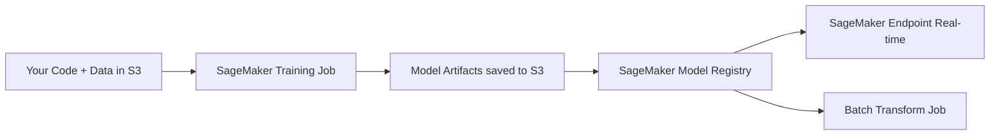
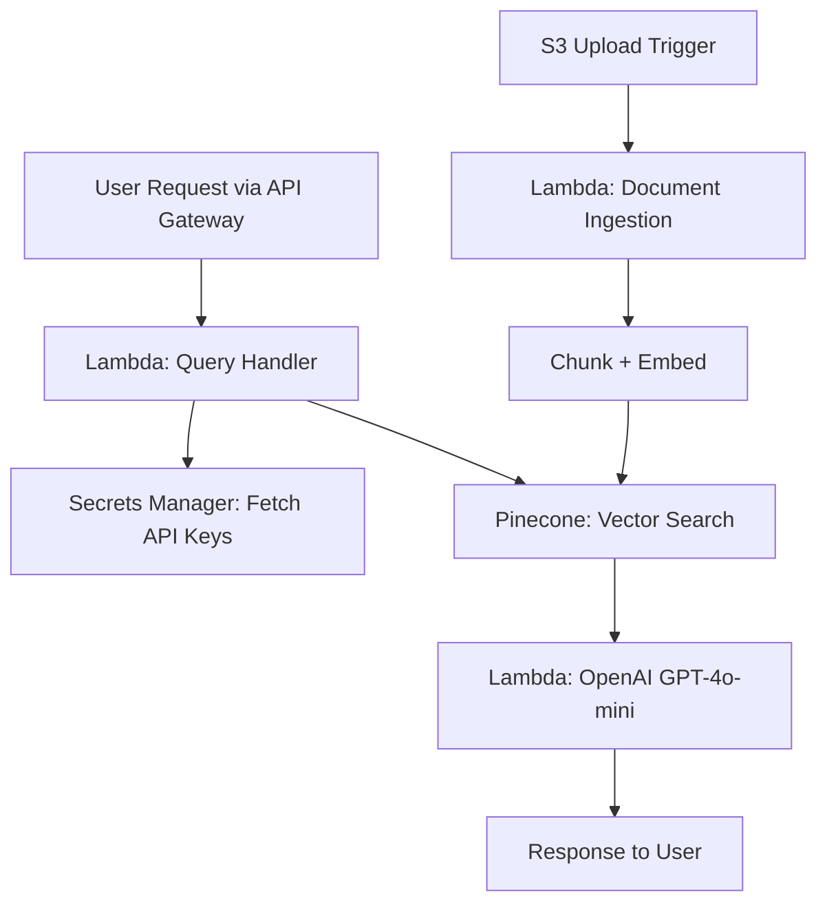

WEEK 23 · DAY 164
# AWS SageMaker — Training & Endpoints
Managed ML Infrastructure on AWS
⏳ 60 mins
Difficulty: Hard
💬 Hinglish Explanation:
### 🎯 By the end of Day 164, you will:
- Implement and evaluate SageMaker's core components (Training Jobs, Models, Endpoints).
- Launch a training job and deploy an endpoint using the Python SDK.
#### 🚦 Before You Start Checklist:
- AWS account with billing alerts configured; use the local/mock path if you do not want to create paid resources.
- `pip install sagemaker boto3`
## 🧠 Theory
Analogy:
AWS SageMaker — Training & Endpoints
💡 Gotcha & Common Pitfall Warning:
Always double check tensor dimensions, verify data types before matrix operations, and ensure feature scaling is fitted strictly on the training set to prevent data leakage.
### SageMaker Architecture
SageMaker separates three concerns: Training (ephemeral compute), Model Registry (versioning), and Endpoint (persistent inference server). You pay only for what you use.

### Deploying an HuggingFace Model to SageMaker
python
```python
import sagemaker
from sagemaker.huggingface import HuggingFaceModel

role = sagemaker.get_execution_role()

# Define model from HuggingFace Hub
hub = {
    'HF_MODEL_ID': 'distilbert-base-uncased-finetuned-sst-2-english',
    'HF_TASK': 'text-classification'
}

huggingface_model = HuggingFaceModel(
    env=hub,
    role=role,
    transformers_version='4.37',
    pytorch_version='2.1',
    py_version='py310',
)

# Deploy to real-time inference endpoint
predictor = huggingface_model.deploy(
    initial_instance_count=1,
    instance_type='ml.g4dn.xlarge'  # 1x T4 GPU
)

# Invoke
output = predictor.predict({'inputs': 'I love using SageMaker!'})
print(output)
# [{'label': 'POSITIVE', 'score': 0.9998}]

# IMPORTANT: Delete endpoint when done to avoid costs
predictor.delete_endpoint()
```
### 🤔 Predict the Output
What is stored in S3 after a SageMaker Training Job completes?
Check
## ⚡ Tasks
**Task 1: Custom Training Script · MEDIUM · ⏱ 45 mins**
Write a SageMaker `Estimator` using a custom `train.py` script with a scikit-learn container.
**Bonus Task: Async Inference · MEDIUM · HARD · ⏱ 45 mins**
Read about SageMaker Async Inference. When would you use it instead of real-time endpoints?
**Task**
## 🧪 Day 164 Knowledge Check
**Q:** What is a SageMaker Endpoint?
  - A batch processing job
  - A persistent HTTPS REST API that hosts your model for real-time inference
  - An S3 bucket for model artifacts
## 🧪 Applied Extension Checks
**Q:** Concept check — for AWS SageMaker — Training & Endpoints, which evaluation approach is most defensible?
  - A) Use a task-specific baseline and measure quality, latency, cost, and failure modes before scaling AWS SageMaker — Training & Endpoints.
  - B) Adopt AWS SageMaker — Training & Endpoints without a baseline because a larger system is automatically better.
  - C) Remove evaluation so the team can move faster.
  - D) Hard-code credentials and environment-specific values.
**Q:** Debugging check — what should you verify first when implementing AWS SageMaker — Training & Endpoints?
  - A) Reproduce the issue with a small deterministic fixture, then inspect inputs, configuration, dependencies, and expected outputs.
  - B) Skip reproduction and immediately increase model size or production traffic.
  - C) Remove evaluation so the team can move faster.
  - D) Hard-code credentials and environment-specific values.
**Q:** Production scenario — what control belongs in a launch plan for AWS SageMaker — Training & Endpoints?
  - A) Use a canary or staged rollout with quality and latency telemetry, budget/security checks, and a tested rollback path.
  - B) Ship globally after one successful demo and assume there are no operational risks.
  - C) Remove evaluation so the team can move faster.
  - D) Hard-code credentials and environment-specific values.
## 🃏 Revision Flashcards
**Flashcard:** SageMaker Training Job
> Ephemeral compute that runs your training script, saves model to S3, then shuts down. You only pay for training duration.
**Flashcard:** ml.g4dn.xlarge
> Entry-level AWS GPU instance with 1x NVIDIA T4 (16GB VRAM). Good for inference of 7B models.
**Flashcard:** SageMaker vs EC2
> SageMaker is managed; EC2 is a raw VM. Relative cost depends on region, instance, utilization, storage, and operational overhead—compare current pricing before choosing.
### ✅ Key Takeaways
"SageMaker aapko infrastructure manage karne ki tension se free karta hai — bas code, data, aur instance type specify karo!"
- Training Jobs are ephemeral — no wasted compute cost.
- Always delete endpoints after testing — they charge by the hour.
- HuggingFace containers are first-class citizens in SageMaker.
## 📚 Recommended Resources
☁️
#### SageMaker Python SDK
Official SDK Documentation
💰
#### SageMaker Pricing
Understand compute costs before running
☁️ Safe lab run:
WEEK 23 · DAY 165
# GCP Vertex AI
Google's Managed ML Platform
⏳ 55 mins
Difficulty: Hard
💬 Hinglish Explanation:
💡 Gotcha & Common Pitfall Warning:
Always double check tensor dimensions, verify data types before matrix operations, and ensure feature scaling is fitted strictly on the training set to prevent data leakage.
### 🎯 By the end of Day 165, you will:
- Submit a custom training job to Vertex AI.
- Deploy a model to a Vertex AI Endpoint.
#### 🚦 Before You Start Checklist:
- GCP account with billing enabled
- `pip install google-cloud-aiplatform`
## 🧠 Theory
Analogy:
GCP Vertex AI
💡 Gotcha & Common Pitfall Warning:
Always double check tensor dimensions, verify data types before matrix operations, and ensure feature scaling is fitted strictly on the training set to prevent data leakage.
### Vertex AI Custom Training
Vertex AI uses Docker containers for custom training. You package your code into a container, push to Google Container Registry (GCR), and submit a CustomJob.
python
```python
from google.cloud import aiplatform

aiplatform.init(project="my-gcp-project", location="us-central1")

# Submit a Custom Training Job
job = aiplatform.CustomTrainingJob(
    display_name="train-llm-classifier",
    script_path="train.py",           # Your local training script
    container_uri="us-docker.pkg.dev/vertex-ai/training/pytorch-gpu.2-0:latest",
    requirements=["transformers", "datasets"],
    model_serving_container_image_uri="us-docker.pkg.dev/vertex-ai/prediction/pytorch-gpu.2-0:latest"
)

model = job.run(
    dataset=vertex_dataset,
    replica_count=1,
    machine_type="n1-standard-8",
    accelerator_type="NVIDIA_TESLA_T4",
    accelerator_count=1,
)

# Deploy to endpoint
endpoint = model.deploy(
    machine_type="n1-standard-4",
    accelerator_type="NVIDIA_TESLA_T4",
    accelerator_count=1,
    traffic_split={"0": 100}
)
```
### Vertex AI Model Garden
Vertex AI Model Garden provides one-click deployment of Llama 3, Gemma, Mistral, and other foundation models without any custom containers.
### 🤔 Predict the Output
What is the key advantage of Vertex AI's `traffic_split` parameter?
Check
## ⚡ Tasks
**Task 1: Gemini via Vertex SDK · MEDIUM · ⏱ 45 mins**
Write a snippet using the Vertex AI SDK to call the `gemini-1.5-flash` model.
**Bonus Task: Vertex Pipeline · MEDIUM · ⏱ 45 mins**
Research Vertex AI Pipelines (Kubeflow Pipelines). Write out what a 3-step data→train→deploy pipeline would look like in YAML.
**Task**
## 🧪 Day 165 Knowledge Check
**Q:** What does Vertex AI Model Garden offer?
  - A marketplace for datasets
  - One-click deployment of foundation models like Llama 3, Gemma, and Mistral
  - Free GPU compute
## 🧪 Applied Extension Checks
**Q:** Concept check — for GCP Vertex AI, which evaluation approach is most defensible?
  - A) Use a task-specific baseline and measure quality, latency, cost, and failure modes before scaling GCP Vertex AI.
  - B) Adopt GCP Vertex AI without a baseline because a larger system is automatically better.
  - C) Remove evaluation so the team can move faster.
  - D) Hard-code credentials and environment-specific values.
**Q:** Debugging check — what should you verify first when implementing GCP Vertex AI?
  - A) Reproduce the issue with a small deterministic fixture, then inspect inputs, configuration, dependencies, and expected outputs.
  - B) Skip reproduction and immediately increase model size or production traffic.
  - C) Remove evaluation so the team can move faster.
  - D) Hard-code credentials and environment-specific values.
**Q:** Production scenario — what control belongs in a launch plan for GCP Vertex AI?
  - A) Use a canary or staged rollout with quality and latency telemetry, budget/security checks, and a tested rollback path.
  - B) Ship globally after one successful demo and assume there are no operational risks.
  - C) Remove evaluation so the team can move faster.
  - D) Hard-code credentials and environment-specific values.
## 🃏 Revision Flashcards
**Flashcard:** Vertex AI vs SageMaker
> Vertex AI integrates tightly with BigQuery and GCS. SageMaker integrates with S3 and the broader AWS ecosystem.
**Flashcard:** Vertex AI Pipelines
> Kubeflow-based ML pipeline orchestrator. Each component is a containerized Python function connected as a DAG.
**Flashcard:** traffic_split
> Routes e.g. 90% of traffic to model v1, 10% to model v2. Essential for safe A/B deployments.
### ✅ Key Takeaways
"Agar aapka data BigQuery mein hai, toh Vertex AI natural choice hai — direct integration milti hai bina data movement ke!"
- Vertex AI Model Garden eliminates custom Docker setup for popular models.
- traffic_split enables zero-downtime A/B deployments.
- Kubeflow Pipelines make ML workflows reproducible and auditable.
## 📚 Recommended Resources
🌐
#### Vertex AI Docs
Official documentation
☁️ Safe lab run:
WEEK 23 · DAY 166
# Serverless ML with Lambda + API Gateway
Zero-Infrastructure Inference on AWS
⏳ 50 mins
Difficulty: Medium
💬 Hinglish Explanation:
💡 Gotcha & Common Pitfall Warning:
Always double check tensor dimensions, verify data types before matrix operations, and ensure feature scaling is fitted strictly on the training set to prevent data leakage.
### 🎯 By the end of Day 166, you will:
- Package a lightweight ML model in a Lambda container.
- Expose it via API Gateway as a REST endpoint.
#### 🚦 Before You Start Checklist:
- AWS CLI configured
- Docker installed locally
## 🧠 Theory
Analogy:
Serverless ML with Lambda + API Gateway
💡 Gotcha & Common Pitfall Warning:
Always double check tensor dimensions, verify data types before matrix operations, and ensure feature scaling is fitted strictly on the training set to prevent data leakage.
### Lambda Container Image for ML
Lambda can now run arbitrary Docker containers (up to 10GB image size). This lets us ship models like scikit-learn or even small HuggingFace models.
dockerfile
```dockerfile
# Dockerfile for Lambda ML inference
FROM public.ecr.aws/lambda/python:3.11

# Install ML dependencies
RUN pip install scikit-learn numpy joblib

# Copy model artifact and handler
COPY model.joblib .
COPY handler.py .

CMD ["handler.lambda_handler"]
```
### Lambda Handler
python
```python
import json
import joblib
import numpy as np

model = joblib.load('model.joblib')  # Cold start: loads once per container

def lambda_handler(event, context):
    body = json.loads(event['body'])
    features = np.array(body['features']).reshape(1, -1)
    prediction = model.predict(features).tolist()
    return {
        'statusCode': 200,
        'body': json.dumps({'prediction': prediction})
    }
```
### 🤔 Predict the Output
What is a "cold start" in Lambda, and when does it happen?
Check
## ⚡ Tasks
**Task 1: OpenAI Proxy Lambda · MEDIUM · ⏱ 45 mins**
Write a Lambda handler that receives a `prompt` in the POST body, calls the OpenAI API, and returns the LLM response. Store the API key in AWS Secrets Manager.
**Task**
## 🧪 Day 166 Knowledge Check
**Q:** What is the maximum execution timeout for an AWS Lambda function?
  - 60 seconds
  - 15 minutes
  - 1 hour
## 🧪 Applied Extension Checks
**Q:** Concept check — for Serverless ML with Lambda + API Gateway, which evaluation approach is most defensible?
  - A) Use a task-specific baseline and measure quality, latency, cost, and failure modes before scaling Serverless ML with Lambda + API Gateway.
  - B) Adopt Serverless ML with Lambda + API Gateway without a baseline because a larger system is automatically better.
  - C) Remove evaluation so the team can move faster.
  - D) Hard-code credentials and environment-specific values.
**Q:** Debugging check — what should you verify first when implementing Serverless ML with Lambda + API Gateway?
  - A) Reproduce the issue with a small deterministic fixture, then inspect inputs, configuration, dependencies, and expected outputs.
  - B) Skip reproduction and immediately increase model size or production traffic.
  - C) Remove evaluation so the team can move faster.
  - D) Hard-code credentials and environment-specific values.
**Q:** Production scenario — what control belongs in a launch plan for Serverless ML with Lambda + API Gateway?
  - A) Use a canary or staged rollout with quality and latency telemetry, budget/security checks, and a tested rollback path.
  - B) Ship globally after one successful demo and assume there are no operational risks.
  - C) Remove evaluation so the team can move faster.
  - D) Hard-code credentials and environment-specific values.
## 🃏 Revision Flashcards
**Flashcard:** Lambda Cold Start
> The extra latency (~1-3s) on the first request after Lambda spins up a new container instance.
**Flashcard:** Lambda vs SageMaker Endpoint
> Lambda: pay-per-request, scales to zero, cold start latency. SageMaker: always-on, higher cost, instant response.
**Flashcard:** Provisioned Concurrency
> Keeps N Lambda containers pre-warmed to eliminate cold starts. Costs more but needed for latency-sensitive apps.
### ✅ Key Takeaways
"Lambda has no invocation compute charge while idle, but storage, requests, networking, provisioned concurrency, and related services can still cost money. Check current pricing and limits."
- Lambda container images up to 10GB enable substantial ML models.
- Always store API keys in Secrets Manager, never in env vars directly.
- Use Provisioned Concurrency for production latency SLAs.
## 📚 Recommended Resources
☁️
#### Lambda Container Images
AWS Documentation
☁️ Safe lab run:
WEEK 23 · DAY 167
# Azure OpenAI Service
Enterprise LLMs on Microsoft Cloud
⏳ 45 mins
Difficulty: Medium
💬 Hinglish Explanation:
💡 Gotcha & Common Pitfall Warning:
Always double check tensor dimensions, verify data types before matrix operations, and ensure feature scaling is fitted strictly on the training set to prevent data leakage.
### 🎯 By the end of Day 167, you will:
- Implement and evaluate Azure OpenAI vs OpenAI API differences.
- Call GPT-4o via the Azure endpoint using the OpenAI SDK.
#### 🚦 Before You Start Checklist:
- Azure account (free trial works)
- `pip install openai`
## 🧠 Theory
Analogy:
Azure OpenAI Service
💡 Gotcha & Common Pitfall Warning:
Always double check tensor dimensions, verify data types before matrix operations, and ensure feature scaling is fitted strictly on the training set to prevent data leakage.
### Azure OpenAI vs OpenAI API
Azure OpenAI uses a **deployment model**: you provision a named deployment (e.g., `gpt4o-prod`) of a specific model version. This gives you a dedicated throughput quota and data residency guarantees.
python
```python
from openai import AzureOpenAI

# Azure OpenAI uses a different base URL and requires deployment name
client = AzureOpenAI(
    azure_endpoint="https://my-company.openai.azure.com/",
    api_key="AZURE_OPENAI_API_KEY",
    api_version="2024-02-01"
)

# Use deployment name (not model name)
response = client.chat.completions.create(
    model="gpt4o-prod",   # Your deployment name, not "gpt-4o"
    messages=[{"role": "user", "content": "Summarize this contract."}],
    temperature=0.2
)
print(response.choices[0].message.content)
```
### Azure AI Studio
Azure AI Studio is a no-code/low-code IDE for building RAG pipelines, prompt flows, and evaluation harnesses. It supports both Azure OpenAI and open-source models via serverless APIs.
### 🤔 Predict the Output
Why do large enterprises prefer Azure OpenAI over the direct OpenAI API?
Check
## ⚡ Tasks
**Task 1: LangChain with Azure · MEDIUM · EASY · ⏱ 45 mins**
Configure LangChain's `AzureChatOpenAI` to use your Azure deployment.
**Task**
## 🧪 Day 167 Knowledge Check
**Q:** What is an Azure OpenAI "Deployment"?
  - A Docker container
  - A named, provisioned instance of a specific model version with dedicated throughput quota
  - A CI/CD pipeline
## 🧪 Applied Extension Checks
**Q:** Concept check — for Azure OpenAI Service, which evaluation approach is most defensible?
  - A) Use a task-specific baseline and measure quality, latency, cost, and failure modes before scaling Azure OpenAI Service.
  - B) Adopt Azure OpenAI Service without a baseline because a larger system is automatically better.
  - C) Remove evaluation so the team can move faster.
  - D) Hard-code credentials and environment-specific values.
**Q:** Debugging check — what should you verify first when implementing Azure OpenAI Service?
  - A) Reproduce the issue with a small deterministic fixture, then inspect inputs, configuration, dependencies, and expected outputs.
  - B) Skip reproduction and immediately increase model size or production traffic.
  - C) Remove evaluation so the team can move faster.
  - D) Hard-code credentials and environment-specific values.
**Q:** Production scenario — what control belongs in a launch plan for Azure OpenAI Service?
  - A) Use a canary or staged rollout with quality and latency telemetry, budget/security checks, and a tested rollback path.
  - B) Ship globally after one successful demo and assume there are no operational risks.
  - C) Remove evaluation so the team can move faster.
  - D) Hard-code credentials and environment-specific values.
## 🃏 Revision Flashcards
**Flashcard:** Data Residency
> Guarantee that data never leaves a specific geographic region (e.g., EU). Required for GDPR compliance.
**Flashcard:** PTU (Provisioned Throughput)
> Pre-purchased Azure OpenAI capacity in tokens-per-minute. Ensures stable throughput vs. shared limits.
**Flashcard:** Azure AI Studio
> A GUI for building, testing, and evaluating LLM applications with Prompt Flow visual editor.
### ✅ Key Takeaways
"Enterprise clients = Azure. Aapko AzureChatOpenAI ka usage pata hona chahiye — almost har bank/consulting firm Azure pe hai!"
- The Python API is almost identical to OpenAI — just endpoint and deployment name differ.
- LangChain, LlamaIndex all support Azure natively.
- Azure AI Studio's Prompt Flow is popular for no-code RAG building.
## 📚 Recommended Resources
🔵
#### Azure OpenAI Docs
Microsoft Learn
☁️ Safe lab run:
WEEK 23 · DAY 168
# Cloud Cost Optimization for LLMs
Taming Your AI Infrastructure Bill
⏳ 45 mins
Difficulty: Medium
💬 Hinglish Explanation:
💡 Gotcha & Common Pitfall Warning:
Always double check tensor dimensions, verify data types before matrix operations, and ensure feature scaling is fitted strictly on the training set to prevent data leakage.
### 🎯 By the end of Day 168, you will:
- Identify the 5 biggest cost drivers in LLM applications.
- Apply concrete optimizations to each cost driver.
#### 🚦 Before You Start Checklist:
- Reviewed Weeks 19–22 (RAG, serving, caching)
## 🧠 Theory
Analogy:
Cloud Cost Optimization for LLMs
💡 Gotcha & Common Pitfall Warning:
Always double check tensor dimensions, verify data types before matrix operations, and ensure feature scaling is fitted strictly on the training set to prevent data leakage.
### The 5 Cost Drivers
python
```python
# === Cost Driver 1: LLM API Tokens ===
# GPT-4o: $5 / 1M input tokens, $15 / 1M output tokens
# Fix: Use GPT-4o-mini ($0.15/$0.60) for 80% of requests.
# Route heavy reasoning only to GPT-4o.

from litellm import completion

def smart_route(prompt, complexity_score):
    model = "gpt-4o" if complexity_score > 0.8 else "gpt-4o-mini"
    return completion(model=model, messages=[{"role":"user","content":prompt}])

# === Cost Driver 2: Always-on Compute (SageMaker/K8s) ===
# Fix: Auto-scale down to 0 during off-hours using scheduled scaling
# aws sagemaker update-endpoint --endpoint-name my-ep \
#   --deployment-config '{"AutoRollbackConfiguration":{}}'

# === Cost Driver 3: Redundant Embeddings ===
# Fix: Cache embeddings! Same document should never be embedded twice.
import hashlib, json

def get_or_create_embedding(text, client, cache):
    key = hashlib.md5(text.encode()).hexdigest()
    if key in cache: return cache[key]
    embedding = client.embeddings.create(model="text-embedding-3-small", input=text).data[0].embedding
    cache[key] = embedding
    return embedding

# === Cost Driver 4: Context Window Bloat ===
# Fix: Limit retrieved chunks. 3-5 chunks are almost always sufficient.
# Returning 20 chunks wastes 15x more input tokens with minimal quality gain.

# === Cost Driver 5: Storage (Vector DB + S3) ===
# Fix: Use HNSW (Qdrant/Pinecone) — not Flat L2.
# Archive old embeddings to S3 Glacier for long-term cold storage.
```
### 🤔 Predict the Output
If you switch from GPT-4o to GPT-4o-mini for 80% of requests and costs drop 70%, what is this strategy called?
Check
## ⚡ Tasks
**Task 1: Token Counter · MEDIUM · ⏱ 45 mins**
Write a function using `tiktoken` that estimates the cost of a prompt+completion for GPT-4o-mini before sending it.
**Bonus Task: Complexity Router · MEDIUM · HARD · ⏱ 45 mins**
Write a router that classifies user queries as "simple" or "complex" using a fast classifier, then routes to gpt-4o-mini vs gpt-4o.
**Task**
## 🧪 Day 168 Knowledge Check
**Q:** Why does embedding caching reduce costs?
  - It reduces model size
  - Embedding the same document repeatedly wastes API calls — caching returns the stored vector instantly for free
  - It compresses vectors
## 🧪 Applied Extension Checks
**Q:** Concept check — for Cloud Cost Optimization for LLMs, which evaluation approach is most defensible?
  - A) Use a task-specific baseline and measure quality, latency, cost, and failure modes before scaling Cloud Cost Optimization for LLMs.
  - B) Adopt Cloud Cost Optimization for LLMs without a baseline because a larger system is automatically better.
  - C) Remove evaluation so the team can move faster.
  - D) Hard-code credentials and environment-specific values.
**Q:** Debugging check — what should you verify first when implementing Cloud Cost Optimization for LLMs?
  - A) Reproduce the issue with a small deterministic fixture, then inspect inputs, configuration, dependencies, and expected outputs.
  - B) Skip reproduction and immediately increase model size or production traffic.
  - C) Remove evaluation so the team can move faster.
  - D) Hard-code credentials and environment-specific values.
**Q:** Production scenario — what control belongs in a launch plan for Cloud Cost Optimization for LLMs?
  - A) Use a canary or staged rollout with quality and latency telemetry, budget/security checks, and a tested rollback path.
  - B) Ship globally after one successful demo and assume there are no operational risks.
  - C) Remove evaluation so the team can move faster.
  - D) Hard-code credentials and environment-specific values.
## 🃏 Revision Flashcards
**Flashcard:** Model Routing
> Dynamically selecting a cheap model for simple queries and an expensive model only for complex ones.
**Flashcard:** Context Window Bloat
> Passing far more retrieved chunks than needed, wasting input tokens and money with minimal quality gain.
**Flashcard:** tiktoken
> OpenAI's official tokenizer library. Use it to estimate token counts before sending API calls.
### ✅ Key Takeaways
"Senior engineers optimize costs proactively — they don't wait for the bill shock at month end!"
- Model routing is the single highest-impact cost optimization.
- Cache embeddings — documents don't change but you may embed them 1000x.
- Right-size compute: turn off endpoints at night via scheduled scaling.
## 📚 Recommended Resources
💰
#### OpenAI Pricing
Full model pricing breakdown
☁️ Safe lab run:
WEEK 23 · DAY 169
# Secrets Management
AWS Secrets Manager & Vault
⏳ 40 mins
Difficulty: Medium
💬 Hinglish Explanation:
💡 Gotcha: Micro-batching vs Streaming Inference
Real-time recommendation APIs requiring $< 20	ext{ms}$ latency cannot rely on heavy offline batch predictions. Use low-latency C++ / Rust inference engines (Triton / vLLM) with dynamic micro-batching.
### 🎯 By the end of Day 169, you will:
- Store and retrieve secrets from AWS Secrets Manager.
- Implement automatic key rotation.
#### 🚦 Before You Start Checklist:
- AWS CLI configured with correct IAM role
## 🧠 Theory
Analogy:
Secrets Management
💡 Gotcha & Common Pitfall Warning:
Always double check tensor dimensions, verify data types before matrix operations, and ensure feature scaling is fitted strictly on the training set to prevent data leakage.
### AWS Secrets Manager Pattern
python
```python
import boto3
import json
from functools import lru_cache

@lru_cache(maxsize=1)  # Cache in Lambda warm container (avoids repeated API calls)
def get_secrets():
    client = boto3.client('secretsmanager', region_name='us-east-1')
    secret_string = client.get_secret_value(SecretId='prod/llm-api-keys')['SecretString']
    return json.loads(secret_string)

# Usage in your application
secrets = get_secrets()
OPENAI_KEY = secrets['openai_api_key']
PINECONE_KEY = secrets['pinecone_api_key']

# --- Storing a secret (do this once during setup) ---
def store_secret(name, value_dict):
    client = boto3.client('secretsmanager')
    client.create_secret(
        Name=name,
        SecretString=json.dumps(value_dict)
    )
    print(f"Stored secret: {name}")
```
### IAM Policy for Secrets Access
python
```python
# Minimal IAM policy (principle of least privilege)
{
  "Version": "2012-10-17",
  "Statement": [{
    "Effect": "Allow",
    "Action": ["secretsmanager:GetSecretValue"],
    "Resource": "arn:aws:secretsmanager:us-east-1:123456789:secret:prod/llm-api-keys*"
  }]
}
```
### 🤔 Predict the Output
Why do we use `@lru_cache` on the `get_secrets()` function in a Lambda?
Check
## ⚡ Tasks
**Task 1: Environment Variables Audit · MEDIUM · EASY · ⏱ 45 mins**
Scan your existing projects for hardcoded API keys using `grep -r "sk-" .` and `grep -r "AKIA" .`. List what you find and plan to move to Secrets Manager.
**Task**
## 🧪 Day 169 Knowledge Check
**Q:** What is the "Principle of Least Privilege" for IAM?
  - Admin access for all team members
  - Grant only the exact permissions needed for a task — no more
  - Sharing API keys via environment variables
## 🧪 Applied Extension Checks
**Q:** Concept check — for Secrets Management, which evaluation approach is most defensible?
  - A) Use a task-specific baseline and measure quality, latency, cost, and failure modes before scaling Secrets Management.
  - B) Adopt Secrets Management without a baseline because a larger system is automatically better.
  - C) Remove evaluation so the team can move faster.
  - D) Hard-code credentials and environment-specific values.
**Q:** Debugging check — what should you verify first when implementing Secrets Management?
  - A) Reproduce the issue with a small deterministic fixture, then inspect inputs, configuration, dependencies, and expected outputs.
  - B) Skip reproduction and immediately increase model size or production traffic.
  - C) Remove evaluation so the team can move faster.
  - D) Hard-code credentials and environment-specific values.
**Q:** Production scenario — what control belongs in a launch plan for Secrets Management?
  - A) Use a canary or staged rollout with quality and latency telemetry, budget/security checks, and a tested rollback path.
  - B) Ship globally after one successful demo and assume there are no operational risks.
  - C) Remove evaluation so the team can move faster.
  - D) Hard-code credentials and environment-specific values.
## 🃏 Revision Flashcards
**Flashcard:** Secret Rotation
> Automatically cycling API keys/passwords on a schedule so compromised keys expire quickly.
**Flashcard:** IAM Role
> An AWS identity with specific permissions that can be assumed by services (Lambda, EC2, SageMaker) without using credentials.
**Flashcard:** HashiCorp Vault
> Cloud-agnostic secrets management. Works across AWS, GCP, Azure, and on-prem. More complex but vendor-neutral.
### ✅ Key Takeaways
"GitHub pe accidentally pushed API key = instant ban + massive AWS bill. Secrets Manager use karo, hamesha!"
- Never put secrets in environment variables that go into Docker images.
- IAM Roles are preferred over access keys for services running in AWS.
- Use `@lru_cache` to avoid fetching secrets on every Lambda invocation.
## 📚 Recommended Resources
🔐
#### AWS Secrets Manager
Official Developer Guide
☁️ Safe lab run:
WEEK 23 · DAY 170
# Capstone: Deploy RAG to AWS
End-to-End Cloud RAG Architecture
⏳ 120 mins
Difficulty: CAPSTONE
💬 Hinglish Explanation:
💡 Gotcha: Common Pitfalls in Day-170
Always validate underlying data assumptions, check tensor shape alignments, and verify hyperparameter scaling before running production training or evaluation loops.
### 🎯 By the end of Day 170, you will:
- Deploy a production RAG pipeline entirely on AWS.
- Use API Gateway + Lambda for serverless inference.
#### 🚦 Before You Start Checklist:
- Reviewed Days 164–169
- Pinecone or Qdrant Cloud account
## 🧠 Theory
Analogy:
Capstone: Deploy RAG to AWS
💡 Gotcha & Common Pitfall Warning:
Always double check tensor dimensions, verify data types before matrix operations, and ensure feature scaling is fitted strictly on the training set to prevent data leakage.
### Target Architecture

python
```python
# Lambda handler for the RAG query endpoint
import json
import boto3
from pinecone import Pinecone
from openai import OpenAI

def lambda_handler(event, context):
    body = json.loads(event['body'])
    query = body['query']
    
    # Get secrets (cached after first call)
    secrets = get_secrets()  # From Secrets Manager
    pc = Pinecone(api_key=secrets['pinecone_key'])
    client = OpenAI(api_key=secrets['openai_key'])
    index = pc.Index("rag-index")
    
    # Embed query
    query_vec = client.embeddings.create(
        model="text-embedding-3-small", input=query
    ).data[0].embedding
    
    # Retrieve
    results = index.query(vector=query_vec, top_k=5, include_metadata=True)
    context_str = "\n".join([r['metadata']['text'] for r in results['matches']])
    
    # Generate
    response = client.chat.completions.create(
        model="gpt-4o-mini",
        messages=[
            {"role":"system","content":f"Answer using this context:\n{context_str}"},
            {"role":"user","content":query}
        ]
    )
    return {'statusCode':200,'body':json.dumps({'answer':response.choices[0].message.content})}
```
### 🤔 Predict the Output
If a new document is uploaded to S3, how does it automatically get indexed into Pinecone?
Check
## ⚡ Tasks
**Task 1: Full Deployment · MEDIUM · CAPSTONE · ⏱ 45 mins**
Deploy the full architecture: S3 bucket → ingestion Lambda (triggered on upload) → Pinecone → query Lambda → API Gateway. Test with curl.
**Task**
## 🧪 Day 170 Knowledge Check
**Q:** Why use API Gateway in front of Lambda instead of exposing Lambda directly?
  - Lambda has no networking
  - API Gateway provides rate limiting, auth, CORS, SSL, and a stable public URL
  - Lambda cannot handle HTTP
## 🧪 Applied Extension Checks
**Q:** Concept check — for Capstone: Deploy RAG to AWS, which evaluation approach is most defensible?
  - A) Use a task-specific baseline and measure quality, latency, cost, and failure modes before scaling Capstone: Deploy RAG to AWS.
  - B) Adopt Capstone: Deploy RAG to AWS without a baseline because a larger system is automatically better.
  - C) Remove evaluation so the team can move faster.
  - D) Hard-code credentials and environment-specific values.
**Q:** Debugging check — what should you verify first when implementing Capstone: Deploy RAG to AWS?
  - A) Reproduce the issue with a small deterministic fixture, then inspect inputs, configuration, dependencies, and expected outputs.
  - B) Skip reproduction and immediately increase model size or production traffic.
  - C) Remove evaluation so the team can move faster.
  - D) Hard-code credentials and environment-specific values.
**Q:** Production scenario — what control belongs in a launch plan for Capstone: Deploy RAG to AWS?
  - A) Use a canary or staged rollout with quality and latency telemetry, budget/security checks, and a tested rollback path.
  - B) Ship globally after one successful demo and assume there are no operational risks.
  - C) Remove evaluation so the team can move faster.
  - D) Hard-code credentials and environment-specific values.
## 🃏 Revision Flashcards
**Flashcard:** S3 Event Trigger
> Configure S3 to invoke a Lambda function automatically when a new object is uploaded to a specific prefix.
**Flashcard:** AWS SAM
> Serverless Application Model. YAML-based IaC for deploying Lambda + API Gateway + S3 stacks with one command.
**Flashcard:** Cold Start Mitigation
> Use Provisioned Concurrency or keep-warm pings (EventBridge rule) to prevent Lambda cold starts in prod.
### ✅ Key Takeaways
"Ye architecture real production mein use hoti hai. Resume pe likho: 'Built serverless RAG on AWS with Lambda, API Gateway, Pinecone and OpenAI.'"
- Event-driven ingestion keeps the vector DB always up-to-date.
- Entire architecture can serve millions of users for ~\$50/month at low traffic.
- Use AWS SAM or CDK to version-control your infrastructure.
## 📚 Recommended Resources
🏗️
#### AWS SAM
Serverless Application Model
☁️ Safe lab run:
