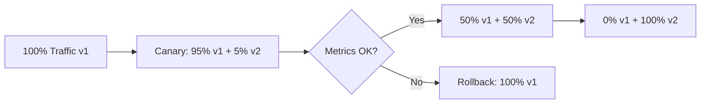
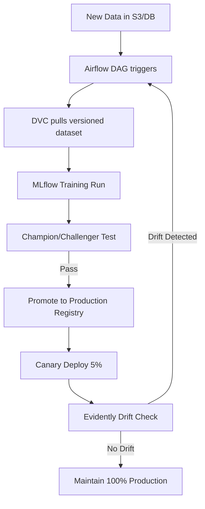

WEEK 24 · DAY 171
# MLflow Experiment Tracking
Reproducible ML Experiments at Scale
⏳ 50 mins
Difficulty: Medium
💬 Hinglish Explanation:
💡 Gotcha: Common Pitfalls in Day-171
Always validate underlying data assumptions, check tensor shape alignments, and verify hyperparameter scaling before running production training or evaluation loops.
### 🎯 By the end of Day 171, you will:
- Log parameters, metrics, and artifacts using MLflow Tracking.
- Compare runs in the MLflow UI.
#### 🚦 Before You Start Checklist:
- `pip install mlflow`
- Basic PyTorch or sklearn knowledge
## 🧠 Theory
Analogy:
MLflow Experiment Tracking
💡 Gotcha & Common Pitfall Warning:
Always double check tensor dimensions, verify data types before matrix operations, and ensure feature scaling is fitted strictly on the training set to prevent data leakage.
### Core MLflow Concepts
An **Experiment** groups related runs. A **Run** is one training execution. Each run logs Parameters (inputs), Metrics (outputs), and Artifacts (model files, plots).
python
```python
import mlflow
import mlflow.sklearn
from sklearn.ensemble import RandomForestClassifier
from sklearn.metrics import accuracy_score

mlflow.set_experiment("credit-fraud-detection")

with mlflow.start_run(run_name="rf-n100-depth5"):
    # 1. Log hyperparameters
    params = {"n_estimators": 100, "max_depth": 5, "random_state": 42}
    mlflow.log_params(params)
    
    # 2. Train model
    model = RandomForestClassifier(**params)
    model.fit(X_train, y_train)
    preds = model.predict(X_test)
    
    # 3. Log metrics
    acc = accuracy_score(y_test, preds)
    mlflow.log_metric("accuracy", acc)
    mlflow.log_metric("f1_score", f1_score(y_test, preds))
    
    # 4. Log model artifact
    mlflow.sklearn.log_model(model, "random-forest-model")
    
    print(f"Run ID: {mlflow.active_run().info.run_id}")

# Launch UI: mlflow ui --port 5000
```
### MLflow Autolog
python
```python
import mlflow
mlflow.sklearn.autolog()  # Automatically logs everything!

with mlflow.start_run():
    model = RandomForestClassifier(n_estimators=100)
    model.fit(X_train, y_train)
    # mlflow.sklearn.autolog() handles all params, metrics, model automatically
```
### 🤔 Predict the Output
What is the difference between MLflow `log_metric` and `log_param`?
Check
## ⚡ Tasks
**Task 1: Compare 3 Models · MEDIUM · ⏱ 45 mins**
Run 3 experiments varying `n_estimators` (50, 100, 200) in a loop. Compare accuracy in `mlflow ui`.
**Bonus Task: MLflow with LLM · MEDIUM · ⏱ 45 mins**
Use `mlflow.log_text()` to save the system prompt and response of an LLM call as an artifact for auditability.
**Task**
## 🧪 Day 171 Knowledge Check
**Q:** What is an MLflow "Artifact"?
  - A training hyperparameter
  - Any file output from a run — model weights, plots, confusion matrices, text files
  - A scalar metric value
## 🧪 Applied Extension Checks
**Q:** Concept check — for MLflow Experiment Tracking, which evaluation approach is most defensible?
  - A) Use a task-specific baseline and measure quality, latency, cost, and failure modes before scaling MLflow Experiment Tracking.
  - B) Adopt MLflow Experiment Tracking without a baseline because a larger system is automatically better.
  - C) Remove evaluation so the team can move faster.
  - D) Hard-code credentials and environment-specific values.
**Q:** Debugging check — what should you verify first when implementing MLflow Experiment Tracking?
  - A) Reproduce the issue with a small deterministic fixture, then inspect inputs, configuration, dependencies, and expected outputs.
  - B) Skip reproduction and immediately increase model size or production traffic.
  - C) Remove evaluation so the team can move faster.
  - D) Hard-code credentials and environment-specific values.
**Q:** Production scenario — what control belongs in a launch plan for MLflow Experiment Tracking?
  - A) Use a canary or staged rollout with quality and latency telemetry, budget/security checks, and a tested rollback path.
  - B) Ship globally after one successful demo and assume there are no operational risks.
  - C) Remove evaluation so the team can move faster.
  - D) Hard-code credentials and environment-specific values.
## 🃏 Revision Flashcards
**Flashcard:** MLflow Run
> A single training execution that logs params, metrics, and artifacts to the MLflow tracking server.
**Flashcard:** MLflow Autolog
> One-line setup that automatically captures all sklearn/PyTorch/XGBoost params, metrics, and models.
**Flashcard:** Tracking Server
> MLflow can use local filesystem, SQLite, or a remote server (MLflow on Databricks/AWS) to store run data.
### ✅ Key Takeaways
"Bina MLflow ke, 3 mahine baad tum bhool jaoge kaunsa run best tha. Tracking mandatory hai!"
- Always log the git commit hash as a parameter for full reproducibility.
- MLflow integrates with SageMaker, Databricks, and Azure ML natively.
- Use `mlflow.autolog()` to reduce boilerplate in quick experiments.
## 📚 Recommended Resources
📊
#### MLflow Tracking
Official Tracking Documentation
☁️ Safe lab run:
WEEK 24 · DAY 172
# MLflow Model Registry
Staging → Production Model Lifecycle
⏳ 45 mins
Difficulty: Medium
💬 Hinglish Explanation:
💡 Gotcha: Common Pitfalls in Day-172
Always validate underlying data assumptions, check tensor shape alignments, and verify hyperparameter scaling before running production training or evaluation loops.
### 🎯 By the end of Day 172, you will:
- Register a model from an MLflow run.
- Promote a model through Staging → Production stages.
#### 🚦 Before You Start Checklist:
- MLflow tracking server running
## 🧠 Theory
Analogy:
MLflow Model Registry
💡 Gotcha & Common Pitfall Warning:
Always double check tensor dimensions, verify data types before matrix operations, and ensure feature scaling is fitted strictly on the training set to prevent data leakage.
### Model Lifecycle States
Every registered model version goes through: `None → Staging → Production → Archived`. This enforces a review gate before production rollout.
python
```python
import mlflow
from mlflow.tracking import MlflowClient

client = MlflowClient()

# 1. Register a model from a run
run_id = "abc123def456"
model_uri = f"runs:/{run_id}/random-forest-model"
mv = mlflow.register_model(model_uri, "CreditFraudDetector")
print(f"Registered version: {mv.version}")

# 2. Promote to Staging
client.transition_model_version_stage(
    name="CreditFraudDetector",
    version=mv.version,
    stage="Staging"
)

# 3. After testing — promote to Production
client.transition_model_version_stage(
    name="CreditFraudDetector",
    version=mv.version,
    stage="Production"
)

# 4. Load the current production model anywhere
prod_model = mlflow.sklearn.load_model("models:/CreditFraudDetector/Production")
preds = prod_model.predict(X_new)
```
### 🤔 Predict the Output
If you have version 1 in Production and promote version 2 to Production, what happens to version 1?
Check
## ⚡ Tasks
**Task 1: Champion/Challenger · MEDIUM · ⏱ 45 mins**
Implement a script that loads both the Production and Staging models, evaluates them on a holdout set, and promotes Staging to Production only if it beats the champion.
**Task**
## 🧪 Day 172 Knowledge Check
**Q:** Why is a model registry important in MLOps?
  - It speeds up training
  - It provides version control, audit trail, and deployment stage gates for models
  - It reduces inference latency
## 🧪 Applied Extension Checks
**Q:** Concept check — for MLflow Model Registry, which evaluation approach is most defensible?
  - A) Use a task-specific baseline and measure quality, latency, cost, and failure modes before scaling MLflow Model Registry.
  - B) Adopt MLflow Model Registry without a baseline because a larger system is automatically better.
  - C) Remove evaluation so the team can move faster.
  - D) Hard-code credentials and environment-specific values.
**Q:** Debugging check — what should you verify first when implementing MLflow Model Registry?
  - A) Reproduce the issue with a small deterministic fixture, then inspect inputs, configuration, dependencies, and expected outputs.
  - B) Skip reproduction and immediately increase model size or production traffic.
  - C) Remove evaluation so the team can move faster.
  - D) Hard-code credentials and environment-specific values.
**Q:** Production scenario — what control belongs in a launch plan for MLflow Model Registry?
  - A) Use a canary or staged rollout with quality and latency telemetry, budget/security checks, and a tested rollback path.
  - B) Ship globally after one successful demo and assume there are no operational risks.
  - C) Remove evaluation so the team can move faster.
  - D) Hard-code credentials and environment-specific values.
## 🃏 Revision Flashcards
**Flashcard:** Staging Stage
> Model is ready for QA/integration testing but not yet serving real users.
**Flashcard:** Champion/Challenger
> Testing a new model (challenger) against the current best (champion) on held-out data before promoting.
**Flashcard:** load_model URI
> `models:/ModelName/Production` — resolves to whichever version is currently in the Production stage.
### ✅ Key Takeaways
"Model Registry = 'git' for ML models. Har version traceable, rollback possible, audit ready!"
- Never load a model by run ID in production — use the registry URI.
- Automate champion/challenger evaluation in CI to prevent regressions.
- Add model tags with training date and dataset version for traceability.
## 📚 Recommended Resources
📦
#### MLflow Model Registry
Docs and API reference
☁️ Safe lab run:
WEEK 24 · DAY 173
# DVC — Data Version Control
Git for Datasets and Models
⏳ 50 mins
Difficulty: Medium
💬 Hinglish Explanation:
💡 Gotcha: Common Pitfalls in Day-173
Always validate underlying data assumptions, check tensor shape alignments, and verify hyperparameter scaling before running production training or evaluation loops.
### 🎯 By the end of Day 173, you will:
- Track datasets and model weights using DVC.
- Reproduce a specific data version from git history.
#### 🚦 Before You Start Checklist:
- Git repo initialized
- `pip install dvc dvc-s3`
## 🧠 Theory
Analogy:
DVC — Data Version Control
💡 Gotcha & Common Pitfall Warning:
Always double check tensor dimensions, verify data types before matrix operations, and ensure feature scaling is fitted strictly on the training set to prevent data leakage.
### DVC Workflow
shell
```shell
# 1. Initialize DVC
git init
dvc init

# 2. Set remote storage (S3, GCS, Azure Blob, local)
dvc remote add -d myremote s3://my-ml-bucket/dvc-store

# 3. Track a large file (dataset or model)
dvc add data/train.csv
# Creates data/train.csv.dvc (tiny pointer file) + adds data/train.csv to .gitignore

# 4. Commit the pointer to Git
git add data/train.csv.dvc .gitignore
git commit -m "Add training dataset v1"
dvc push  # Upload actual file to S3

# 5. Later — pull data on another machine
git pull
dvc pull  # Downloads the exact data version the git commit points to

# 6. Pipeline: define reproducible steps
# dvc.yaml
stages:
  preprocess:
    cmd: python preprocess.py
    deps: [data/raw.csv, src/preprocess.py]
    outs: [data/processed.csv]
  train:
    cmd: python train.py
    deps: [data/processed.csv, src/train.py]
    outs: [models/model.pkl]
    metrics: [metrics.json]
```
### 🤔 Predict the Output
What does `dvc repro` do?
Check
## ⚡ Tasks
**Task 1: Track a Dataset · MEDIUM · ⏱ 45 mins**
Initialize DVC in a project, track `data/train.csv`, push to a local remote, and verify you can pull it fresh.
**Bonus: Data Versioning · MEDIUM · HARD · ⏱ 45 mins**
Create two versions of a dataset (v1: 1000 rows, v2: 5000 rows), commit both with DVC. Checkout the v1 dataset using `git checkout`.
**Task**
## 🧪 Day 173 Knowledge Check
**Q:** What does DVC actually store in Git?
  - The full dataset binary
  - A tiny `.dvc` pointer file with the MD5 hash of the actual file stored in remote storage
  - Compressed dataset
## 🧪 Applied Extension Checks
**Q:** Concept check — for DVC — Data Version Control, which evaluation approach is most defensible?
  - A) Use a task-specific baseline and measure quality, latency, cost, and failure modes before scaling DVC — Data Version Control.
  - B) Adopt DVC — Data Version Control without a baseline because a larger system is automatically better.
  - C) Remove evaluation so the team can move faster.
  - D) Hard-code credentials and environment-specific values.
**Q:** Debugging check — what should you verify first when implementing DVC — Data Version Control?
  - A) Reproduce the issue with a small deterministic fixture, then inspect inputs, configuration, dependencies, and expected outputs.
  - B) Skip reproduction and immediately increase model size or production traffic.
  - C) Remove evaluation so the team can move faster.
  - D) Hard-code credentials and environment-specific values.
**Q:** Production scenario — what control belongs in a launch plan for DVC — Data Version Control?
  - A) Use a canary or staged rollout with quality and latency telemetry, budget/security checks, and a tested rollback path.
  - B) Ship globally after one successful demo and assume there are no operational risks.
  - C) Remove evaluation so the team can move faster.
  - D) Hard-code credentials and environment-specific values.
## 🃏 Revision Flashcards
**Flashcard:** DVC .dvc file
> A small YAML pointer file with the MD5 hash and size of the tracked file. Stored in Git, actual data stored in remote.
**Flashcard:** dvc repro
> Runs the full pipeline defined in dvc.yaml, skipping stages whose dependencies haven't changed (like Makefile).
**Flashcard:** dvc checkout
> After `git checkout` to an old commit, `dvc checkout` restores the data files that match that commit's `.dvc` pointers.
### ✅ Key Takeaways
"DVC + Git = complete reproducibility. 6 mahine baad bhi exact same model reproduce kar sakte ho!"
- DVC pipelines cache intermediate outputs — rerun is instant if deps unchanged.
- Works with S3, GCS, Azure, SSH, HTTP as remote backends.
- Use `dvc metrics show` to compare metrics across git branches.
## 📚 Recommended Resources
📁
#### DVC Getting Started
Official DVC Tutorial
☁️ Safe lab run:
WEEK 24 · DAY 174
# Apache Airflow
Orchestrating ML Data Pipelines
⏳ 55 mins
Difficulty: Hard
💬 Hinglish Explanation:
💡 Gotcha: Common Pitfalls in Day-174
Always validate underlying data assumptions, check tensor shape alignments, and verify hyperparameter scaling before running production training or evaluation loops.
### 🎯 By the end of Day 174, you will:
- Write a DAG (Directed Acyclic Graph) in Airflow.
- Schedule an ML retraining pipeline.
#### 🚦 Before You Start Checklist:
- `pip install apache-airflow`
- Airflow initialized (`airflow db init`)
## 🧠 Theory
Analogy:
Apache Airflow
💡 Gotcha & Common Pitfall Warning:
Always double check tensor dimensions, verify data types before matrix operations, and ensure feature scaling is fitted strictly on the training set to prevent data leakage.
### ML Retraining DAG
python
```python
from airflow import DAG
from airflow.operators.python import PythonOperator
from airflow.operators.bash import BashOperator
from datetime import datetime, timedelta

def extract_data():
    # Pull new data from database
    import pandas as pd, sqlalchemy
    engine = sqlalchemy.create_engine("postgresql://...")
    df = pd.read_sql("SELECT * FROM events WHERE date > NOW() - INTERVAL '7 days'", engine)
    df.to_parquet("/tmp/raw_data.parquet")
    print(f"Extracted {len(df)} rows")

def train_model():
    import pandas as pd, mlflow
    from sklearn.ensemble import GradientBoostingClassifier
    df = pd.read_parquet("/tmp/processed_data.parquet")
    with mlflow.start_run():
        model = GradientBoostingClassifier().fit(df.drop("label",axis=1), df["label"])
        mlflow.sklearn.log_model(model, "model")
        mlflow.register_model(f"runs:/{mlflow.active_run().info.run_id}/model", "ProductionModel")

with DAG(
    dag_id="weekly_model_retrain",
    schedule_interval="0 2 * * 1",  # Every Monday at 2 AM
    start_date=datetime(2024, 1, 1),
    catchup=False,
    default_args={"retries": 2, "retry_delay": timedelta(minutes=5)},
) as dag:
    
    t1 = PythonOperator(task_id="extract_data", python_callable=extract_data)
    t2 = BashOperator(task_id="preprocess", bash_command="python /opt/ml/preprocess.py")
    t3 = PythonOperator(task_id="train_model", python_callable=train_model)
    t4 = BashOperator(task_id="run_tests", bash_command="pytest /opt/ml/tests/")
    
    t1 >> t2 >> t3 >> t4  # Defines execution order
```
### 🤔 Predict the Output
What does `catchup=False` do in the DAG definition?
Check
## ⚡ Tasks
**Task 1: Embedding Update DAG · MEDIUM · ⏱ 45 mins**
Write an Airflow DAG that runs daily: pulls new documents from S3, embeds them, and upserts into Pinecone.
**Task**
## 🧪 Day 174 Knowledge Check
**Q:** Why is a DAG (not a cycle) important for pipeline orchestration?
  - It makes pipelines faster
  - Acyclic guarantees no infinite loops — every pipeline must terminate
  - It reduces memory usage
## 🧪 Applied Extension Checks
**Q:** Concept check — for Apache Airflow, which evaluation approach is most defensible?
  - A) Use a task-specific baseline and measure quality, latency, cost, and failure modes before scaling Apache Airflow.
  - B) Adopt Apache Airflow without a baseline because a larger system is automatically better.
  - C) Remove evaluation so the team can move faster.
  - D) Hard-code credentials and environment-specific values.
**Q:** Debugging check — what should you verify first when implementing Apache Airflow?
  - A) Reproduce the issue with a small deterministic fixture, then inspect inputs, configuration, dependencies, and expected outputs.
  - B) Skip reproduction and immediately increase model size or production traffic.
  - C) Remove evaluation so the team can move faster.
  - D) Hard-code credentials and environment-specific values.
**Q:** Production scenario — what control belongs in a launch plan for Apache Airflow?
  - A) Use a canary or staged rollout with quality and latency telemetry, budget/security checks, and a tested rollback path.
  - B) Ship globally after one successful demo and assume there are no operational risks.
  - C) Remove evaluation so the team can move faster.
  - D) Hard-code credentials and environment-specific values.
## 🃏 Revision Flashcards
**Flashcard:** Airflow DAG
> Directed Acyclic Graph. Defines tasks and their dependencies in a pipeline. No cycles allowed.
**Flashcard:** Airflow Operator
> A template for a task. PythonOperator runs Python, BashOperator runs shell, and there are 100+ community operators (S3, Slack, etc).
**Flashcard:** Managed Airflow
> Amazon MWAA, Google Cloud Composer, Astronomer. Use these in production instead of self-hosted Airflow.
### ✅ Key Takeaways
"Without orchestration, ML pipelines are scripts on a cron job — fragile aur debuggable nahi!"
- Airflow's UI shows task history, logs, and retries visually.
- Use managed Airflow (MWAA, Composer) in prod — self-hosting is painful.
- Alternatives: Prefect, Dagster are more Pythonic and easier to test.
## 📚 Recommended Resources
🌬️
#### Airflow Tutorial
Official Fundamentals Guide
☁️ Safe lab run:
WEEK 24 · DAY 175
# Model Drift Detection
Evidently AI & Monitoring in Production
⏳ 50 mins
Difficulty: Hard
💬 Hinglish Explanation:
💡 Gotcha: Common Pitfalls in Day-175
Always validate underlying data assumptions, check tensor shape alignments, and verify hyperparameter scaling before running production training or evaluation loops.
### 🎯 By the end of Day 175, you will:
- Implement and evaluate Data Drift vs Concept Drift.
- Generate drift reports using Evidently AI.
#### 🚦 Before You Start Checklist:
- `pip install evidently`
## 🧠 Theory
Analogy:
Model Drift Detection
💡 Gotcha & Common Pitfall Warning:
Always double check tensor dimensions, verify data types before matrix operations, and ensure feature scaling is fitted strictly on the training set to prevent data leakage.
### Drift Types
- **Data Drift (Covariate Shift):** Input feature distribution changes. E.g., users' age distribution shifts.
- **Concept Drift:** The relationship between features and target changes. E.g., fraud patterns evolve.
- **Prediction Drift:** Model's output distribution changes without label access.
python
```python
import pandas as pd
from evidently.report import Report
from evidently.metric_preset import DataDriftPreset, TargetDriftPreset

# Load reference (training) and current (production) data
reference = pd.read_parquet("train_data.parquet")
current = pd.read_parquet("production_last_7days.parquet")

# Generate drift report
report = Report(metrics=[
    DataDriftPreset(),
    TargetDriftPreset(),
])
report.run(reference_data=reference, current_data=current)
report.save_html("drift_report.html")

# Programmatic check — use in CI/CD or Airflow
from evidently.test_suite import TestSuite
from evidently.tests import TestNumberOfDriftedColumns

suite = TestSuite(tests=[
    TestNumberOfDriftedColumns(lt=3)  # Fail if more than 3 features drift
])
suite.run(reference_data=reference, current_data=current)
print(suite.as_dict()['summary']['all_passed'])  # True or False
```
### 🤔 Predict the Output
What action should you take when Evidently detects significant data drift?
Check
## 🛡️ Responsible AI & Governance Pack
Apply the toolchain to a real release decision. Evaluate subgroup performance, minimize PII, record dataset/model licenses, document limitations in a model card, red-team jailbreak and prompt-injection paths, and define human review plus incident escalation.
- **Fairness:** compare precision, recall, false-positive and false-negative rates across at least two meaningful subgroups.
- **Privacy:** remove unnecessary PII, define retention, and test redaction before logging.
- **Provenance:** record dataset, model, dependency, and content licenses.
- **Operations:** define audit-log fields, rollback owner, approval gate, and incident severity.
**Governance Pack: Model Card + Risk Register · CAPSTONE · ⏱ 60 mins**
Produce `MODEL_CARD.md` and `RISK_REGISTER.md` for your capstone. Include intended use, out-of-scope use, subgroup metrics, privacy controls, license inventory, red-team cases, human-review triggers, monitoring signals, rollback steps, and a named approval owner.
## ⚡ Tasks
**Task 1: Simulate Drift · MEDIUM · ⏱ 45 mins**
Generate a synthetic dataset where a feature's mean shifts by 2 standard deviations. Use Evidently to detect it.
**Task**
## 🧪 Day 175 Knowledge Check
**Q:** What is the difference between Data Drift and Concept Drift?
  - They are the same thing
  - Data Drift: input distribution changes. Concept Drift: the feature-to-target relationship changes.
  - Data Drift is only in NLP models
## 🧪 Applied Extension Checks
**Q:** Concept check — for Model Drift Detection, which evaluation approach is most defensible?
  - A) Use a task-specific baseline and measure quality, latency, cost, and failure modes before scaling Model Drift Detection.
  - B) Adopt Model Drift Detection without a baseline because a larger system is automatically better.
  - C) Remove evaluation so the team can move faster.
  - D) Hard-code credentials and environment-specific values.
**Q:** Debugging check — what should you verify first when implementing Model Drift Detection?
  - A) Reproduce the issue with a small deterministic fixture, then inspect inputs, configuration, dependencies, and expected outputs.
  - B) Skip reproduction and immediately increase model size or production traffic.
  - C) Remove evaluation so the team can move faster.
  - D) Hard-code credentials and environment-specific values.
**Q:** Production scenario — what control belongs in a launch plan for Model Drift Detection?
  - A) Use a canary or staged rollout with quality and latency telemetry, budget/security checks, and a tested rollback path.
  - B) Ship globally after one successful demo and assume there are no operational risks.
  - C) Remove evaluation so the team can move faster.
  - D) Hard-code credentials and environment-specific values.
## 🃏 Revision Flashcards
**Flashcard:** Evidently AI
> Open-source ML monitoring library that generates interactive drift reports comparing reference vs current data.
**Flashcard:** Reference Dataset
> Your training/validation data — the baseline distribution you compare production data against.
**Flashcard:** Prediction Drift
> When model output distribution changes. Detectable without labels — useful when ground truth is delayed.
### ✅ Key Takeaways
"Models don't break — they silently degrade. Drift detection is your early warning system!"
- Run drift checks weekly in an Airflow DAG on production traffic samples.
- Alert on Slack when drift exceeds threshold — trigger retraining automatically.
- Evidently also checks for missing values, outliers, and data quality.
## 📚 Recommended Resources
📈
#### Evidently Docs
ML monitoring documentation
☁️ Safe lab run:
WEEK 24 · DAY 176
# A/B Testing & Canary Deployments
Safe Production Model Rollout
⏳ 45 mins
Difficulty: Hard
💬 Hinglish Explanation:
💡 Gotcha: Common Pitfalls in Day-176
Always validate underlying data assumptions, check tensor shape alignments, and verify hyperparameter scaling before running production training or evaluation loops.
### 🎯 By the end of Day 176, you will:
- Implement a canary deployment with traffic splitting.
- Define success metrics to automate rollout/rollback.
#### 🚦 Before You Start Checklist:
- Understanding of MLflow Model Registry (Day 172)
## 🧠 Theory
Analogy:
A/B Testing & Canary Deployments
💡 Gotcha & Common Pitfall Warning:
Always double check tensor dimensions, verify data types before matrix operations, and ensure feature scaling is fitted strictly on the training set to prevent data leakage.
### Deployment Strategies

python
```python
import random
import mlflow

# Load both models from registry
model_v1 = mlflow.sklearn.load_model("models:/FraudDetector/Production")
model_v2 = mlflow.sklearn.load_model("models:/FraudDetector/Staging")

CANARY_PERCENTAGE = 0.05  # 5% to new model

def predict_with_canary(features, user_id):
    # Deterministic routing based on user_id hash
    use_canary = (hash(user_id) % 100) < (CANARY_PERCENTAGE * 100)
    
    if use_canary:
        pred = model_v2.predict([features])[0]
        model_version = "v2-canary"
    else:
        pred = model_v1.predict([features])[0]
        model_version = "v1-production"
    
    # Log to monitoring system for comparison
    log_prediction(user_id, features, pred, model_version)
    return pred

# Auto-promote if canary metrics are better after 24h
def evaluate_canary():
    v1_metrics = get_metrics_for_model("v1-production", hours=24)
    v2_metrics = get_metrics_for_model("v2-canary", hours=24)
    
    if v2_metrics['accuracy'] > v1_metrics['accuracy'] and \
       v2_metrics['latency_p99'] < v1_metrics['latency_p99'] * 1.1:
        print("Canary passed! Promoting to 100%")
        return "promote"
    else:
        print("Canary failed! Rolling back.")
        return "rollback"
```
### 🤔 Predict the Output
Why use a hash of user_id instead of random() for traffic splitting?
Check
## ⚡ Tasks
**Task 1: Shadow Mode · MEDIUM · ⏱ 45 mins**
Implement "Shadow Mode" where v2 receives all traffic but its predictions are only logged (not returned to the user). Compare logs to identify regressions safely.
**Task**
## 🧪 Day 176 Knowledge Check
**Q:** What is Shadow Mode deployment?
  - Deploying to a test environment only
  - New model receives all traffic but predictions are only logged — user always sees the old model
  - Deploying at night only
## 🧪 Applied Extension Checks
**Q:** Concept check — for A/B Testing & Canary Deployments, which evaluation approach is most defensible?
  - A) Use a task-specific baseline and measure quality, latency, cost, and failure modes before scaling A/B Testing & Canary Deployments.
  - B) Adopt A/B Testing & Canary Deployments without a baseline because a larger system is automatically better.
  - C) Remove evaluation so the team can move faster.
  - D) Hard-code credentials and environment-specific values.
**Q:** Debugging check — what should you verify first when implementing A/B Testing & Canary Deployments?
  - A) Reproduce the issue with a small deterministic fixture, then inspect inputs, configuration, dependencies, and expected outputs.
  - B) Skip reproduction and immediately increase model size or production traffic.
  - C) Remove evaluation so the team can move faster.
  - D) Hard-code credentials and environment-specific values.
**Q:** Production scenario — what control belongs in a launch plan for A/B Testing & Canary Deployments?
  - A) Use a canary or staged rollout with quality and latency telemetry, budget/security checks, and a tested rollback path.
  - B) Ship globally after one successful demo and assume there are no operational risks.
  - C) Remove evaluation so the team can move faster.
  - D) Hard-code credentials and environment-specific values.
## 🃏 Revision Flashcards
**Flashcard:** Canary Release
> Gradually routing a small % of traffic to a new model, monitoring metrics, and increasing % if healthy.
**Flashcard:** Blue/Green Deployment
> Running two identical environments. Switch traffic instantly from Blue (current) to Green (new). Instant rollback possible.
**Flashcard:** Rollback Trigger
> Automatic rule: if canary error rate > X% or latency p99 > Yms, immediately revert to 100% old model.
### ✅ Key Takeaways
"Never go all-in on a new model. Canary + Shadow = safe, data-driven rollout!"
- Use user_id hashing for consistent user experience during canary.
- Monitor business metrics (revenue, CTR) not just ML metrics (accuracy).
- SageMaker, Vertex AI, and K8s all support traffic splitting natively.
## 📚 Recommended Resources
🐤
#### Canary Release Pattern
Martin Fowler's classic explanation
☁️ Safe lab run:
WEEK 24 · DAY 177
# Capstone: Full MLOps Pipeline
DVC → MLflow → Airflow → Evidently
⏳ 120 mins
Difficulty: CAPSTONE
💬 Hinglish Explanation:
💡 Gotcha: Common Pitfalls in Day-177
Always validate underlying data assumptions, check tensor shape alignments, and verify hyperparameter scaling before running production training or evaluation loops.
### 🎯 By the end of Day 177, you will:
- Wire together all MLOps tools into a single automated pipeline.
- Demonstrate a reproducible, monitored ML system.
#### 🚦 Before You Start Checklist:
- Reviewed Days 171–176
- Airflow running locally
## 🧠 Theory
Analogy:
Capstone: Full MLOps Pipeline
💡 Gotcha & Common Pitfall Warning:
Always double check tensor dimensions, verify data types before matrix operations, and ensure feature scaling is fitted strictly on the training set to prevent data leakage.
### The Complete MLOps Loop

python
```python
# Airflow DAG wiring everything together
from airflow import DAG
from airflow.operators.python import PythonOperator, BranchPythonOperator

with DAG("full_mlops_pipeline", schedule="@weekly", start_date=datetime(2026, 1, 1), catchup=False) as dag:
    
    pull_data     = PythonOperator(task_id="pull_dvc_data", python_callable=dvc_pull)
    train         = PythonOperator(task_id="train_mlflow",  python_callable=train_with_mlflow)
    evaluate      = BranchPythonOperator(task_id="champion_challenger", python_callable=evaluate_models)
    promote       = PythonOperator(task_id="promote_to_prod", python_callable=promote_model)
    drift_check   = PythonOperator(task_id="evidently_drift", python_callable=run_drift_report)
    alert_slack   = PythonOperator(task_id="alert_on_drift",  python_callable=notify_slack)
    
    pull_data >> train >> evaluate >> promote >> drift_check
    drift_check >> alert_slack
```
### 🤔 Predict the Output
In this pipeline, what would trigger a full retrain even outside the weekly schedule?
Check
## ⚡ Tasks
**Task 1: Wire the Full Pipeline · MEDIUM · CAPSTONE · ⏱ 45 mins**
Implement the complete Airflow DAG that calls DVC pull, MLflow training, champion/challenger evaluation, and Evidently drift check. Test it runs end-to-end.
**Task**
## 🧪 Day 177 Knowledge Check
**Q:** What is the purpose of a BranchPythonOperator in Airflow?
  - To run tasks in parallel
  - To conditionally choose which downstream task(s) to execute based on logic
  - To compress data
## 🧪 Applied Extension Checks
**Q:** Concept check — for Capstone: Full MLOps Pipeline, which evaluation approach is most defensible?
  - A) Use a task-specific baseline and measure quality, latency, cost, and failure modes before scaling Capstone: Full MLOps Pipeline.
  - B) Adopt Capstone: Full MLOps Pipeline without a baseline because a larger system is automatically better.
  - C) Remove evaluation so the team can move faster.
  - D) Hard-code credentials and environment-specific values.
**Q:** Debugging check — what should you verify first when implementing Capstone: Full MLOps Pipeline?
  - A) Reproduce the issue with a small deterministic fixture, then inspect inputs, configuration, dependencies, and expected outputs.
  - B) Skip reproduction and immediately increase model size or production traffic.
  - C) Remove evaluation so the team can move faster.
  - D) Hard-code credentials and environment-specific values.
**Q:** Production scenario — what control belongs in a launch plan for Capstone: Full MLOps Pipeline?
  - A) Use a canary or staged rollout with quality and latency telemetry, budget/security checks, and a tested rollback path.
  - B) Ship globally after one successful demo and assume there are no operational risks.
  - C) Remove evaluation so the team can move faster.
  - D) Hard-code credentials and environment-specific values.
## 🃏 Revision Flashcards
**Flashcard:** MLOps Loop
> Data → Train → Evaluate → Deploy → Monitor → Drift → Retrain. This cycle never ends in production.
**Flashcard:** Continuous Training (CT)
> Automatically retraining models when drift is detected or on a schedule, without manual intervention.
**Flashcard:** Model Card
> Documentation for a deployed model: training data, metrics, intended use, limitations. Required for responsible AI.
### ✅ Key Takeaways
"MLOps ka goal hai: model deployment zero-downtime, fully reproducible, aur self-healing bana dena!"
- This full loop is what separates MLOps Engineers from Data Scientists.
- Start simple: git + MLflow is already 10x better than notebooks.
- Add Airflow + Evidently when you have production traffic to monitor.
## 📚 Recommended Resources
🏭
#### ML-Ops.org
MLOps principles and practices
☁️ Safe lab run:
