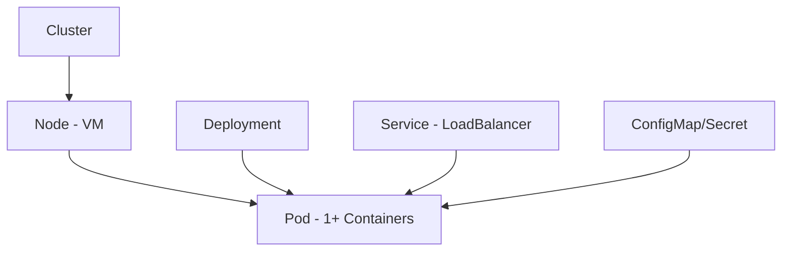
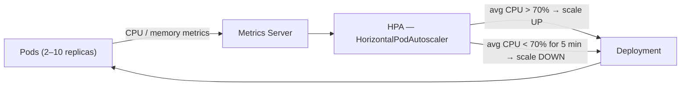
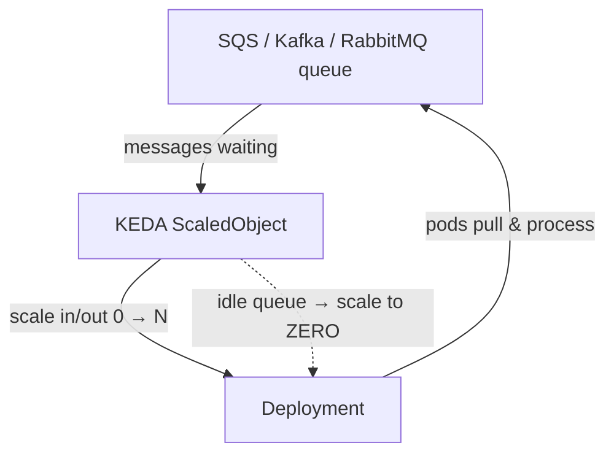
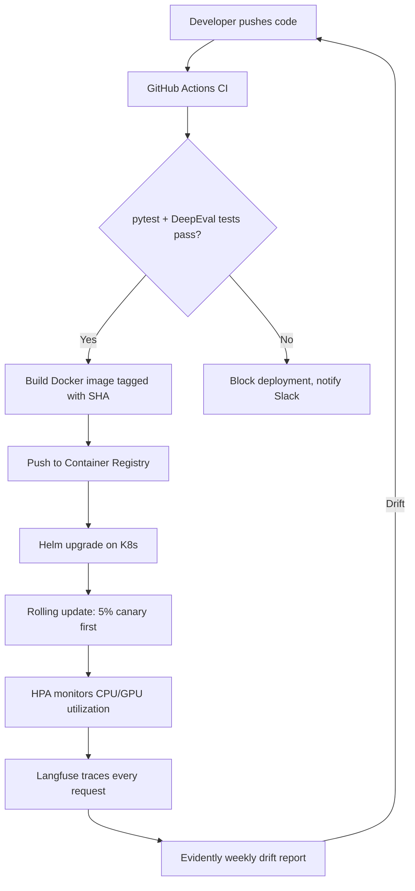

WEEK 25 · DAY 178
# Kubernetes Core Concepts
Container Orchestration for ML Engineers
⏳ 60 mins
Difficulty: Hard
💬 Hinglish Explanation:
💡 Gotcha: Common Pitfalls in Day-178
Always validate underlying data assumptions, check tensor shape alignments, and verify hyperparameter scaling before running production training or evaluation loops.
### 🎯 By the end of Day 178, you will:
- Implement and evaluate Pods, Deployments, Services, and ConfigMaps.
- Deploy a FastAPI ML inference server to K8s.
#### 🚦 Before You Start Checklist:
- minikube or kind installed locally
- kubectl installed
## 🧠 Theory
Analogy:
Kubernetes Core Concepts
💡 Gotcha & Common Pitfall Warning:
Always double check tensor dimensions, verify data types before matrix operations, and ensure feature scaling is fitted strictly on the training set to prevent data leakage.
### K8s Resource Hierarchy

### Deploying a FastAPI ML Service
yaml
```yaml
# deployment.yaml — Kubernetes manifest for ML inference server
apiVersion: apps/v1
kind: Deployment
metadata:
  name: ml-inference-api
spec:
  replicas: 3
  selector:
    matchLabels:
      app: ml-api
  template:
    metadata:
      labels:
        app: ml-api
    spec:
      containers:
      - name: api
        image: myrepo/ml-api:v1.2.0
        ports:
        - containerPort: 8000
        env:
        - name: OPENAI_API_KEY
          valueFrom:
            secretKeyRef:
              name: api-secrets
              key: openai_key
        resources:
          requests:
            memory: "512Mi"
            cpu: "250m"
          limits:
            memory: "1Gi"
            cpu: "500m"
        livenessProbe:
          httpGet:
            path: /health
            port: 8000
          initialDelaySeconds: 30
---
apiVersion: v1
kind: Service
metadata:
  name: ml-inference-service
spec:
  type: LoadBalancer
  selector:
    app: ml-api
  ports:
  - port: 80
    targetPort: 8000
```
### 🤔 Predict the Output
What happens to a Pod if it fails its `livenessProbe`?
Check
## ⚡ Tasks
**Task 1: Deploy to minikube · MEDIUM · ⏱ 45 mins**
Create a Docker image of a simple FastAPI `/predict` endpoint, push to a local registry, and deploy using `kubectl apply -f deployment.yaml`.
**Bonus Task: Secret for API Key · MEDIUM · ⏱ 45 mins**
Create a Kubernetes Secret for `OPENAI_API_KEY` and reference it in the Deployment manifest.
**Task**
## 🧪 Day 178 Knowledge Check
**Q:** What is the difference between a Pod and a Deployment?
  - Pods are faster
  - A Pod is a single instance. A Deployment manages N replicated Pods and handles rolling updates and restarts.
  - Deployments are only for databases
## 🧪 Applied Extension Checks
**Q:** Concept check — for Kubernetes Core Concepts, which evaluation approach is most defensible?
  - A) Use a task-specific baseline and measure quality, latency, cost, and failure modes before scaling Kubernetes Core Concepts.
  - B) Adopt Kubernetes Core Concepts without a baseline because a larger system is automatically better.
  - C) Remove evaluation so the team can move faster.
  - D) Hard-code credentials and environment-specific values.
**Q:** Debugging check — what should you verify first when implementing Kubernetes Core Concepts?
  - A) Reproduce the issue with a small deterministic fixture, then inspect inputs, configuration, dependencies, and expected outputs.
  - B) Skip reproduction and immediately increase model size or production traffic.
  - C) Remove evaluation so the team can move faster.
  - D) Hard-code credentials and environment-specific values.
**Q:** Production scenario — what control belongs in a launch plan for Kubernetes Core Concepts?
  - A) Use a canary or staged rollout with quality and latency telemetry, budget/security checks, and a tested rollback path.
  - B) Ship globally after one successful demo and assume there are no operational risks.
  - C) Remove evaluation so the team can move faster.
  - D) Hard-code credentials and environment-specific values.
## 🃏 Revision Flashcards
**Flashcard:** Kubernetes Pod
> The smallest deployable unit in K8s. Contains one or more tightly coupled containers sharing network and storage.
**Flashcard:** Resource Requests vs Limits
> Requests: guaranteed resources for scheduling. Limits: maximum allowed — container is killed if exceeded.
**Flashcard:** K8s Service (LoadBalancer)
> Exposes pods to external traffic with a stable IP, routing to healthy pods automatically.
### ✅ Key Takeaways
"Docker builds containers, K8s runs them at scale. Production teams need both concepts and their operational trade-offs."
- Always set resource requests/limits — prevents one pod from starving others.
- Use livenessProbe and readinessProbe for automatic health checking.
- Never store secrets in ConfigMaps — always use K8s Secrets or Vault.
## 📚 Recommended Resources
☸️
#### K8s Basics Tutorial
Official interactive tutorial
☁️ Safe lab run:
WEEK 25 · DAY 179
# Deploying vLLM on Kubernetes
GPU-Enabled LLM Serving at Scale
⏳ 60 mins
Difficulty: Hard
💬 Hinglish Explanation:
💡 Gotcha: Common Pitfalls in Day-179
Always validate underlying data assumptions, check tensor shape alignments, and verify hyperparameter scaling before running production training or evaluation loops.
### 🎯 By the end of Day 179, you will:
- Write a K8s Deployment manifest for vLLM with GPU requests.
- Implement and evaluate how NVIDIA Device Plugin works.
#### 🚦 Before You Start Checklist:
- K8s cluster with GPU nodes (or RunPod/Lambda Labs)
## 🧠 Theory
Analogy:
Deploying vLLM on Kubernetes
💡 Gotcha & Common Pitfall Warning:
Always double check tensor dimensions, verify data types before matrix operations, and ensure feature scaling is fitted strictly on the training set to prevent data leakage.
### vLLM K8s Deployment with GPU
yaml
```yaml
# vllm-deployment.yaml
apiVersion: apps/v1
kind: Deployment
metadata:
  name: vllm-mistral-7b
spec:
  replicas: 1  # One replica per A100 GPU
  selector:
    matchLabels:
      app: vllm
  template:
    metadata:
      labels:
        app: vllm
    spec:
      containers:
      - name: vllm
        image: vllm/vllm-openai:latest
        args:
        - "--model"
        - "mistralai/Mistral-7B-Instruct-v0.2"
        - "--gpu-memory-utilization"
        - "0.9"
        - "--max-model-len"
        - "8192"
        ports:
        - containerPort: 8000
        resources:
          limits:
            nvidia.com/gpu: "1"  # Request 1 GPU — key for K8s GPU scheduling!
          requests:
            nvidia.com/gpu: "1"
            memory: "20Gi"
            cpu: "4"
        env:
        - name: HUGGING_FACE_HUB_TOKEN
          valueFrom:
            secretKeyRef:
              name: hf-secrets
              key: token
        volumeMounts:
        - name: model-cache
          mountPath: /root/.cache/huggingface
      volumes:
      - name: model-cache
        persistentVolumeClaim:
          claimName: model-cache-pvc  # PVC for caching model weights
      nodeSelector:
        accelerator: nvidia-a100  # Schedule only on GPU nodes
```
### Persistent Volume for Model Cache
yaml
```yaml
# pvc.yaml — Avoid re-downloading 14GB model on every restart
apiVersion: v1
kind: PersistentVolumeClaim
metadata:
  name: model-cache-pvc
spec:
  accessModes: [ReadWriteOnce]
  resources:
    requests:
      storage: 50Gi
```
### 🤔 Predict the Output
Why do we use a PersistentVolumeClaim for the HuggingFace cache?
Check
## ⚡ Tasks
**Task 1: Test the vLLM K8s Endpoint · MEDIUM · HARD · ⏱ 45 mins**
After deploying, expose the service and test it with the OpenAI Python client pointing to your K8s LoadBalancer IP.
**Task**
## 🧪 Day 179 Knowledge Check
**Q:** How does Kubernetes know which nodes have GPUs available?
  - Manual configuration in each pod
  - The NVIDIA Device Plugin DaemonSet automatically discovers GPUs and exposes them as `nvidia.com/gpu` resources
  - Node labels must be set manually
## 🧪 Applied Extension Checks
**Q:** Concept check — for Deploying vLLM on Kubernetes, which evaluation approach is most defensible?
  - A) Use a task-specific baseline and measure quality, latency, cost, and failure modes before scaling Deploying vLLM on Kubernetes.
  - B) Adopt Deploying vLLM on Kubernetes without a baseline because a larger system is automatically better.
  - C) Remove evaluation so the team can move faster.
  - D) Hard-code credentials and environment-specific values.
**Q:** Debugging check — what should you verify first when implementing Deploying vLLM on Kubernetes?
  - A) Reproduce the issue with a small deterministic fixture, then inspect inputs, configuration, dependencies, and expected outputs.
  - B) Skip reproduction and immediately increase model size or production traffic.
  - C) Remove evaluation so the team can move faster.
  - D) Hard-code credentials and environment-specific values.
**Q:** Production scenario — what control belongs in a launch plan for Deploying vLLM on Kubernetes?
  - A) Use a canary or staged rollout with quality and latency telemetry, budget/security checks, and a tested rollback path.
  - B) Ship globally after one successful demo and assume there are no operational risks.
  - C) Remove evaluation so the team can move faster.
  - D) Hard-code credentials and environment-specific values.
## 🃏 Revision Flashcards
**Flashcard:** nvidia.com/gpu limit
> K8s resource limit that requests N physical GPUs for a pod. Must match the number of GPUs the container needs.
**Flashcard:** PersistentVolumeClaim (PVC)
> A request for durable storage that persists across pod restarts. Essential for model weight caches.
**Flashcard:** nodeSelector
> Constrains a pod to only be scheduled on nodes with matching labels (e.g., `accelerator: nvidia-a100`).
### ✅ Key Takeaways
"GPU scheduling on K8s is the industry standard for production LLM serving at scale!"
- Always use PVC for model cache — prevents 10-minute cold starts on pod restarts.
- Use nodeSelector or nodeTaints to ensure GPU pods go to GPU nodes only.
- Multi-GPU: use `nvidia.com/gpu: "4"` for tensor parallelism (tp=4).
## 📚 Recommended Resources
⚡
#### vLLM K8s Example
Official deployment manifest
☁️ Safe lab run:
WEEK 25 · DAY 180
# Horizontal Pod Autoscaling
Scaling ML Services with Traffic
⏳ 45 mins
Difficulty: Medium
💬 Hinglish Explanation:
💡 Gotcha: Common Pitfalls in Day-180
Always validate underlying data assumptions, check tensor shape alignments, and verify hyperparameter scaling before running production training or evaluation loops.
### 🎯 By the end of Day 180, you will:
- Configure HPA based on CPU and custom metrics.
- Implement and evaluate KEDA for event-driven autoscaling.
#### 🚦 Before You Start Checklist:
- Metrics Server installed in K8s cluster
## 🧠 Theory
Analogy:
Horizontal Pod Autoscaling
💡 Gotcha & Common Pitfall Warning:
Always double check tensor dimensions, verify data types before matrix operations, and ensure feature scaling is fitted strictly on the training set to prevent data leakage.
### HPA Configuration

*HPA loop: measure pod metrics, compare to target, adjust replica count*
yaml
```yaml
# hpa.yaml — Scale ML API between 2 and 10 pods
apiVersion: autoscaling/v2
kind: HorizontalPodAutoscaler
metadata:
  name: ml-api-hpa
spec:
  scaleTargetRef:
    apiVersion: apps/v1
    kind: Deployment
    name: ml-inference-api
  minReplicas: 2
  maxReplicas: 10
  metrics:
  - type: Resource
    resource:
      name: cpu
      target:
        type: Utilization
        averageUtilization: 70  # Scale up when avg CPU > 70%
  - type: Resource
    resource:
      name: memory
      target:
        type: Utilization
        averageUtilization: 80
  behavior:
    scaleDown:
      stabilizationWindowSeconds: 300  # Wait 5 mins before scaling down
```
### KEDA for Queue-Based Scaling

*KEDA scales on queue depth — even down to zero pods when no work is waiting*
yaml
```yaml
# KEDA ScaledObject — scale based on SQS queue depth
apiVersion: keda.sh/v1alpha1
kind: ScaledObject
metadata:
  name: sqs-ml-scaler
spec:
  scaleTargetRef:
    name: ml-batch-processor
  triggers:
  - type: aws-sqs-queue
    metadata:
      queueURL: https://sqs.us-east-1.amazonaws.com/.../ml-jobs
      queueLength: "5"  # 1 pod per 5 messages in queue
```
### 🤔 Predict the Output
Why is `stabilizationWindowSeconds` for scaleDown useful for LLM services?
Check
## ⚡ Tasks
**Task 1: Apply HPA · MEDIUM · ⏱ 45 mins**
Apply the HPA to your ml-inference-api Deployment and use `kubectl get hpa -w` to watch it scale.
**Task**
## 🧪 Day 180 Knowledge Check
**Q:** What metric is NOT directly supported by standard HPA?
  - CPU utilization
  - SQS queue depth (requires KEDA)
  - Memory utilization
## 🧪 Applied Extension Checks
**Q:** Concept check — for Horizontal Pod Autoscaling, which evaluation approach is most defensible?
  - A) Use a task-specific baseline and measure quality, latency, cost, and failure modes before scaling Horizontal Pod Autoscaling.
  - B) Adopt Horizontal Pod Autoscaling without a baseline because a larger system is automatically better.
  - C) Remove evaluation so the team can move faster.
  - D) Hard-code credentials and environment-specific values.
**Q:** Debugging check — what should you verify first when implementing Horizontal Pod Autoscaling?
  - A) Reproduce the issue with a small deterministic fixture, then inspect inputs, configuration, dependencies, and expected outputs.
  - B) Skip reproduction and immediately increase model size or production traffic.
  - C) Remove evaluation so the team can move faster.
  - D) Hard-code credentials and environment-specific values.
**Q:** Production scenario — what control belongs in a launch plan for Horizontal Pod Autoscaling?
  - A) Use a canary or staged rollout with quality and latency telemetry, budget/security checks, and a tested rollback path.
  - B) Ship globally after one successful demo and assume there are no operational risks.
  - C) Remove evaluation so the team can move faster.
  - D) Hard-code credentials and environment-specific values.
## 🃏 Revision Flashcards
**Flashcard:** HPA (Horizontal Pod Autoscaler)
> Automatically adds/removes pod replicas based on CPU, memory, or custom metrics.
**Flashcard:** KEDA
> Kubernetes Event-Driven Autoscaling. Extends HPA to scale on external events like Kafka topics, SQS queues, Prometheus metrics.
**Flashcard:** Scale-to-Zero
> KEDA can scale to 0 replicas when a queue is empty, saving cost. Standard HPA minimum is 1.
### ✅ Key Takeaways
"Manual scaling = ops nightmare. HPA + KEDA = auto-scale karo, sirf traffic ke hisaab se pay karo!"
- GPU pods cannot scale to zero (GPU nodes are expensive to spin up). Use separate CPU API + async GPU worker pattern.
- KEDA is the gold standard for batch ML inference workloads.
- Always set both minReplicas and maxReplicas to prevent cost explosions.
## 📚 Recommended Resources
📈
#### KEDA Docs
Event-driven autoscaling for K8s
☁️ Safe lab run:
WEEK 25 · DAY 181
# Helm Charts for ML Stacks
Packaging K8s Applications
⏳ 45 mins
Difficulty: Medium
💬 Hinglish Explanation:
💡 Gotcha: Common Pitfalls in Day-181
Always validate underlying data assumptions, check tensor shape alignments, and verify hyperparameter scaling before running production training or evaluation loops.
### 🎯 By the end of Day 181, you will:
- Create a Helm chart for an ML inference service.
- Deploy with different values for dev and prod.
#### 🚦 Before You Start Checklist:
- `brew install helm` or equivalent
## 🧠 Theory
Analogy:
Helm Charts for ML Stacks
💡 Gotcha & Common Pitfall Warning:
Always double check tensor dimensions, verify data types before matrix operations, and ensure feature scaling is fitted strictly on the training set to prevent data leakage.
### Helm Chart Structure & Templates
shell
```shell
# Create a chart
helm create ml-inference
# Structure:
# ml-inference/
#   Chart.yaml        # Metadata
#   values.yaml       # Default values
#   templates/
#     deployment.yaml # Templated manifest
#     service.yaml
#     hpa.yaml

# templates/deployment.yaml
apiVersion: apps/v1
kind: Deployment
metadata:
  name: {{ .Release.Name }}-api
spec:
  replicas: {{ .Values.replicaCount }}
  template:
    spec:
      containers:
      - name: api
        image: "{{ .Values.image.repository }}:{{ .Values.image.tag }}"
        resources:
          limits:
            memory: {{ .Values.resources.limits.memory }}
            nvidia.com/gpu: {{ .Values.gpu.count | quote }}
```
yaml — values.yaml
```yaml
# values.yaml (defaults)
replicaCount: 2
image:
  repository: myrepo/ml-api
  tag: "latest"
resources:
  limits:
    memory: "4Gi"
gpu:
  count: 0  # No GPU by default

# values-prod.yaml (production overrides)
replicaCount: 5
image:
  tag: "v1.2.3"
resources:
  limits:
    memory: "20Gi"
gpu:
  count: 1

# Deploy commands:
# Dev: helm install dev-ml ./ml-inference
# Prod: helm install prod-ml ./ml-inference -f values-prod.yaml
```
### 🤔 Predict the Output
What command upgrades an already-installed Helm release to a new image tag?
Check
## ⚡ Tasks
**Task 1: Parameterize vLLM Chart · MEDIUM · ⏱ 45 mins**
Create a Helm chart for the vLLM deployment from Day 179. Add `values.yaml` parameters for `model`, `gpuCount`, and `maxModelLen`.
**Task**
## 🧪 Day 181 Knowledge Check
**Q:** What is the purpose of `{{ .Release.Name }}` in a Helm template?
  - Sets the Docker image tag
  - Injects the Helm release name to avoid naming conflicts between multiple installations
  - Specifies the namespace
## 🧪 Applied Extension Checks
**Q:** Concept check — for Helm Charts for ML Stacks, which evaluation approach is most defensible?
  - A) Use a task-specific baseline and measure quality, latency, cost, and failure modes before scaling Helm Charts for ML Stacks.
  - B) Adopt Helm Charts for ML Stacks without a baseline because a larger system is automatically better.
  - C) Remove evaluation so the team can move faster.
  - D) Hard-code credentials and environment-specific values.
**Q:** Debugging check — what should you verify first when implementing Helm Charts for ML Stacks?
  - A) Reproduce the issue with a small deterministic fixture, then inspect inputs, configuration, dependencies, and expected outputs.
  - B) Skip reproduction and immediately increase model size or production traffic.
  - C) Remove evaluation so the team can move faster.
  - D) Hard-code credentials and environment-specific values.
**Q:** Production scenario — what control belongs in a launch plan for Helm Charts for ML Stacks?
  - A) Use a canary or staged rollout with quality and latency telemetry, budget/security checks, and a tested rollback path.
  - B) Ship globally after one successful demo and assume there are no operational risks.
  - C) Remove evaluation so the team can move faster.
  - D) Hard-code credentials and environment-specific values.
## 🃏 Revision Flashcards
**Flashcard:** Helm Chart
> A package of templated K8s manifests. Install it with `helm install`, upgrade with `helm upgrade`, rollback with `helm rollback`.
**Flashcard:** values.yaml
> Default configuration values for a Helm chart. Override per environment with `-f values-prod.yaml`.
**Flashcard:** helm rollback
> Instantly reverts a Helm release to a previous revision. Critical for safe production deployments.
### ✅ Key Takeaways
"Helm makes K8s repeatable. Same chart, different values — dev, staging, prod sab ek hi source of truth se!"
- Store charts in a git repo alongside application code.
- Use `helm diff` plugin to preview changes before upgrading.
- Popular Helm charts exist for Prometheus, Grafana, Airflow — don't reinvent.
## 📚 Recommended Resources
⛵
#### Helm Template Guide
Official templating documentation
☁️ Safe lab run:
WEEK 25 · DAY 182
# GitHub Actions CI/CD for ML
Automating Test, Build, and Deploy
⏳ 55 mins
Difficulty: Hard
💬 Hinglish Explanation:
💡 Gotcha: Common Pitfalls in Day-182
Always validate underlying data assumptions, check tensor shape alignments, and verify hyperparameter scaling before running production training or evaluation loops.
### 🎯 By the end of Day 182, you will:
- Write a GitHub Actions workflow for an ML service.
- Run evaluation tests in CI before deployment.
#### 🚦 Before You Start Checklist:
- GitHub repository with your ML project
## 🧠 Theory
Analogy:
GitHub Actions CI/CD for ML
💡 Gotcha & Common Pitfall Warning:
Always double check tensor dimensions, verify data types before matrix operations, and ensure feature scaling is fitted strictly on the training set to prevent data leakage.
### ML CI/CD Pipeline
yaml
```yaml
# .github/workflows/ml-deploy.yaml
name: ML CI/CD Pipeline

on:
  push:
    branches: [main]
  pull_request:
    branches: [main]

jobs:
  test-and-eval:
    runs-on: ubuntu-latest
    steps:
    - uses: actions/checkout@v4
    
    - name: Set up Python
      uses: actions/setup-python@v4
      with:
        python-version: '3.11'
    
    - name: Install dependencies
      run: pip install -r requirements.txt
    
    - name: Run unit tests
      run: pytest tests/ -v
    
    - name: Run LLM evaluation (DeepEval)
      env:
        OPENAI_API_KEY: ${{ secrets.OPENAI_API_KEY }}
      run: deepeval test run tests/test_rag_pipeline.py --confidence-threshold 0.8
    
  build-and-push:
    needs: test-and-eval
    runs-on: ubuntu-latest
    if: github.ref == 'refs/heads/main'
    steps:
    - uses: actions/checkout@v4
    
    - name: Build Docker image
      run: docker build -t myrepo/ml-api:\${{ github.sha }} .
    
    - name: Push to Docker Hub
      run: |
        echo ${{ secrets.DOCKER_PASSWORD }} | docker login -u ${{ secrets.DOCKER_USERNAME }} --password-stdin
        docker push myrepo/ml-api:\${{ github.sha }}
    
  deploy-to-k8s:
    needs: build-and-push
    runs-on: ubuntu-latest
    steps:
    - name: Deploy via Helm
      run: |
        helm upgrade --install prod-ml ./helm/ml-inference \
          --set image.tag=\${{ github.sha }} \
          -f helm/values-prod.yaml
```
### 🤔 Predict the Output
What does `needs: test-and-eval` do in the workflow?
Check
## ⚡ Tasks
**Task 1: Add Eval Gate · MEDIUM · ⏱ 45 mins**
Add a step to the workflow that runs DeepEval tests and fails the CI if answer relevancy drops below 0.75.
**Bonus: Slack Notification · MEDIUM · ⏱ 45 mins**
Add a GitHub Actions step that sends a Slack message when the deployment succeeds or fails.
**Task**
## 🧪 Day 182 Knowledge Check
**Q:** Why use `\${{ github.sha }}` as the Docker image tag?
  - It is shorter than a version number
  - It makes every image uniquely traceable back to the exact commit that built it
  - Docker requires SHA tags
## 🧪 Applied Extension Checks
**Q:** Concept check — for GitHub Actions CI/CD for ML, which evaluation approach is most defensible?
  - A) Use a task-specific baseline and measure quality, latency, cost, and failure modes before scaling GitHub Actions CI/CD for ML.
  - B) Adopt GitHub Actions CI/CD for ML without a baseline because a larger system is automatically better.
  - C) Remove evaluation so the team can move faster.
  - D) Hard-code credentials and environment-specific values.
**Q:** Debugging check — what should you verify first when implementing GitHub Actions CI/CD for ML?
  - A) Reproduce the issue with a small deterministic fixture, then inspect inputs, configuration, dependencies, and expected outputs.
  - B) Skip reproduction and immediately increase model size or production traffic.
  - C) Remove evaluation so the team can move faster.
  - D) Hard-code credentials and environment-specific values.
**Q:** Production scenario — what control belongs in a launch plan for GitHub Actions CI/CD for ML?
  - A) Use a canary or staged rollout with quality and latency telemetry, budget/security checks, and a tested rollback path.
  - B) Ship globally after one successful demo and assume there are no operational risks.
  - C) Remove evaluation so the team can move faster.
  - D) Hard-code credentials and environment-specific values.
## 🃏 Revision Flashcards
**Flashcard:** CI (Continuous Integration)
> Automatically run tests on every commit to catch regressions early.
**Flashcard:** CD (Continuous Delivery)
> Automatically deploy tested code to staging or production after CI passes.
**Flashcard:** Quality Gate
> A step in CI that fails the pipeline if a metric (test pass rate, model accuracy) drops below a threshold.
### ✅ Key Takeaways
"CI/CD is what separates professional ML teams from notebook hackers!"
- Tag Docker images with git SHAs for full traceability.
- Run LLM evaluations as quality gates — block deployment on regressions.
- GitHub Actions secrets are encrypted — safe to store API keys there.
## 📚 Recommended Resources
🐙
#### GitHub Actions Docs
Official workflows documentation
☁️ Safe lab run:
WEEK 25 · DAY 183
# Model Performance Regression Tests
Preventing Silent Quality Degradation
⏳ 45 mins
Difficulty: Medium
💬 Hinglish Explanation:
💡 Gotcha: Common Pitfalls in Day-183
Always validate underlying data assumptions, check tensor shape alignments, and verify hyperparameter scaling before running production training or evaluation loops.
### 🎯 By the end of Day 183, you will:
- Write pytest-based LLM regression tests with DeepEval.
- Integrate into GitHub Actions as a quality gate.
#### 🚦 Before You Start Checklist:
- DeepEval installed
- pytest installed
## 🧠 Theory
Analogy:
Model Performance Regression Tests
💡 Gotcha & Common Pitfall Warning:
Always double check tensor dimensions, verify data types before matrix operations, and ensure feature scaling is fitted strictly on the training set to prevent data leakage.
### pytest + DeepEval Regression Suite
python
```python
# tests/test_rag_pipeline.py
import pytest
from deepeval import assert_test
from deepeval.metrics import AnswerRelevancyMetric, FaithfulnessMetric, ContextualRecallMetric
from deepeval.test_case import LLMTestCase
from my_rag import run_rag_query

# Golden test dataset — never changes without explicit review
GOLDEN_DATASET = [
    {
        "input": "What is the refund policy?",
        "expected_context": "Refunds are processed within 5-7 business days.",
        "expected_answer_fragment": "5-7 business days"
    },
    {
        "input": "How to contact support?",
        "expected_context": "Contact support@company.com or call 1-800-xxx.",
        "expected_answer_fragment": "support@company.com"
    }
]

@pytest.mark.parametrize("test_case_data", GOLDEN_DATASET)
def test_rag_answer_quality(test_case_data):
    """This test MUST pass before any deployment."""
    result = run_rag_query(test_case_data["input"])
    
    test_case = LLMTestCase(
        input=test_case_data["input"],
        actual_output=result["answer"],
        retrieval_context=[result["context"]],
    )
    
    assert_test(test_case, [
        AnswerRelevancyMetric(threshold=0.8),
        FaithfulnessMetric(threshold=0.9),
    ])

# Run: pytest tests/ -v
# Block deployment if any test fails
```
### 🤔 Predict the Output
Why is the Golden Dataset never changed without explicit review?
Check
## ⚡ Tasks
**Task 1: Build a Golden Dataset · MEDIUM · ⏱ 45 mins**
Create 5 golden test cases for a RAG system you've built. Include input, expected context, and expected answer fragment for each.
**Task**
## 🧪 Day 183 Knowledge Check
**Q:** What is a "Golden Dataset" in ML testing?
  - The most expensive dataset
  - A curated, frozen set of test cases representing expected behavior — the baseline all future versions must match
  - Training data labeled by human annotators
## 🧪 Applied Extension Checks
**Q:** Concept check — for Model Performance Regression Tests, which evaluation approach is most defensible?
  - A) Use a task-specific baseline and measure quality, latency, cost, and failure modes before scaling Model Performance Regression Tests.
  - B) Adopt Model Performance Regression Tests without a baseline because a larger system is automatically better.
  - C) Remove evaluation so the team can move faster.
  - D) Hard-code credentials and environment-specific values.
**Q:** Debugging check — what should you verify first when implementing Model Performance Regression Tests?
  - A) Reproduce the issue with a small deterministic fixture, then inspect inputs, configuration, dependencies, and expected outputs.
  - B) Skip reproduction and immediately increase model size or production traffic.
  - C) Remove evaluation so the team can move faster.
  - D) Hard-code credentials and environment-specific values.
**Q:** Production scenario — what control belongs in a launch plan for Model Performance Regression Tests?
  - A) Use a canary or staged rollout with quality and latency telemetry, budget/security checks, and a tested rollback path.
  - B) Ship globally after one successful demo and assume there are no operational risks.
  - C) Remove evaluation so the team can move faster.
  - D) Hard-code credentials and environment-specific values.
## 🃏 Revision Flashcards
**Flashcard:** Regression Test
> A test that verifies new changes don't break existing functionality. In ML: ensures model quality doesn't degrade.
**Flashcard:** @pytest.mark.parametrize
> Run the same test function with multiple input datasets. Perfect for evaluating RAG on N golden test cases.
**Flashcard:** Flaky LLM Test
> A test that sometimes passes and sometimes fails due to LLM non-determinism. Fix with temperature=0 and threshold-based assertions.
### ✅ Key Takeaways
"Har prompt change pe tests chalaao. Ye `deepeval test run` command is your safety net!"
- Use temperature=0 for regression tests to minimize flakiness.
- Store golden dataset in version control alongside code.
- Run evaluations against real production traffic samples, not synthetic ones.
## 📚 Recommended Resources
🧪
#### DeepEval Regression Testing
Official guide
☁️ Safe lab run:
WEEK 25 · DAY 184
# Capstone: Production K8s LLM Deployment
Full CI/CD → K8s → Monitoring Pipeline
⏳ 120 mins
Difficulty: CAPSTONE
💬 Hinglish Explanation:
💡 Gotcha: Common Pitfalls in Day-184
Always validate underlying data assumptions, check tensor shape alignments, and verify hyperparameter scaling before running production training or evaluation loops.
### 🎯 By the end of Day 184, you will:
- Wire together CI/CD + K8s + monitoring into a production system.
- Demonstrate a zero-downtime deployment with regression gate.
#### 🚦 Before You Start Checklist:
- Reviewed Days 178–183
- K8s cluster available
## 🧠 Theory
Analogy:
Capstone: Production K8s LLM Deployment
💡 Gotcha & Common Pitfall Warning:
Always double check tensor dimensions, verify data types before matrix operations, and ensure feature scaling is fitted strictly on the training set to prevent data leakage.
### The Complete Production Architecture

yaml — GitHub Actions workflow
```yaml
# Complete GitHub Actions workflow
name: Full ML CI/CD
on:
  push:
    branches: [main]
jobs:
  eval-gate:
    runs-on: ubuntu-latest
    steps:
    - uses: actions/checkout@v4
    - run: pip install -r requirements.txt
    - run: pytest tests/ && deepeval test run tests/test_rag.py
      env:
        OPENAI_API_KEY: ${{ secrets.OPENAI_API_KEY }}
  
  deploy:
    needs: eval-gate
    runs-on: ubuntu-latest
    steps:
    - uses: actions/checkout@v4
    - run: docker build -t myrepo/ml-api:\${{ github.sha }} . && docker push myrepo/ml-api:\${{ github.sha }}
      env:
        DOCKER_TOKEN: ${{ secrets.DOCKER_TOKEN }}
    - uses: azure/setup-kubectl@v3
    - run: |
        helm upgrade --install ml-prod ./helm \
          --set image.tag=\${{ github.sha }} \
          --set canaryWeight=5 \
          --wait --timeout 10m
```
### 🤔 Predict the Output
What does `--wait --timeout 10m` do in the helm upgrade command?
Check
## ⚡ Tasks
**Task 1: Full Pipeline · MEDIUM · CAPSTONE · ⏱ 45 mins**
Implement the complete workflow. Trigger it with a git push. Verify the deployment rolls out successfully, passes health checks, and traces appear in Langfuse.
**Task**
## 🧪 Day 184 Knowledge Check
**Q:** What happens if the Helm upgrade fails after 10 minutes?
  - The deployment continues anyway
  - The GitHub Actions step fails, K8s rolls back to the previous working revision automatically
  - The cluster crashes
## 🧪 Applied Extension Checks
**Q:** Concept check — for Capstone: Production K8s LLM Deployment, which evaluation approach is most defensible?
  - A) Use a task-specific baseline and measure quality, latency, cost, and failure modes before scaling Capstone: Production K8s LLM Deployment.
  - B) Adopt Capstone: Production K8s LLM Deployment without a baseline because a larger system is automatically better.
  - C) Remove evaluation so the team can move faster.
  - D) Hard-code credentials and environment-specific values.
**Q:** Debugging check — what should you verify first when implementing Capstone: Production K8s LLM Deployment?
  - A) Reproduce the issue with a small deterministic fixture, then inspect inputs, configuration, dependencies, and expected outputs.
  - B) Skip reproduction and immediately increase model size or production traffic.
  - C) Remove evaluation so the team can move faster.
  - D) Hard-code credentials and environment-specific values.
**Q:** Production scenario — what control belongs in a launch plan for Capstone: Production K8s LLM Deployment?
  - A) Use a canary or staged rollout with quality and latency telemetry, budget/security checks, and a tested rollback path.
  - B) Ship globally after one successful demo and assume there are no operational risks.
  - C) Remove evaluation so the team can move faster.
  - D) Hard-code credentials and environment-specific values.
## 🃏 Revision Flashcards
**Flashcard:** Rolling Update
> K8s gradually replaces old pods with new ones, maintaining availability throughout. Zero downtime deployment.
**Flashcard:** helm --wait
> Blocks until all pods are Running and ready. Fails if timeout expires, triggering CI failure and automatic rollback.
**Flashcard:** Production ML System
> Code → CI Tests → Docker Build → K8s Deploy → HPA → Monitoring → Drift → Retrain. The full loop.
### ✅ Key Takeaways
"Ab aap ek complete production ML system build aur operate kar sakte ho — yahi Senior AI Engineer hona matlab hai!"
- The eval gate in CI is the most valuable safety net you can add.
- K8s rolling updates + Helm make zero-downtime deployments trivial.
- This architecture handles millions of requests and auto-heals itself.
## 📚 Recommended Resources
📚
#### Designing ML Systems
Chip Huyen's essential MLOps book
☁️ Safe lab run:
