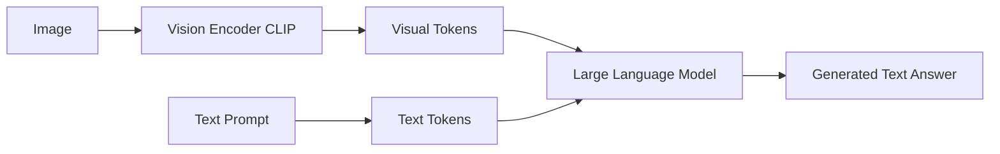
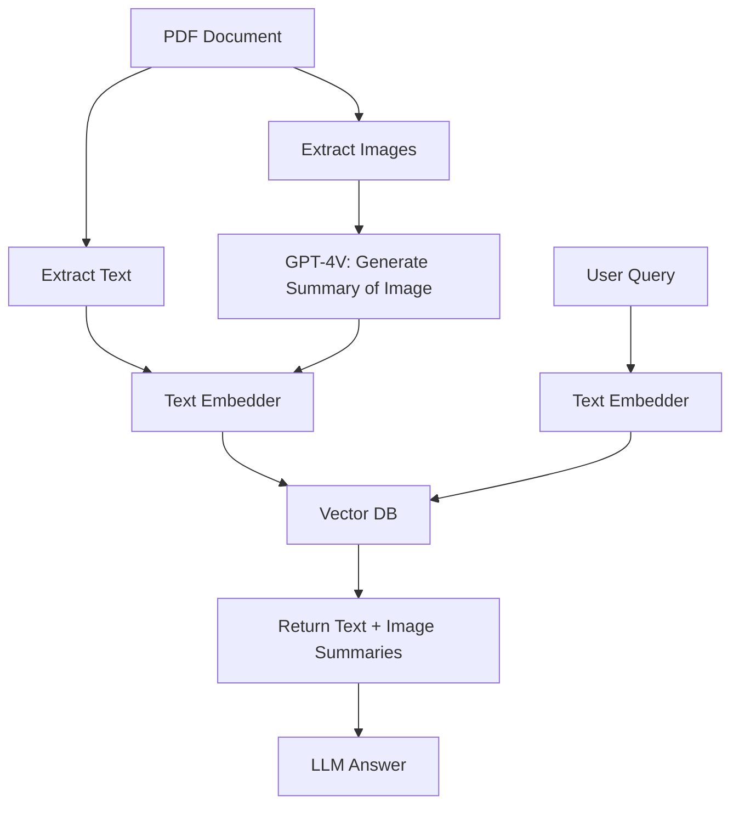
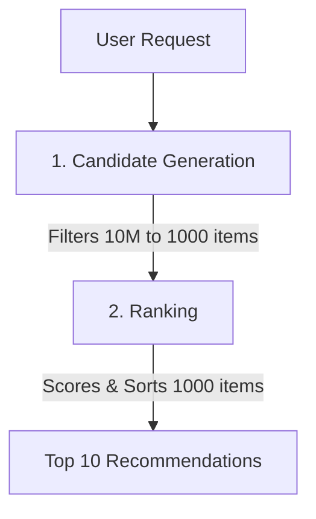
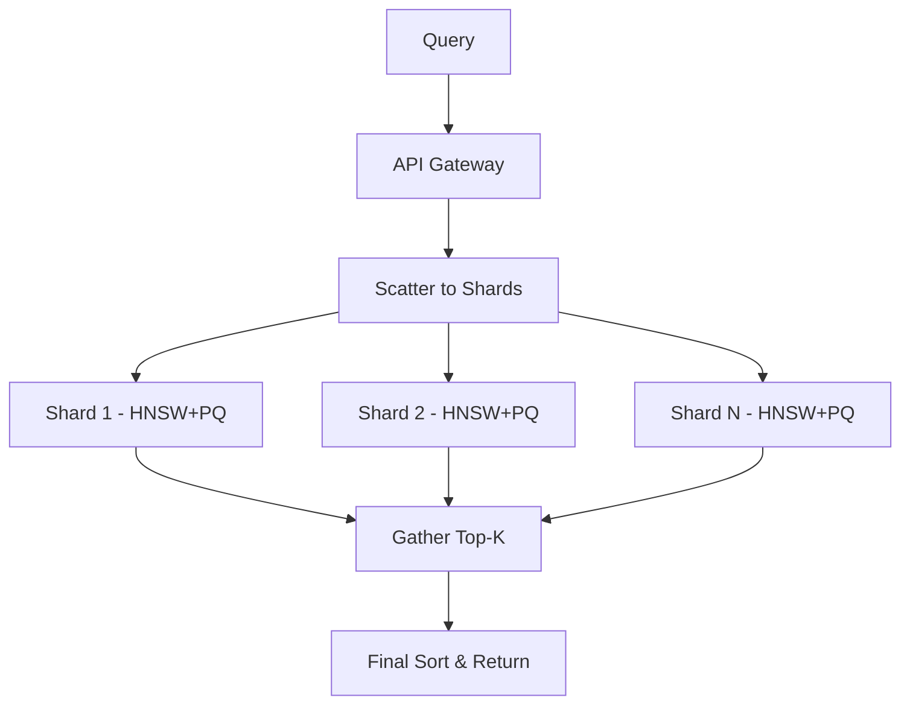

WEEK 26 · DAY 185
# Vision-Language Models (VLMs)
Processing Images with GPT-4V & LLaVA
⏳ 50 mins
Difficulty: Medium
💬 Hinglish Explanation:
💡 Gotcha: VLMs vs OCR for Text Extraction
Vision-Language Models (VLMs) like GPT-4V excel at high-level scene reasoning, but frequently hallucinate digits when reading dense text or small table fonts in scanned PDFs. For production financial document parsing, pair an explicit OCR engine (Tesseract/Textract) with an LLM rather than relying solely on raw VLM vision inputs!
### 🎯 By the end of Day 185, you will:
- Explain how VLMs combine Vision Encoders (CLIP) with LLMs.
- Use GPT-4V API to analyze an image.
#### 🚦 Before You Start Checklist:
- OpenAI API Key
## 🧠 Theory
Analogy:
Vision-Language Models (VLMs)
💡 Gotcha & Common Pitfall Warning:
Always double check tensor dimensions, verify data types before matrix operations, and ensure feature scaling is fitted strictly on the training set to prevent data leakage.
### How VLMs Work
An image is passed through a Vision Encoder (like ViT/CLIP) to convert it into a sequence of embeddings (visual tokens). These tokens are concatenated with text embeddings and passed into the LLM.

### GPT-4V API Usage
python
```python
import base64
from openai import OpenAI

client = OpenAI()

def encode_image(image_path):
    with open(image_path, "rb") as image_file:
        return base64.b64encode(image_file.read()).decode('utf-8')

base64_image = encode_image("dashboard_chart.png")

response = client.chat.completions.create(
    model="gpt-4o",
    messages=[
        {
            "role": "user",
            "content": [
                {"type": "text", "text": "What is the key takeaway from this chart? Output as JSON with a 'takeaway' key."},
                {
                    "type": "image_url",
                    "image_url": {
                        "url": f"data:image/jpeg;base64,{base64_image}",
                        "detail": "high"  # Use 'low' for cheaper, lower res processing
                    }
                }
            ]
        }
    ],
    response_format={"type": "json_object"}
)
print(response.choices[0].message.content)
```
### 🤔 Predict the Output
What is the cost difference between `detail: "low"` and `detail: "high"` in the OpenAI API?
Check
## ⚡ Tasks
**Task 1: Invoice Extraction · MEDIUM · ⏱ 45 mins**
Write a script that takes a picture of an invoice and extracts the total amount, date, and vendor name into a Pydantic schema using Instructor.
**Bonus Task: Local VLM · MEDIUM · ⏱ 45 mins**
Research LLaVA (Large Language-and-Vision Assistant). How can you run it locally?
**Task**
## 🧪 Day 185 Knowledge Check
**Q:** How does a VLM typically process images?
  - It converts the image into a long string of RGB numbers
  - It uses a Vision Encoder (like CLIP) to create embeddings, which are then passed to the LLM as tokens
  - It uses OCR to extract text before passing to the LLM
## 🧪 Applied Extension Checks
**Q:** Concept check — for Vision-Language Models (VLMs), which evaluation approach is most defensible?
  - A) Use a task-specific baseline and measure quality, latency, cost, and failure modes before scaling Vision-Language Models (VLMs).
  - B) Adopt Vision-Language Models (VLMs) without a baseline because a larger system is automatically better.
  - C) Remove evaluation so the team can move faster.
  - D) Hard-code credentials and environment-specific values.
**Q:** Debugging check — what should you verify first when implementing Vision-Language Models (VLMs)?
  - A) Reproduce the issue with a small deterministic fixture, then inspect inputs, configuration, dependencies, and expected outputs.
  - B) Skip reproduction and immediately increase model size or production traffic.
  - C) Remove evaluation so the team can move faster.
  - D) Hard-code credentials and environment-specific values.
**Q:** Production scenario — what control belongs in a launch plan for Vision-Language Models (VLMs)?
  - A) Use a canary or staged rollout with quality and latency telemetry, budget/security checks, and a tested rollback path.
  - B) Ship globally after one successful demo and assume there are no operational risks.
  - C) Remove evaluation so the team can move faster.
  - D) Hard-code credentials and environment-specific values.
## 🃏 Revision Flashcards
**Flashcard:** VLM
> Vision-Language Model. A model that can process both text and images simultaneously (e.g., GPT-4V, Claude 3, LLaVA).
**Flashcard:** Detail: Low vs High
> Low: scales image down to 512x512, costs flat 85 tokens. High: crops image into 512x512 tiles, costs 170 tokens per tile.
**Flashcard:** Visual Tokens
> The embedding representations of image patches that are concatenated with text tokens in a VLM's input sequence.
### ✅ Key Takeaways
"OCR ka zamana gaya. VLMs na sirf text extract karte hain, balki layout, charts, aur context bhi samajhte hain!"
- Use base64 encoding to send local images to the API.
- Always use `detail: "low"` for simple classification to save massive token costs.
- Open source options like LLaVA and Qwen-VL are catching up rapidly.
## 📚 Recommended Resources
👁️
#### OpenAI Vision Guide
API documentation for GPT-4V
☁️ Safe lab run:
WEEK 26 · DAY 186
# Multimodal RAG
Querying Documents with Images & Text
⏳ 60 mins
Difficulty: Hard
💬 Hinglish Explanation:
💡 Gotcha & Common Pitfall Warning:
Always double check tensor dimensions, verify data types before matrix operations, and ensure feature scaling is fitted strictly on the training set to prevent data leakage.
### 🎯 By the end of Day 186, you will:
- Implement and evaluate architectures for Multimodal RAG.
- Use CLIP embeddings to search across text and images.
#### 🚦 Before You Start Checklist:
- Basic understanding of RAG (Week 19)
## 🧠 Theory
Analogy:
Multimodal RAG
💡 Gotcha & Common Pitfall Warning:
Always double check tensor dimensions, verify data types before matrix operations, and ensure feature scaling is fitted strictly on the training set to prevent data leakage.
### Multimodal RAG Architectures
There are two primary ways to handle images in RAG:
- **Joint Embeddings (CLIP):** Embed both text and images into the same vector space. Search query (text) against image embeddings directly.
- **Image Summary (GPT-4V):** Pass every image through a VLM to generate a text summary during indexing. Then, embed that text summary using standard text embeddings. (Most common in production).
### Architecture 2: Image Summarization

python
```python
# Generating an image summary for indexing
def summarize_image(base64_image):
    response = client.chat.completions.create(
        model="gpt-4o-mini",
        messages=[
            {"role": "user", "content": [
                {"type": "text", "text": "Describe this image/chart in detail for a search index."},
                {"type": "image_url", "image_url": {"url": f"data:image/jpeg;base64,{base64_image}"}}
            ]}
        ]
    )
    return response.choices[0].message.content

# Store both the summary and a pointer to the original image in the DB metadata
metadata = {
    "type": "image",
    "image_path": "images/chart_page_4.jpg",
    "summary": summarize_image(img)
}
# Embed the SUMMARY text and store in Vector DB
```
### 🤔 Predict the Output
Why is Architecture 2 (Image Summarization) often preferred over Architecture 1 (CLIP embeddings) for document Q&A?
Check
## ⚡ Tasks
**Task 1: Multimodal Retrieval · MEDIUM · ⏱ 45 mins**
Write the retrieval step: Query the DB, and if the returned chunk is of type "image", pass the original image (via `image_path`) along with the query to GPT-4o to answer.
**Task**
## 🧪 Day 186 Knowledge Check
**Q:** In the Image Summarization architecture for Multimodal RAG, what is stored in the Vector Database?
  - The raw image pixels
  - The CLIP embedding of the image
  - The text embedding of the VLM-generated summary of the image
## 🧪 Applied Extension Checks
**Q:** Concept check — for Multimodal RAG, which evaluation approach is most defensible?
  - A) Use a task-specific baseline and measure quality, latency, cost, and failure modes before scaling Multimodal RAG.
  - B) Adopt Multimodal RAG without a baseline because a larger system is automatically better.
  - C) Remove evaluation so the team can move faster.
  - D) Hard-code credentials and environment-specific values.
**Q:** Debugging check — what should you verify first when implementing Multimodal RAG?
  - A) Reproduce the issue with a small deterministic fixture, then inspect inputs, configuration, dependencies, and expected outputs.
  - B) Skip reproduction and immediately increase model size or production traffic.
  - C) Remove evaluation so the team can move faster.
  - D) Hard-code credentials and environment-specific values.
**Q:** Production scenario — what control belongs in a launch plan for Multimodal RAG?
  - A) Use a canary or staged rollout with quality and latency telemetry, budget/security checks, and a tested rollback path.
  - B) Ship globally after one successful demo and assume there are no operational risks.
  - C) Remove evaluation so the team can move faster.
  - D) Hard-code credentials and environment-specific values.
## 🃏 Revision Flashcards
**Flashcard:** CLIP
> Contrastive Language-Image Pretraining. A model by OpenAI that embeds text and images into the same vector space.
**Flashcard:** Multimodal RAG
> Extending RAG to retrieve and reason over non-text data (images, audio, video) alongside text.
**Flashcard:** ColPali
> An advanced vision retrieval model that embeds document pages directly as images without needing OCR or text extraction.
### ✅ Key Takeaways
"PDFs mein data aksar tables aur charts mein hota hai. Text-only RAG wahan fail hota hai. Image summarize karke index karna production standard hai!"
- CLIP is great for finding photos ("a dog playing"), but bad at reading dense charts.
- For document RAG, always use the Image Summarization pattern.
- Use a cheap model like gpt-4o-mini for generating the summaries during ingestion.
## 📚 Recommended Resources
🔗
#### LangChain Multimodal RAG
Implementation guide
☁️ Safe lab run:
WEEK 26 · DAY 187
# Audio Processing with Whisper
Speech-to-Text Pipelines
⏳ 45 mins
Difficulty: Medium
💬 Hinglish Explanation:
💡 Gotcha & Common Pitfall Warning:
Always double check tensor dimensions, verify data types before matrix operations, and ensure feature scaling is fitted strictly on the training set to prevent data leakage.
### 🎯 By the end of Day 187, you will:
- Use OpenAI's Whisper model via API and locally.
- Process audio files and pass the transcript to an LLM.
#### 🚦 Before You Start Checklist:
- `pip install openai-whisper` (for local running)
## 🧠 Theory
Analogy:
Audio Processing with Whisper
💡 Gotcha & Common Pitfall Warning:
Always double check tensor dimensions, verify data types before matrix operations, and ensure feature scaling is fitted strictly on the training set to prevent data leakage.
### Whisper API
The OpenAI Audio API provides access to the Whisper v2 model for transcription and translation.
python
```python
from openai import OpenAI

client = OpenAI()

# Transcribe audio file to text
audio_file = open("meeting_recording.mp3", "rb")
transcription = client.audio.transcriptions.create(
    model="whisper-1", 
    file=audio_file,
    response_format="text" # can also be "srt" or "vtt" for subtitles
)

print(transcription)

# Pass to LLM for summarization
summary = client.chat.completions.create(
    model="gpt-4o-mini",
    messages=[
        {"role": "system", "content": "You are an assistant that summarizes meeting transcripts into bullet points with action items."},
        {"role": "user", "content": transcription}
    ]
)
print(summary.choices[0].message.content)
```
### Local Whisper
Whisper is open-source. You can run it locally for free, which is crucial for sensitive data like medical recordings.
python
```python
import whisper
# Load the 'base' model (74M params) - runs fast on CPU
model = whisper.load_model("base")
result = model.transcribe("meeting_recording.mp3")
print(result["text"])
```
### 🤔 Predict the Output
What is the main limitation of running the Whisper `large-v3` model locally compared to the `base` model?
Check
## ⚡ Tasks
**Task 1: Chunking Audio · MEDIUM · ⏱ 45 mins**
The OpenAI Whisper API has a 25MB file size limit. Write a script using `pydub` to chunk a large MP3 file into 10-minute segments, transcribe them sequentially, and concatenate the text.
**Task**
## 🧪 Day 187 Knowledge Check
**Q:** Which response format from Whisper should you use if you want to create subtitles for a video?
  - text
  - srt or vtt
  - json
## 🧪 Applied Extension Checks
**Q:** Concept check — for Audio Processing with Whisper, which evaluation approach is most defensible?
  - A) Use a task-specific baseline and measure quality, latency, cost, and failure modes before scaling Audio Processing with Whisper.
  - B) Adopt Audio Processing with Whisper without a baseline because a larger system is automatically better.
  - C) Remove evaluation so the team can move faster.
  - D) Hard-code credentials and environment-specific values.
**Q:** Debugging check — what should you verify first when implementing Audio Processing with Whisper?
  - A) Reproduce the issue with a small deterministic fixture, then inspect inputs, configuration, dependencies, and expected outputs.
  - B) Skip reproduction and immediately increase model size or production traffic.
  - C) Remove evaluation so the team can move faster.
  - D) Hard-code credentials and environment-specific values.
**Q:** Production scenario — what control belongs in a launch plan for Audio Processing with Whisper?
  - A) Use a canary or staged rollout with quality and latency telemetry, budget/security checks, and a tested rollback path.
  - B) Ship globally after one successful demo and assume there are no operational risks.
  - C) Remove evaluation so the team can move faster.
  - D) Hard-code credentials and environment-specific values.
## 🃏 Revision Flashcards
**Flashcard:** Whisper
> OpenAI's robust open-source speech recognition model, trained on 680k hours of multilingual audio.
**Flashcard:** Diarization
> The process of identifying "who spoke when" in an audio recording. Whisper doesn't do this natively; requires external tools like Pyannote.
**Flashcard:** 25MB Limit
> The maximum file size allowed by the OpenAI Whisper API. Larger files must be compressed or chunked.
### ✅ Key Takeaways
"Whisper ne speech-to-text ko solve kar diya hai. Combine it with RAG, and you can build a system that searches through 1000s of podcasts or sales calls instantly!"
- Use local Whisper models (base/small) for free, private transcription on CPU.
- API is cheap and uses the highly accurate large-v2/v3 models.
- Remember to chunk files larger than 25MB when using the API.
## 📚 Recommended Resources
🎙️
#### OpenAI Audio Docs
API usage guide
☁️ Safe lab run:
WEEK 26 · DAY 188
# ML System Design — Recommendation System
Interview Prep: Two-Tower Models
⏳ 50 mins
Difficulty: Hard
💬 Hinglish Explanation:
💡 Gotcha: Candidate Retrieval vs Ranking Tradeoffs
In recommendation systems, candidate retrieval (Vector Search / Two-Tower models) reduces 10 million items down to 500 candidates in $< 10\text{ms}$. Heavy ranking models (Cross-Encoders / Deep Learning Rerankers) compute pairwise attention on the top 500 candidates. Never pass millions of un-filtered items directly to a heavy reranker!
### 🎯 By the end of Day 188, you will:
- Implement and evaluate the Two-Stage Recommendation Architecture.
- Construct and apply the Two-Tower Neural Network design.
#### 🚦 Before You Start Checklist:
- Basic understanding of Vector Databases
## 🧠 Theory
Analogy:
ML System Design — Recommendation System
PYTHON — WORKED EXAMPLE
```python
# Worked Example
import numpy as np
print("Executing worked example pipeline...")
```
💡 Gotcha & Common Pitfall Warning:
Always double check tensor dimensions, verify data types before matrix operations, and ensure feature scaling is fitted strictly on the training set to prevent data leakage.
### Two-Stage Funnel Architecture
You cannot run a heavy deep learning model on 10 million videos for every user request. You need a funnel:

### 1. Candidate Generation: Two-Tower Model
We train two neural networks: one for the User (features: age, watch history) and one for the Item (features: tags, popularity). They output embeddings in the same vector space.  **Crucial trick:** We pre-compute all Item embeddings offline and put them in FAISS/Pinecone. At request time, we only run the User Tower, get the user embedding, and do a fast Vector Search (k=1000) to find matching items.
### 2. Ranking: Heavy Model
Now we have 1000 items. We pass the user features AND the item features together into a heavy model (e.g., XGBoost or deep cross-network) to predict the exact probability of click/watch. Since it's only 1000 items, this is fast enough for real-time.
### 🤔 Predict the Output
Why can't we use the heavy Ranking model directly on all 10 million items?
Check
## ⚡ Tasks
**Task 1: Draw the Architecture · MEDIUM · ⏱ 45 mins**
On a piece of paper, draw the end-to-end architecture including the offline training pipeline, the vector database, the user tower, and the ranking model.
**Task**
## 🧪 Day 188 Knowledge Check
**Q:** In a Two-Tower model, when are the item embeddings calculated?
  - In real-time for every user request
  - Offline in a batch job, and stored in a vector database for fast retrieval
  - In the Ranking stage
## 🧪 Applied Extension Checks
**Q:** Concept check — for ML System Design — Recommendation System, which evaluation approach is most defensible?
  - A) Use a task-specific baseline and measure quality, latency, cost, and failure modes before scaling ML System Design — Recommendation System.
  - B) Adopt ML System Design — Recommendation System without a baseline because a larger system is automatically better.
  - C) Remove evaluation so the team can move faster.
  - D) Hard-code credentials and environment-specific values.
**Q:** Debugging check — what should you verify first when implementing ML System Design — Recommendation System?
  - A) Reproduce the issue with a small deterministic fixture, then inspect inputs, configuration, dependencies, and expected outputs.
  - B) Skip reproduction and immediately increase model size or production traffic.
  - C) Remove evaluation so the team can move faster.
  - D) Hard-code credentials and environment-specific values.
**Q:** Production scenario — what control belongs in a launch plan for ML System Design — Recommendation System?
  - A) Use a canary or staged rollout with quality and latency telemetry, budget/security checks, and a tested rollback path.
  - B) Ship globally after one successful demo and assume there are no operational risks.
  - C) Remove evaluation so the team can move faster.
  - D) Hard-code credentials and environment-specific values.
## 🃏 Revision Flashcards
**Flashcard:** Candidate Generation
> Stage 1: A fast, lightweight method (like Vector Search) to narrow millions of items down to ~1000 relevant candidates.
**Flashcard:** Ranking
> Stage 2: A heavier model (XGBoost) that scores the 1000 candidates precisely to select the final Top 10.
**Flashcard:** Two-Tower Model
> Neural net architecture where User and Item features are processed independently into embeddings. Fast retrieval via dot product.
### ✅ Key Takeaways
"System design is all about trade-offs. You trade off precision in Candidate Generation for latency, and trade latency in Ranking for precision!"
- Always structure rec-sys interviews in two stages: Gen and Rank.
- Mention FAISS/Pinecone for the generation stage.
- Mention Cold Start problem (how to recommend to new users/items).
## 📚 Recommended Resources
🧠
#### Google ML Course
Two-Tower Models
☁️ Safe lab run:
WEEK 26 · DAY 189
# DSPy — Programmatic Prompt Optimization
Replacing Prompt Engineering with Code
⏳ 50 mins
Difficulty: Hard
💬 Hinglish Explanation:
💡 Gotcha: Common Pitfalls in Day-189
Always validate underlying data assumptions, check tensor shape alignments, and verify hyperparameter scaling before running production training or evaluation loops.
### 🎯 By the end of Day 189, you will:
- Implement and evaluate the DSPy paradigm.
- Compile a simple pipeline to auto-optimize prompts.
#### 🚦 Before You Start Checklist:
- `pip install dspy-ai`
## 🧠 Theory
Analogy:
DSPy — Programmatic Prompt Optimization
💡 Gotcha & Common Pitfall Warning:
Always double check tensor dimensions, verify data types before matrix operations, and ensure feature scaling is fitted strictly on the training set to prevent data leakage.
### The DSPy Paradigm
Instead of string manipulation, you define **Signatures** (Input → Output) and **Modules** (e.g., ChainOfThought). Then a **Teleprompter** (optimizer) runs through training examples and rewrites the prompts for maximum accuracy.
python
```python
import dspy
from dspy.teleprompt import BootstrapFewShot

dspy.configure(lm=dspy.OpenAI(model='gpt-4o-mini', max_tokens=250))

# 1. Define Signature (Input/Output definition)
class BasicQA(dspy.Signature):
    """Answer questions with short factoid answers."""
    question = dspy.InputField()
    answer = dspy.OutputField(desc="often between 1 and 5 words")

# 2. Define Module (Architecture)
class CoTQA(dspy.Module):
    def __init__(self):
        super().__init__()
        # Use ChainOfThought instead of direct Predict
        self.generate_answer = dspy.ChainOfThought(BasicQA)
        
    def forward(self, question):
        return self.generate_answer(question=question)

# 3. Optimize (Compile)
# Provide a few examples
trainset = [
    dspy.Example(question="What is the capital of France?", answer="Paris").with_inputs('question'),
    dspy.Example(question="Who wrote Hamlet?", answer="William Shakespeare").with_inputs('question'),
]

# The optimizer runs the model, evaluates, and rewrites the internal prompt!
teleprompter = BootstrapFewShot(metric=dspy.evaluate.answer_exact_match)
compiled_model = teleprompter.compile(CoTQA(), trainset=trainset)

# 4. Use it
pred = compiled_model(question="What is the largest ocean?")
print(pred.answer)
```
### 🤔 Predict the Output
If you switch from GPT-4 to Llama-3, do you need to manually rewrite all your prompts in DSPy?
Check
## ⚡ Tasks
**Task 1: RAG Signature · MEDIUM · ⏱ 45 mins**
Write a DSPy Signature for a RAG system that takes `context` and `question` as inputs and outputs `answer`.
**Task**
## 🧪 Day 189 Knowledge Check
**Q:** What does the Teleprompter in DSPy do?
  - It reads text aloud
  - It acts as an optimizer, automatically rewriting prompts and selecting few-shot examples to maximize a metric
  - It connects to the OpenAI API
## 🧪 Applied Extension Checks
**Q:** Concept check — for DSPy — Programmatic Prompt Optimization, which evaluation approach is most defensible?
  - A) Use a task-specific baseline and measure quality, latency, cost, and failure modes before scaling DSPy — Programmatic Prompt Optimization.
  - B) Adopt DSPy — Programmatic Prompt Optimization without a baseline because a larger system is automatically better.
  - C) Remove evaluation so the team can move faster.
  - D) Hard-code credentials and environment-specific values.
**Q:** Debugging check — what should you verify first when implementing DSPy — Programmatic Prompt Optimization?
  - A) Reproduce the issue with a small deterministic fixture, then inspect inputs, configuration, dependencies, and expected outputs.
  - B) Skip reproduction and immediately increase model size or production traffic.
  - C) Remove evaluation so the team can move faster.
  - D) Hard-code credentials and environment-specific values.
**Q:** Production scenario — what control belongs in a launch plan for DSPy — Programmatic Prompt Optimization?
  - A) Use a canary or staged rollout with quality and latency telemetry, budget/security checks, and a tested rollback path.
  - B) Ship globally after one successful demo and assume there are no operational risks.
  - C) Remove evaluation so the team can move faster.
  - D) Hard-code credentials and environment-specific values.
## 🃏 Revision Flashcards
**Flashcard:** DSPy Signature
> Declarative definition of what a module should do, specifying input and output fields (e.g. `question -> answer`).
**Flashcard:** DSPy Module
> A building block (like dspy.Predict or dspy.ChainOfThought) that executes a Signature.
**Flashcard:** Teleprompter
> DSPy's optimizers that automatically tune the prompts and few-shot examples inside your modules.
### ✅ Key Takeaways
"Prompt engineering is dead. Prompt programming is the future. Define the goal, let the compiler find the prompt!"
- DSPy makes LLM pipelines model-agnostic. Switch models, just re-compile.
- It treats prompts like weights in a neural network.
- Highly recommended for complex pipelines (e.g. multi-hop RAG).
## 📚 Recommended Resources
⚙️
#### DSPy Docs
Stanford's official documentation
☁️ Safe lab run:
WEEK 26 · DAY 190
# ML System Design — Semantic Search
Interview Prep: Scaling Vector DBs
⏳ 45 mins
Difficulty: Hard
💬 Hinglish Explanation:
💡 Gotcha: Common Pitfalls in Day-190
Always validate underlying data assumptions, check tensor shape alignments, and verify hyperparameter scaling before running production training or evaluation loops.
### 🎯 By the end of Day 190, you will:
- Design a scalable semantic search architecture.
- Implement and evaluate PQ (Product Quantization) for RAM reduction.
#### 🚦 Before You Start Checklist:
- Review HNSW (Day 139)
## 🧠 Theory
Analogy:
ML System Design — Semantic Search
PYTHON — WORKED EXAMPLE
```python
# Worked Example
import numpy as np
print("Executing worked example pipeline...")
```
💡 Gotcha & Common Pitfall Warning:
Always double check tensor dimensions, verify data types before matrix operations, and ensure feature scaling is fitted strictly on the training set to prevent data leakage.
### The 1 Billion Vector Problem
1 Billion vectors of dimension 1536 (OpenAI size) as float32 takes:  `1B * 1536 * 4 bytes = 6 Terabytes of RAM!`             You cannot hold this in RAM. You must compress and shard.
### Scaling Techniques
- **Product Quantization (PQ):** Compresses vectors by up to 95%. It splits the vector into sub-vectors, runs k-means, and stores the centroid IDs (integers) instead of floats.
- **Scalar Quantization (SQ):** Converts float32 to int8. 4x compression with minimal accuracy loss.
- **Sharding:** Split the 1B vectors across 10 machines (100M each). When a query comes, scatter the query to all 10 machines, gather the top-K from each, and do a final sort.

### 🤔 Predict the Output
If you use int8 quantization instead of float32, how much RAM does a 1536-d vector take?
Check
## ⚡ Tasks
**Task 1: VRAM Math Check · MEDIUM · ⏱ 45 mins**
Calculate RAM required for 100 Million vectors, dim=768, using int8 quantization.
**Task**
## 🧪 Day 190 Knowledge Check
**Q:** What is Product Quantization (PQ)?
  - Converting floats to integers
  - Splitting vectors into sub-vectors and replacing them with cluster centroid IDs for massive compression
  - A hardware optimization in GPUs
## 🧪 Applied Extension Checks
**Q:** Concept check — for ML System Design — Semantic Search, which evaluation approach is most defensible?
  - A) Use a task-specific baseline and measure quality, latency, cost, and failure modes before scaling ML System Design — Semantic Search.
  - B) Adopt ML System Design — Semantic Search without a baseline because a larger system is automatically better.
  - C) Remove evaluation so the team can move faster.
  - D) Hard-code credentials and environment-specific values.
**Q:** Debugging check — what should you verify first when implementing ML System Design — Semantic Search?
  - A) Reproduce the issue with a small deterministic fixture, then inspect inputs, configuration, dependencies, and expected outputs.
  - B) Skip reproduction and immediately increase model size or production traffic.
  - C) Remove evaluation so the team can move faster.
  - D) Hard-code credentials and environment-specific values.
**Q:** Production scenario — what control belongs in a launch plan for ML System Design — Semantic Search?
  - A) Use a canary or staged rollout with quality and latency telemetry, budget/security checks, and a tested rollback path.
  - B) Ship globally after one successful demo and assume there are no operational risks.
  - C) Remove evaluation so the team can move faster.
  - D) Hard-code credentials and environment-specific values.
## 🃏 Revision Flashcards
**Flashcard:** Sharding
> Distributing data across multiple physical machines to scale horizontally when data exceeds one machine's RAM.
**Flashcard:** Scalar Quantization (SQ)
> Converting 32-bit floats to 8-bit integers (int8). Provides 4x memory reduction with negligible accuracy loss.
**Flashcard:** Scatter-Gather
> Search pattern for sharded DBs: send query to all shards concurrently, collect local Top-K results, merge and sort globally.
### ✅ Key Takeaways
"Vector DBs memory-bound hote hain. Compression (PQ/SQ) aur Sharding ke bina millions of vectors scale nahi hote."
- Always mention RAM constraints when discussing Vector DBs in interviews.
- Compression causes a slight drop in recall, but saves 90% of costs.
## 📚 Recommended Resources
📉
#### Qdrant SQ Guide
Understanding Scalar Quantization
☁️ Safe lab run:
WEEK 26 · DAY 191
# Final Capstone & Portfolio Polish
Production-oriented AI/ML checkpoint — document evidence for each capability.
⏳ 60 mins
Difficulty: Capstone
💬 Hinglish Explanation:
💡 Gotcha: Common Pitfalls in Day-191
Always validate underlying data assumptions, check tensor shape alignments, and verify hyperparameter scaling before running production training or evaluation loops.
### 🎯 Final Portfolio Checklist:
- Update LinkedIn to "AI/ML Engineer"
- Pin 3 repositories to GitHub (RAG, Agents, MLOps)
- Ensure every repo has a professional `README.md` with architecture diagrams
#### 🚦 Before You Claim:
- Completed all 191 days
- Built a cloud-deployed ML project
- Added MLflow/DVC to a project
- Ready for structured system-design practice with documented trade-offs
## 🧠 The AI Engineer's Manifesto
python
```python
while True:
    try:
        read_paper()
        implement_concept()
        deploy_to_cloud()
        monitor_drift()
    except DistributionShift:
        retrain_model()
    finally:
        stay_humble()
```
## ⚡ Tasks
**Apply for Jobs · MEDIUM · FINAL · ⏱ 45 mins**
Apply for Applied AI Engineer and MLOps Engineer roles. You have the Cloud, Kubernetes, and Multimodal skills required to clear the technical rounds.
**Task**
## 🧪 Day 191 Knowledge Check
**Q:** Which statement best describes graduation readiness?
  - I completed the capstone, documented it, and can explain the trade-offs.
  - I skipped the capstone but memorized the flashcards.
  - Production readiness means no monitoring is needed.
## 🧪 Applied Extension Checks
**Q:** Concept check — for Final Capstone & Portfolio Polish, which evaluation approach is most defensible?
  - A) Use a task-specific baseline and measure quality, latency, cost, and failure modes before scaling Final Capstone & Portfolio Polish.
  - B) Adopt Final Capstone & Portfolio Polish without a baseline because a larger system is automatically better.
  - C) Remove evaluation so the team can move faster.
  - D) Hard-code credentials and environment-specific values.
**Q:** Debugging check — what should you verify first when implementing Final Capstone & Portfolio Polish?
  - A) Reproduce the issue with a small deterministic fixture, then inspect inputs, configuration, dependencies, and expected outputs.
  - B) Skip reproduction and immediately increase model size or production traffic.
  - C) Remove evaluation so the team can move faster.
  - D) Hard-code credentials and environment-specific values.
**Q:** Production scenario — what control belongs in a launch plan for Final Capstone & Portfolio Polish?
  - A) Use a canary or staged rollout with quality and latency telemetry, budget/security checks, and a tested rollback path.
  - B) Ship globally after one successful demo and assume there are no operational risks.
  - C) Remove evaluation so the team can move faster.
  - D) Hard-code credentials and environment-specific values.
## 🃏 Revision Flashcards
**Flashcard:** What is your title?
> Senior Full-Stack AI Engineer
**Flashcard:** The AI Engineer Loop
> Build → Evaluate → Deploy → Monitor → Improve.
**Flashcard:** Future-Proofing
> Frameworks change (LangChain vs DSPy), but fundamentals (Vector Math, CI/CD, K8s, K-means) remain.
### ✅ Key Takeaways
"The journey never ends, but you now have the tools to build anything you can imagine. Go build the future!"
- Real engineering is 80% ops, 20% models.
- Never stop being curious.
## 📚 Resources
📚
#### Curriculum Resource Guide
Review official references and maintenance notes before extending the capstone.
☁️ Safe lab run:
